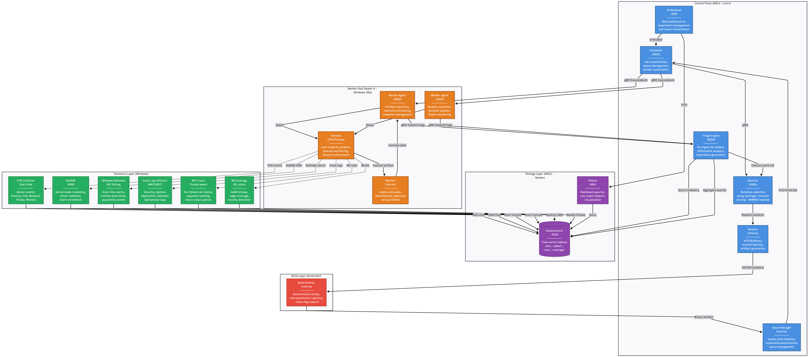
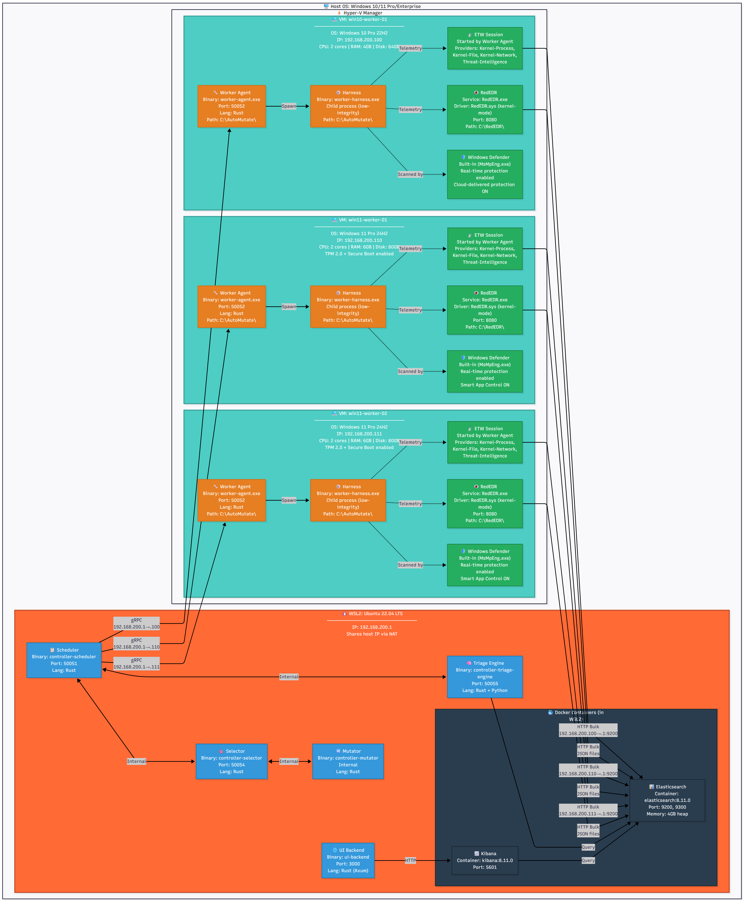
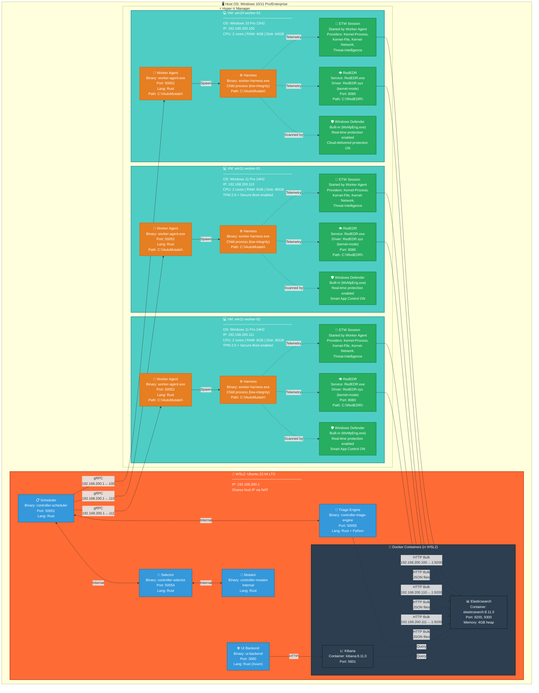
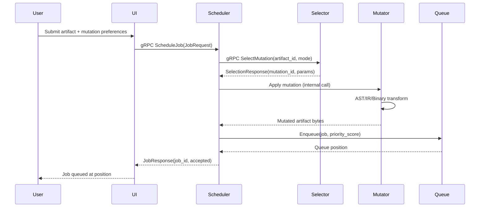
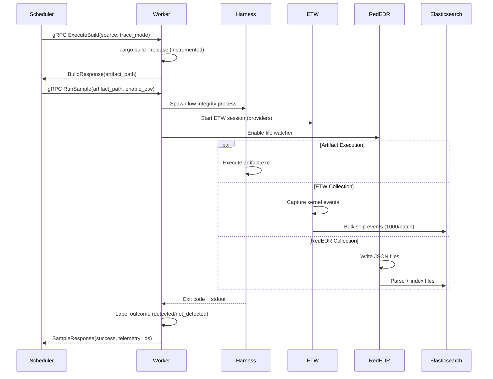
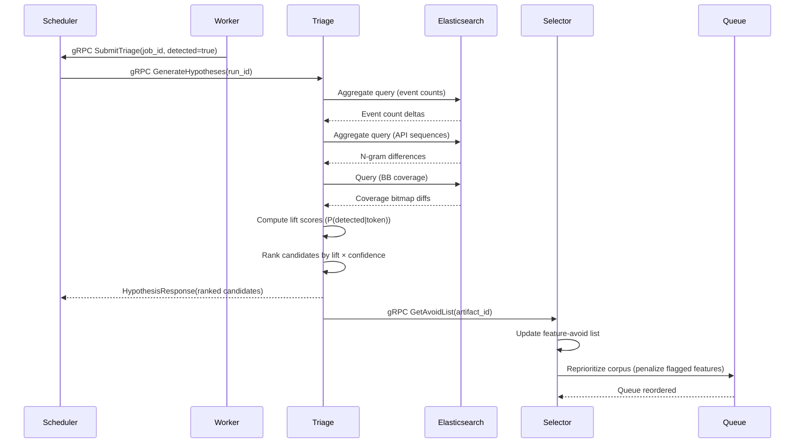
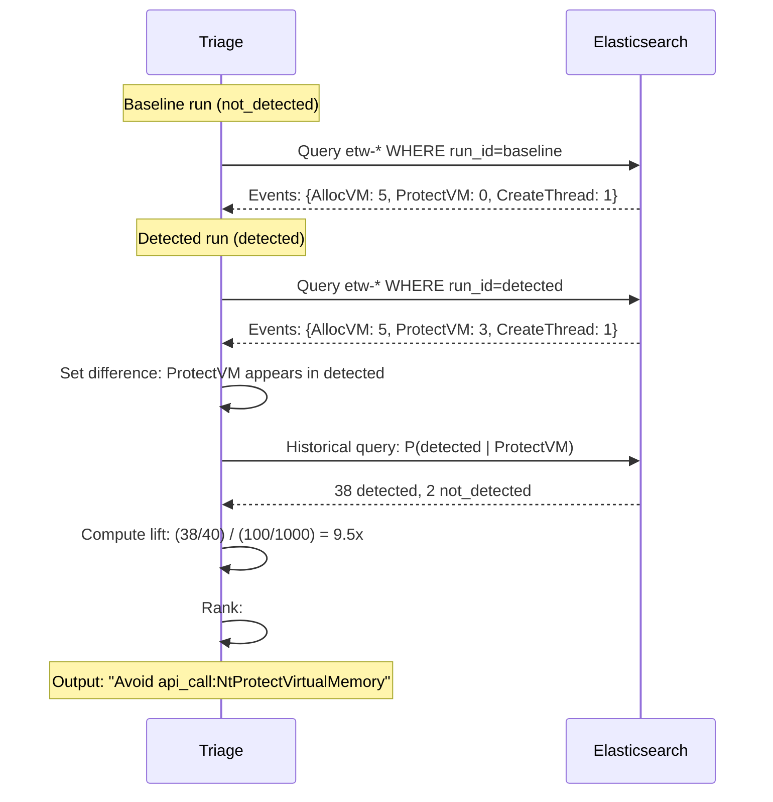

# AutoMutate++ Architecture Diagram

Complete system architecture with API endpoints, communication flows, and component descriptions.

---

## Global Pipeline Overview

```mermaid
graph TB
    subgraph "Control Plane (WSL2 - Linux)"
        UI[UI Backend<br/>:3000<br/>────────<br/>Web dashboard for<br/>experiment management<br/>and result visualization]

        SCHED[Scheduler<br/>:50051<br/>────────<br/>Job orchestration,<br/>queue management,<br/>worker coordination]

        SEL[Selector<br/>:50054<br/>────────<br/>Mutation selection<br/>using coverage + evasion<br/>scoring (WINNIE-inspired)]

        MUT[Mutator<br/>Internal<br/>────────<br/>AST/IR/Binary<br/>transformations,<br/>artifact generation]

        TRIAGE[Triage Engine<br/>:50055<br/>────────<br/>Surrogate ML models,<br/>differential analysis,<br/>hypothesis generation]

        QUEUE[Queue Manager<br/>Internal<br/>────────<br/>Corpus prioritization,<br/>exploration/exploitation<br/>queue management]
    end

    subgraph "Worker Pool (Hyper-V - Windows VMs)"
        W1[Worker Agent<br/>:50052<br/>────────<br/>Artifact execution,<br/>telemetry streaming,<br/>snapshot management]

        W2[Worker Agent<br/>:50053<br/>────────<br/>Parallel execution,<br/>isolated sandbox,<br/>health monitoring]

        HARNESS[Harness<br/>Child Process<br/>────────<br/>Low-integrity sandbox,<br/>process monitoring,<br/>timeout enforcement]

        MON[Monitor<br/>Internal<br/>────────<br/>Labels outcomes:<br/>detected/not_detected<br/>noisy/crashed]
    end

    subgraph "Telemetry Layer (Windows)"
        ETW[ETW Collector<br/>Real-time<br/>────────<br/>Kernel events:<br/>Process, File, Network,<br/>Thread, Memory]

        REDEDR[RedEDR<br/>:8080<br/>────────<br/>Kernel-mode telemetry,<br/>driver callbacks,<br/>event enrichment]

        DEFENDER[Windows Defender<br/>API Polling<br/>────────<br/>Scan-time alerts,<br/>runtime detections,<br/>quarantine events]

        EVTLOG[Event Log Collector<br/>WMI/WEVT<br/>────────<br/>Security, System,<br/>Application, Defender<br/>Operational logs]

        API_TRACE[API Tracer<br/>Thread-aware<br/>────────<br/>Per-thread call stacks,<br/>argument hashing,<br/>return value capture]

        BB_COV[BB Coverage<br/>AFL-style<br/>────────<br/>64KB bitmap,<br/>edge coverage,<br/>novelty detection]
    end

    subgraph "Storage Layer (WSL2 - Docker)"
        ES[(Elasticsearch<br/>:9200<br/>────────<br/>Time-series indices:<br/>etw-*, rededr-*,<br/>runs-*, coverage-*)]

        KIBANA[Kibana<br/>:5601<br/>────────<br/>Dashboard queries,<br/>rule export/import,<br/>visualization]
    end

    subgraph "Build Layer (Controller)"
        EMITTER[Build Emitter<br/>Internal<br/>────────<br/>Deterministic builds,<br/>instrumentation injection,<br/>--trace flag support]
    end

    %% Control flow
    UI -->|HTTP REST| SCHED
    SCHED -->|gRPC| SEL
    SEL -->|Request mutation| MUT
    MUT -->|AST/IR transform| EMITTER
    EMITTER -->|Binary artifact| QUEUE
    QUEUE -->|Prioritized job| SCHED
    SCHED -->|gRPC ExecuteBuild| W1
    SCHED -->|gRPC ExecuteBuild| W2
    W1 -->|Spawn| HARNESS
    W2 -->|Spawn| HARNESS
    HARNESS -->|Execute artifact| MON
    MON -->|Outcome label| W1

    %% Telemetry flow
    HARNESS -.->|ETW events| ETW
    HARNESS -.->|RedEDR JSON| REDEDR
    HARNESS -.->|Defender alerts| DEFENDER
    HARNESS -.->|Event logs| EVTLOG
    HARNESS -.->|API calls| API_TRACE
    HARNESS -.->|BB IDs| BB_COV

    ETW -->|Bulk ship| ES
    REDEDR -->|JSON files| ES
    DEFENDER -->|Alert records| ES
    EVTLOG -->|Event records| ES
    API_TRACE -->|Newline JSON| ES
    BB_COV -->|Base64 bitmap| ES

    %% Triage flow
    W1 -->|gRPC SubmitTriage| TRIAGE
    W2 -->|gRPC SubmitTriage| TRIAGE
    TRIAGE -->|Query telemetry| ES
    TRIAGE -->|Feature-avoid list| SEL

    %% Query flow
    UI -->|HTTP| KIBANA
    KIBANA -->|Query| ES
    TRIAGE -->|Aggregate queries| ES

    %% Styling
    classDef controller fill:#4A90E2,stroke:#2E5C8A,stroke-width:2px,color:#fff
    classDef worker fill:#E67E22,stroke:#A04000,stroke-width:2px,color:#fff
    classDef telemetry fill:#27AE60,stroke:#1E8449,stroke-width:2px,color:#fff
    classDef storage fill:#8E44AD,stroke:#6C3483,stroke-width:2px,color:#fff
    classDef build fill:#E74C3C,stroke:#C0392B,stroke-width:2px,color:#fff

    class UI,SCHED,SEL,MUT,TRIAGE,QUEUE controller
    class W1,W2,HARNESS,MON worker
    class ETW,REDEDR,DEFENDER,EVTLOG,API_TRACE,BB_COV telemetry
    class ES,KIBANA storage
    class EMITTER build
```

---

## Physical Deployment Architecture

This diagram shows the actual operating systems, VMs, and where each component runs.





### Deployment Summary

| Layer | Environment | OS | IP Address | Components |
|-------|-------------|----|-----------:|------------|
| **Host** | Physical machine | Windows 10/11 Pro | N/A | Hyper-V Manager, WSL2 host |
| **Control Plane** | WSL2 Ubuntu | Linux (Ubuntu 22.04) | 192.168.200.1 | Scheduler, Selector, Mutator, Triage, UI, Elasticsearch (Docker), Kibana (Docker) |
| **Worker 1** | Hyper-V VM | Windows 10 Pro 22H2 | 192.168.200.100 | Worker Agent, Harness, RedEDR, Defender, ETW |
| **Worker 2** | Hyper-V VM | Windows 11 Pro 24H2 | 192.168.200.110 | Worker Agent, Harness, RedEDR, Defender, ETW |
| **Worker 3** | Hyper-V VM | Windows 11 Pro 24H2 | 192.168.200.111 | Worker Agent, Harness, RedEDR, Defender, ETW |

### Component Distribution

#### WSL2 Ubuntu (Controller - All Native Binaries)

**Location**: `~/automutate/target/release/`

| Binary | Language | Purpose | Config |
|--------|----------|---------|--------|
| `controller-scheduler` | Rust | Job orchestration | `~/automutate/config/controller.toml` |
| `controller-selector` | Rust | Mutation selection | Same config file |
| `controller-mutator` | Rust | Code transformation | Same config file |
| `controller-triage-engine` | Rust + Python | Hypothesis generation | Same config file |
| `ui-backend` | Rust (Axum) | Web dashboard | Same config file |

**Docker Containers** (started via docker-compose):

| Container | Image | Purpose | Port Mapping |
|-----------|-------|---------|--------------|
| `automutate-elasticsearch` | elasticsearch:8.11.0 | Telemetry storage | 9200→9200, 9300→9300 |
| `automutate-kibana` | kibana:8.11.0 | Visualization UI | 5601→5601 |

**File Paths**:
```bash
~/automutate/
├── config/
│   └── controller.toml          # Controller configuration
├── target/release/
│   ├── controller-scheduler     # gRPC server (:50051)
│   ├── controller-selector      # gRPC server (:50054)
│   ├── controller-mutator       # Internal library
│   ├── controller-triage-engine # gRPC server (:50055)
│   └── ui-backend               # HTTP server (:3000)
└── docker-compose.yml           # Elasticsearch + Kibana
```

#### Windows VMs (Workers - All Native .exe)

**Location**: `C:\AutoMutate\`

| Binary | Language | Purpose | Config |
|--------|----------|---------|--------|
| `worker-agent.exe` | Rust | Artifact executor | `C:\AutoMutate\worker.toml` |
| `worker-harness.exe` | Rust | Sandbox harness | Same config file |

**System Services** (Windows built-in):

| Service | Type | Purpose | Control |
|---------|------|---------|---------|
| RedEDR.exe | User-mode service | Telemetry API server | `sc start RedEDR` |
| RedEDR.sys | Kernel driver | Kernel callbacks | Loaded at boot |
| MsMpEng.exe | Windows Defender | Real-time protection | Services.msc |

**File Paths**:
```powershell
C:\AutoMutate\
├── worker.toml              # Worker configuration
├── worker-agent.exe         # gRPC server (:50052)
├── worker-harness.exe       # Child process (spawned)
├── artifacts\               # Generated binaries
├── results\                 # Run outputs
├── traces\                  # API trace logs
├── coverage\                # BB coverage bitmaps
└── logs\                    # Worker logs

C:\RedEDR\
├── RedEDR.exe               # Service binary
├── RedEDR.sys               # Kernel driver
├── Data\                    # JSON telemetry files
│   ├── process-*.json
│   ├── file-*.json
│   └── network-*.json
└── Config\                  # RedEDR config
```

### Network Architecture

```
┌──────────────────────────────────────────────────────────────┐
│ Physical Host: Windows 10/11 Pro                             │
│ IP: External (e.g., 192.168.1.100 on home network)          │
└─┬────────────────────────────────────────────────────────────┘
  │
  ├─────────────────────────────────────────────────────────────┐
  │ WSL2 Ubuntu (NAT Bridge)                                    │
  │ IP: 192.168.200.1 (IsolationSwitch)                        │
  │ ┌─────────────────────────────────────────────────────────┐ │
  │ │ Controller Binaries (native Linux)                      │ │
  │ │  - Scheduler     :50051                                 │ │
  │ │  - Selector      :50054                                 │ │
  │ │  - Triage        :50055                                 │ │
  │ │  - UI Backend    :3000                                  │ │
  │ └─────────────────────────────────────────────────────────┘ │
  │ ┌─────────────────────────────────────────────────────────┐ │
  │ │ Docker Containers                                       │ │
  │ │  - Elasticsearch :9200                                  │ │
  │ │  - Kibana        :5601                                  │ │
  │ └─────────────────────────────────────────────────────────┘ │
  └─────────────────────────────────────────────────────────────┘
  │
  ├─────────────────────────────────────────────────────────────┐
  │ Hyper-V VM: win10-worker-01                                │
  │ IP: 192.168.200.100                                        │
  │ ┌─────────────────────────────────────────────────────────┐ │
  │ │ worker-agent.exe      :50052                            │ │
  │ │ worker-harness.exe    (child process)                   │ │
  │ │ RedEDR.exe            :8080                             │ │
  │ │ RedEDR.sys            (kernel driver)                   │ │
  │ │ Windows Defender      (built-in)                        │ │
  │ │ ETW Session           (started by agent)                │ │
  │ └─────────────────────────────────────────────────────────┘ │
  └─────────────────────────────────────────────────────────────┘
  │
  ├─────────────────────────────────────────────────────────────┐
  │ Hyper-V VM: win11-worker-01                                │
  │ IP: 192.168.200.110                                        │
  │ (Same components as win10-worker-01)                       │
  └─────────────────────────────────────────────────────────────┘
  │
  └─────────────────────────────────────────────────────────────┐
    │ Hyper-V VM: win11-worker-02                                │
    │ IP: 192.168.200.111                                        │
    │ (Same components as win10-worker-01)                       │
    └─────────────────────────────────────────────────────────────┘
```

**Firewall Rules** (IsolationSwitch):
- ✅ Workers → Controller (192.168.200.1:50051) - ALLOW gRPC
- ✅ Workers → Elasticsearch (192.168.200.1:9200) - ALLOW HTTP
- ❌ Workers → Workers - DENY (isolation)
- ❌ Workers → Internet - DENY (block_internet: true in worker.toml)
- ✅ Controller → Workers (any:50052, any:50053) - ALLOW gRPC
- ✅ Controller → Workers (any:8080) - ALLOW HTTP (RedEDR API)

### Hardware Requirements

#### Host Machine

| Component | Minimum | Recommended | Purpose |
|-----------|---------|-------------|---------|
| **CPU** | Intel i5/i7 or AMD Ryzen 5/7 | Intel i7/i9 or AMD Ryzen 7/9 | Parallel VM execution |
| **Cores** | 8 cores | 12+ cores | 2 cores/VM × 3 VMs + 2 for host |
| **RAM** | 32 GB | 64 GB | 6GB/VM × 3 VMs + 4GB Elastic + 10GB host |
| **Storage** | 500 GB SSD | 1 TB NVMe SSD | VHD snapshots (~60GB/VM) |
| **OS** | Windows 10/11 Pro | Windows 11 Pro | Hyper-V support |
| **Virtualization** | VT-x/AMD-V enabled | VT-x/AMD-V + SLAT | Hyper-V requirement |

#### Per-VM Requirements

**Windows 10 Worker**:
- CPU: 2 cores
- RAM: 4 GB
- Disk: 64 GB (dynamic VHD)
- OS: Windows 10 Pro 22H2 (build 19045)

**Windows 11 Worker**:
- CPU: 2 cores
- RAM: 6 GB
- Disk: 80 GB (dynamic VHD)
- OS: Windows 11 Pro 24H2 (build 26100)
- TPM: 2.0 (virtual TPM)
- Secure Boot: Enabled

### Software Dependencies

#### WSL2 Ubuntu

**Installed via `automation/scripts/02-wsl-bootstrap.sh`**:
```bash
# System packages
build-essential
curl
git
unzip
jq
ca-certificates
gnupg
lsb-release
docker-compose

# Rust toolchain
rustc 1.75.0 (stable)
cargo
rustup

# Protobuf compiler
protoc 25.1

# Docker containers
elasticsearch:8.11.0
kibana:8.11.0
```

#### Windows VMs

**Installed via `automation/scripts/04-vm-init.ps1`**:
```powershell
# Build tools
Rust (stable toolchain, MSVC target)
Visual Studio Build Tools 2022
Windows SDK 10.0.22621.0

# System components
.NET Framework 4.8
PowerShell 7.x

# Telemetry
RedEDR (custom - built from source)
Windows Defender (built-in, enabled)

# Project binaries
worker-agent.exe
worker-harness.exe
```

### Deployment Paths

**Automated setup** (via `automation/setup-all.ps1`):
```
Step 1: Host setup (01-host-setup.ps1)
  → Enable Hyper-V
  → Create IsolationSwitch
  → Configure firewall

Step 2: WSL2 bootstrap (02-wsl-bootstrap.sh)
  → Install Rust, protoc
  → Build Controller binaries
  → Start Elasticsearch + Kibana

Step 3: Create Worker VMs (03-create-worker-vm.ps1)
  → Create VHD from ISO
  → Configure VM (CPU, RAM, network)
  → Attach to IsolationSwitch

Step 4: VM initialization (04-vm-init.ps1)
  → Install Rust toolchain
  → Build Worker binaries
  → Install RedEDR
  → Configure Windows Defender

Step 5: Create baseline snapshot (05-create-baseline.ps1)
  → Checkpoint VM state
  → Save clean baseline for revert
```

**Result**: Fully functional lab environment ready for mutation experiments.

---

## API Specifications

### Controller APIs (gRPC)

#### 1. Scheduler (:50051)

```protobuf
service Controller {
  // Submit artifact for mutation and execution
  rpc ScheduleJob(JobRequest) returns (JobResponse);

  // Check job status
  rpc GetJobStatus(JobStatusRequest) returns (JobStatusResponse);

  // Submit triage result
  rpc SubmitTriage(TriageRequest) returns (TriageResponse);

  // Query historical results
  rpc QueryResults(QueryRequest) returns (QueryResponse);
}

message JobRequest {
  string name = 1;              // Job identifier
  bytes artifact_source = 2;     // Source code or binary
  string language = 3;           // "c", "rust", "asm", etc.
  repeated string mutations = 4; // Mutation IDs to apply
  map<string, string> metadata = 5;
}

message JobResponse {
  string job_id = 1;
  bool accepted = 2;
  string message = 3;
  int64 estimated_duration_seconds = 4;
}

message JobStatusResponse {
  string job_id = 1;
  string status = 2;             // "queued", "building", "running", "completed"
  int32 progress_percent = 3;
  string current_phase = 4;
  repeated string logs = 5;
}

message TriageRequest {
  string job_id = 1;
  bool detected = 2;
  int64 detection_latency_ms = 3;
  repeated string telemetry_ids = 4;
}

message TriageResponse {
  string job_id = 1;
  bool stored = 2;
  string triage_id = 3;
}
```

#### 2. Selector (:50054)

```protobuf
service Selector {
  // Request next mutation to apply
  rpc SelectMutation(SelectionRequest) returns (SelectionResponse);

  // Update mutation effectiveness
  rpc UpdateFeedback(FeedbackRequest) returns (FeedbackResponse);
}

message SelectionRequest {
  string artifact_id = 1;
  repeated string avoid_features = 2; // From triage engine
  string mode = 3;                    // "exploration" or "exploitation"
}

message SelectionResponse {
  string mutation_id = 1;
  map<string, string> mutation_params = 2;
  double priority_score = 3;
}

message FeedbackRequest {
  string mutation_id = 1;
  bool detected = 2;
  int32 new_bb_count = 3;             // Coverage gain
  double jaccard_similarity = 4;      // Behavioral similarity
}
```

#### 3. Triage Engine (:50055)

```protobuf
service TriageEngine {
  // Generate hypotheses for detected run
  rpc GenerateHypotheses(HypothesisRequest) returns (HypothesisResponse);

  // Perform differential analysis
  rpc DifferentialAnalysis(DiffRequest) returns (DiffResponse);

  // Export feature-avoid list for selector
  rpc GetAvoidList(AvoidListRequest) returns (AvoidListResponse);
}

message HypothesisRequest {
  string run_id = 1;
  string artifact_id = 2;
  int32 max_hypotheses = 3;
}

message HypothesisResponse {
  repeated Hypothesis hypotheses = 1;
  double confidence_threshold = 2;
}

message Hypothesis {
  int32 rank = 1;
  string description = 2;
  repeated string evidence_fields = 3;
  double confidence = 4;
  repeated string recommendations = 5; // "Avoid X", "Seek Y"
}

message DiffRequest {
  string baseline_run_id = 1;
  string detected_run_id = 2;
  repeated string layers = 3; // ["event_counts", "api_sequences", "bb_coverage"]
}

message DiffResponse {
  repeated DiffCandidate candidates = 1;
}

message DiffCandidate {
  int32 rank = 1;
  string token = 2;                   // "api_sequence:Write→Protect"
  double lift = 3;                    // P(detected|T) / P(detected)
  double confidence = 4;
  int32 support = 5;                  // Observation count
  string recommendation = 6;
}
```

#### 4. UI Backend (:3000)

```http
# REST API (HTTP/JSON)

# Get dashboard summary
GET /api/dashboard
Response: {
  "active_jobs": 5,
  "completed_runs": 1234,
  "evasion_rate": 0.42,
  "avg_coverage": 0.78,
  "recent_hypotheses": [...]
}

# Submit new job
POST /api/jobs
Request: {
  "artifact": "base64-encoded-source",
  "language": "c",
  "mutations": ["ast.import_reshape", "beh.preamble.fs"]
}

# Get job status
GET /api/jobs/{job_id}

# Query triage reports
GET /api/triage?artifact_id=sha256&confidence_min=0.7

# Export Sigma/KQL rules
GET /api/rules/export?format=sigma
```

---

### Worker APIs (gRPC)

#### Worker Agent (:50052, :50053, ...)

```protobuf
service WorkerAgent {
  // Build artifact with instrumentation
  rpc ExecuteBuild(BuildRequest) returns (BuildResponse);

  // Run artifact in sandbox
  rpc RunSample(SampleRequest) returns (SampleResponse);

  // Health check
  rpc HealthCheck(HealthRequest) returns (HealthResponse);

  // Stream telemetry to Controller
  rpc StreamTelemetry(stream TelemetryData) returns (TelemetryAck);
}

message BuildRequest {
  string job_id = 1;
  bytes source_code = 2;
  string language = 3;
  string trace_mode = 4;              // "off", "api", "bb", "api+bb", "lines"
  map<string, string> build_flags = 5;
}

message BuildResponse {
  string job_id = 1;
  bool success = 2;
  string artifact_path = 3;
  string error_message = 4;
  int64 build_time_ms = 5;
}

message SampleRequest {
  string job_id = 1;
  string artifact_path = 2;
  bool enable_etw = 3;
  bool enable_rededr = 4;
  int32 timeout_seconds = 5;
}

message SampleResponse {
  string job_id = 1;
  bool success = 2;
  int32 exit_code = 3;
  string output = 4;
  repeated string telemetry_ids = 5;  // Elasticsearch document IDs
}

message HealthResponse {
  string worker_id = 1;
  bool healthy = 2;
  int32 cpu_percent = 3;
  int32 memory_percent = 4;
  int32 active_jobs = 5;
}

message TelemetryData {
  string job_id = 1;
  string run_id = 2;
  string provider = 3;                // "etw", "rededr", "defender"
  int64 timestamp_us = 4;
  map<string, string> fields = 5;
}
```

---

### Telemetry APIs

#### RedEDR (:8080)

```http
# REST API (HTTP/JSON)

# Get process tree for run
GET /api/processes?run_id={run_id}

# Get file events
GET /api/events/file?pid={pid}&start_time={ts}

# Get registry events
GET /api/events/registry?pid={pid}

# Health check
GET /api/health
```

**RedEDR also writes JSON files**:
```bash
C:\RedEDR\Data\
├── process-{pid}-{timestamp}.json    # Process creation events
├── file-{pid}-{timestamp}.json       # File operations
├── network-{pid}-{timestamp}.json    # Network connections
└── registry-{pid}-{timestamp}.json   # Registry modifications
```

#### Windows Defender (API Polling)

**PowerShell API** (polled by Worker Agent):
```powershell
# Get recent detections
Get-MpThreatDetection -TimeSpan (New-TimeSpan -Hours 1)

# Get threat catalog
Get-MpThreat

# Get scan history
Get-MpComputerStatus
```

**Output format** (converted to JSON):
```json
{
  "threat_id": "2147735503",
  "threat_name": "Trojan:Win32/Wacatac.B!ml",
  "severity": "Severe",
  "detection_time": "2025-01-14T12:34:56Z",
  "resources": ["C:\\AutoMutate\\runs\\artifact-abc123.exe"],
  "action_taken": "Quarantine"
}
```

---

### Storage APIs

#### Elasticsearch (:9200)

```http
# REST API (HTTP/JSON)

# Index telemetry event
POST /etw-2025.01.14/_doc
{
  "run_id": "uuid",
  "artifact_id": "sha256",
  "provider": "Microsoft-Windows-Kernel-Process",
  "event_id": 1,
  "timestamp": "2025-01-14T12:34:56.789Z",
  "pid": 1234,
  "image": "C:\\artifact.exe",
  "command_line": "artifact.exe --test"
}

# Bulk insert (used by Collector)
POST /_bulk
{ "index": { "_index": "etw-2025.01.14" } }
{ "run_id": "uuid", ... }
{ "index": { "_index": "etw-2025.01.14" } }
{ "run_id": "uuid", ... }

# Search for detected runs
GET /runs-*/_search
{
  "query": {
    "bool": {
      "must": [
        { "term": { "status": "detected" } },
        { "range": { "detection_latency_ms": { "lt": 5000 } } }
      ]
    }
  },
  "aggs": {
    "by_artifact": {
      "terms": { "field": "artifact_id" }
    }
  }
}

# Differential analysis query
GET /etw-*/_search
{
  "query": {
    "bool": {
      "should": [
        { "term": { "run_id": "baseline-uuid" } },
        { "term": { "run_id": "detected-uuid" } }
      ]
    }
  },
  "aggs": {
    "by_run": {
      "terms": { "field": "run_id" },
      "aggs": {
        "api_calls": {
          "terms": { "field": "event_name.keyword", "size": 100 }
        }
      }
    }
  }
}
```

**Index Patterns**:
- `etw-YYYY.MM.DD` - ETW events (time-series)
- `rededr-YYYY.MM.DD` - RedEDR events (time-series)
- `runs-YYYY.MM.DD` - Run results (time-series)
- `coverage-YYYY.MM.DD` - BB coverage bitmaps (time-series)
- `api-trace-YYYY.MM.DD` - Thread-aware API traces (time-series)
- `last-events-*` - Death-bed telemetry (ring buffer snapshots)

#### Kibana (:5601)

```http
# REST API (HTTP/JSON)

# Get saved dashboards
GET /api/saved_objects/_find?type=dashboard

# Export dashboard
GET /api/kibana/dashboards/export?dashboard={id}

# Import dashboard
POST /api/kibana/dashboards/import

# Query via KQL
POST /api/console/proxy?path=/runs-*/_search&method=POST
{
  "query": {
    "query_string": {
      "query": "status:detected AND detection_latency_ms:<5000"
    }
  }
}
```

---

## Communication Flows

### 1. Job Submission Flow



### 2. Artifact Execution Flow



### 3. Triage & Feedback Flow



### 4. Differential Analysis Flow



---

## Component Descriptions (Detailed)

### Control Plane Components

#### UI Backend (:3000)
**Purpose**: Web dashboard for experiment management
**Tech**: Axum (Rust async HTTP framework)
**Responsibilities**:
- Job submission form
- Real-time job status updates (WebSocket)
- Triage hypothesis visualization
- Rule export (Sigma, KQL, YARA)
- Historical run queries

#### Scheduler (:50051)
**Purpose**: Central orchestrator for job lifecycle
**Tech**: Tonic (Rust gRPC)
**Responsibilities**:
- Accept job requests from UI/CLI
- Coordinate with Selector for mutation selection
- Dispatch jobs to Worker pool
- Track job state (queued → building → running → completed)
- Aggregate triage results

#### Selector (:50054)
**Purpose**: Intelligent mutation selection (fuzzer brain)
**Tech**: Tonic (Rust gRPC)
**Responsibilities**:
- Multi-signal scoring: `score = coverage_gain×1.5 + evasion×3.0 - similarity×0.5`
- Maintain exploration/exploitation queues
- Apply feature-avoid lists from Triage Engine
- Prioritize novel mutations (Jaccard distance)

#### Mutator (Internal)
**Purpose**: Code transformation engine
**Tech**: Rust (syn for AST, LLVM for IR, custom for binary)
**Responsibilities**:
- **AST transforms**: Control-flow jitter, opaque predicates, constant encoding
- **IR transforms**: Import reshaping, API indirection
- **Binary transforms**: Splicing, shellcode re-encoding
- **Behavioral**: Benign preambles, staged execution wrappers

#### Triage Engine (:50055)
**Purpose**: Explainable detection analysis
**Tech**: Rust + Python (scikit-learn for ML)
**Responsibilities**:
- Train surrogate models (logistic regression, random forest)
- Feature importance extraction (SHAP values)
- Differential analysis (5 layers: event counts, API sequences, BB coverage, line-trace, arguments)
- Hypothesis ranking (lift-based: `P(detected|token) / P(detected)`)
- Generate feature-avoid lists

#### Queue Manager (Internal)
**Purpose**: Corpus prioritization
**Tech**: Rust (priority queue)
**Responsibilities**:
- Maintain separate queues for exploration vs. exploitation
- Novelty detection (Jaccard distance threshold)
- Max corpus size enforcement (10,000 entries)
- Deduplication (artifact SHA256 hashing)

---

### Worker Pool Components

#### Worker Agent (:50052, :50053, ...)
**Purpose**: Artifact executor on Windows VMs
**Tech**: Rust (tokio for async gRPC)
**Responsibilities**:
- Build artifacts with instrumentation
- Spawn harness in low-integrity sandbox
- Stream telemetry to Elasticsearch
- Health monitoring (CPU, memory, disk)
- Snapshot revert coordination

#### Harness (Child Process)
**Purpose**: Isolated artifact execution sandbox
**Tech**: Rust (Windows Job Object API)
**Responsibilities**:
- Set low-integrity level (IL_LOW)
- Apply process mitigation policies (DEP, ASLR, CFG)
- Monitor child processes (max depth: 3)
- Enforce timeout (120s default)
- Cleanup temp files post-execution

#### Monitor (Internal)
**Purpose**: Outcome labeling
**Tech**: Rust
**Responsibilities**:
- Label runs: `detected | not_detected | noisy | crashed`
- Compute detection latency (artifact start → EDR kill)
- Detect noise (multiple conflicting Defender alerts)
- Crash detection (exit code analysis)

---

### Telemetry Layer Components

#### ETW Collector (Real-time)
**Purpose**: Kernel event capture via Event Tracing for Windows
**Tech**: Rust (windows-rs bindings)
**Providers**:
- `Microsoft-Windows-Kernel-Process` - Process create/exit, image load
- `Microsoft-Windows-Kernel-File` - File open/read/write/delete
- `Microsoft-Windows-Kernel-Network` - TCP/UDP connect/send/receive
- `Microsoft-Windows-Threat-Intelligence` - ETWTI (image load from remote, map executable)

**Output**: Newline-delimited JSON → Elasticsearch bulk API

#### RedEDR (:8080)
**Purpose**: Kernel-mode telemetry with enrichment
**Tech**: C++ kernel driver + Rust user-mode service
**Capabilities**:
- Driver callbacks (ObRegisterCallbacks for process/thread)
- MiniFilter for file operations (FltRegisterFilter)
- Network filter (WFP/NDIS)
- Event correlation (parent→child process trees)

**Output**: JSON files in `C:\RedEDR\Data\` (watched by Collector)

#### Windows Defender (API Polling)
**Purpose**: Scan-time and runtime detection signals
**Tech**: PowerShell + Rust (COM interop)
**Polled APIs**:
- `Get-MpThreatDetection` (recent alerts)
- `Get-MpComputerStatus` (quarantine events)
- `Get-MpThreat` (threat catalog)

**Polling interval**: 500ms (configurable in worker.toml)

#### Event Log Collector (WMI/WEVT)
**Purpose**: Windows Event Log correlation
**Tech**: Rust (windows-rs WEVT API)
**Channels**:
- `Security` - Audit events (process creation 4688, logon 4624)
- `System` - Service start/stop, driver load
- `Application` - Application crashes
- `Microsoft-Windows-Windows Defender/Operational` - Defender detections

#### API Tracer (Thread-aware)
**Purpose**: Per-thread API call sequence capture
**Tech**: Rust (inline hooks or ETW-TI)
**Captured Data**:
- Thread ID, caller address, callee API
- Argument hashes (e.g., `flProtect=0x40` for VirtualAlloc)
- Return values (success/failure codes)
- Stack hashes (for call-stack topology)

**Output format** (newline JSON):
```json
{"ts_us":12345,"tid":5678,"ip":"0x401000","api":"NtAllocateVirtualMemory","args_hash":"a3f2b1","ret":"0x0"}
```

#### BB Coverage (AFL-style)
**Purpose**: Code coverage feedback for mutation selection
**Tech**: Instrumented binary (compile-time or LLVM pass)
**Method**:
- 64KB bitmap (2^16 edges via `(prev_bb << 1) ^ curr_bb`)
- Store as Base64 in Elasticsearch
- Compute Jaccard similarity: `J(A,B) = |A∩B| / |A∪B|`

**Integration**:
- Emitter injects BB ID writes at compile-time
- Harness reads bitmap from shared memory
- Selector uses new_bb_count for prioritization

---

### Storage Layer Components

#### Elasticsearch (:9200)
**Purpose**: Time-series telemetry store + query engine
**Tech**: Elasticsearch 8.11.0 (single-node cluster)
**Indices**:
- `etw-YYYY.MM.DD` - Daily ETW events (~1M docs/day)
- `rededr-YYYY.MM.DD` - RedEDR enriched events
- `runs-YYYY.MM.DD` - Run metadata (status, latency, labels)
- `coverage-YYYY.MM.DD` - BB coverage bitmaps (Base64)
- `api-trace-YYYY.MM.DD` - Thread-aware API traces
- `last-events-*` - Death-bed telemetry (ring buffer)

**Index Lifecycle Management**:
- Retention: 90 days (configurable in controller.toml)
- Max size: 50 GB per index
- Auto-rollover: Daily

#### Kibana (:5601)
**Purpose**: Dashboard UI + rule export
**Tech**: Kibana 8.11.0
**Features**:
- Pre-built dashboards (EDR Overview, Triage Hypotheses, Coverage Trends)
- KQL query interface
- Rule export (Sigma YAML, EQL, KQL)
- Visualization (timeline, heatmap, sankey for process trees)

---

### Build Layer Components

#### Build Emitter (Internal)
**Purpose**: Deterministic artifact compilation with instrumentation
**Tech**: Rust (calls cargo, clang, MSVC)
**Flags**:
- `--trace=off` - No instrumentation (validation mode)
- `--trace=api` - API tracing only
- `--trace=bb` - BB coverage only
- `--trace=api+bb` - Both (default for mutation loop)
- `--trace=lines` - Full line printing (baseline only, diagnostic)
- `--trace=lines-around-bb=123` - Targeted line instrumentation (narrowing)

**Output**: Deterministic binaries (pinned toolchain, reproducible builds)

---

## Data Flow Summary

### Telemetry Data Flow

```
Artifact Execution (Harness)
  ↓
  ├─→ ETW Events → Elasticsearch (etw-*)
  ├─→ RedEDR JSON → Elasticsearch (rededr-*)
  ├─→ Defender Alerts → Elasticsearch (runs-*)
  ├─→ Event Logs → Elasticsearch (etw-*)
  ├─→ API Traces → Elasticsearch (api-trace-*)
  └─→ BB Coverage → Elasticsearch (coverage-*)

Elasticsearch
  ↓
  ├─→ Kibana (visualization)
  ├─→ Triage Engine (differential analysis)
  └─→ Selector (feature-avoid lists)
```

### Control Flow

```
User → UI → Scheduler
            ↓
        Selector (choose mutation)
            ↓
        Mutator (transform code)
            ↓
        Emitter (build binary)
            ↓
        Queue (prioritize)
            ↓
        Worker (execute)
            ↓
        Monitor (label outcome)
            ↓
        Triage Engine (analyze)
            ↓
        Selector (update avoid-list)
            ↓
        [LOOP]
```

---

## Port Assignments

| Service | Port | Protocol | Purpose |
|---------|------|----------|---------|
| Controller Scheduler | 50051 | gRPC | Job orchestration |
| Selector | 50054 | gRPC | Mutation selection |
| Triage Engine | 50055 | gRPC | Hypothesis generation |
| UI Backend | 3000 | HTTP | Web dashboard |
| Elasticsearch | 9200 | HTTP | Document storage |
| Elasticsearch Transport | 9300 | TCP | Cluster communication |
| Kibana | 5601 | HTTP | Visualization UI |
| RedEDR API | 8080 | HTTP | Telemetry queries |
| Worker Agent 01 | 50052 | gRPC | Artifact execution |
| Worker Agent 02 | 50053 | gRPC | Artifact execution |
| Prometheus Metrics | 9090 | HTTP | Controller metrics |

---

## Network Topology

```
┌─────────────────────────────────────────────────────────────┐
│ IsolationSwitch (192.168.200.0/24)                          │
│                                                              │
│  ┌─────────────────────┐                                    │
│  │ Host Gateway        │ 192.168.200.1                      │
│  │ (WSL2 Bridge)       │                                    │
│  └──────────┬──────────┘                                    │
│             │                                                │
│  ┌──────────▼──────────┐                                    │
│  │ WSL2 Ubuntu         │ 192.168.200.1 (shared with host)   │
│  │ (Controller)        │                                    │
│  │  - Scheduler:50051  │                                    │
│  │  - Selector:50054   │                                    │
│  │  - Triage:50055     │                                    │
│  │  - UI:3000          │                                    │
│  │  - Elasticsearch    │                                    │
│  │  - Kibana           │                                    │
│  └─────────────────────┘                                    │
│                                                              │
│  ┌─────────────────────┐                                    │
│  │ win10-worker-01     │ 192.168.200.100                    │
│  │  - Agent:50052      │                                    │
│  │  - RedEDR:8080      │                                    │
│  └─────────────────────┘                                    │
│                                                              │
│  ┌─────────────────────┐                                    │
│  │ win11-worker-01     │ 192.168.200.110                    │
│  │  - Agent:50053      │                                    │
│  │  - RedEDR:8080      │                                    │
│  └─────────────────────┘                                    │
│                                                              │
│  ┌─────────────────────┐                                    │
│  │ win11-worker-02     │ 192.168.200.111                    │
│  │  - Agent:50053      │                                    │
│  │  - RedEDR:8080      │                                    │
│  └─────────────────────┘                                    │
│                                                              │
└─────────────────────────────────────────────────────────────┘
```

**Network Isolation**:
- Internal switch only (no external internet)
- DNS points to host gateway (192.168.200.1)
- Workers can reach Controller but not each other
- Firewall rules enforced in worker.toml (`allow_controller_only: true`)

---

## Key Design Patterns

### 1. Producer-Consumer (Telemetry)
- **Producers**: ETW, RedEDR, Defender, Event Logs, API Tracer
- **Queue**: Elasticsearch bulk API (buffer 100 events, 5s timeout)
- **Consumers**: Triage Engine, Kibana, Selector

### 2. Request-Reply (gRPC)
- **Synchronous**: UI → Scheduler, Scheduler → Worker
- **Timeout**: 300s per request (configurable)
- **Retry**: 3 attempts with exponential backoff (30s base)

### 3. Publish-Subscribe (Not Used)
- **Considered**: Redis pub/sub for real-time job updates
- **Rejected**: gRPC server streaming simpler for low volume (<100 jobs/hour)

### 4. Event Sourcing (Partial)
- **Events**: All run outcomes stored in Elasticsearch (immutable)
- **Replay**: Triage Engine can recompute hypotheses from historical events
- **Not full event sourcing**: Controller state not rebuilt from events

---

## Scalability Considerations

### Vertical Scaling (Current)
- Single Controller instance (WSL2)
- 2-3 Worker VMs (Hyper-V)
- Single Elasticsearch node (4 GB heap)

### Horizontal Scaling (Future)
- **Controller**: Stateless (can run multiple schedulers behind load balancer)
- **Workers**: Add more Hyper-V VMs (modify automation/config.yaml)
- **Elasticsearch**: Cluster with 3+ nodes (modify docker-compose.yml)
- **Bottleneck**: Triage Engine (CPU-bound ML inference) - could use GPU acceleration

---

**See Also**:
- [automation/README.md](automation/README.md) - Deployment guide
- [CLAUDE.md](CLAUDE.md) - Full project specification
- [MIGRATION_GUIDE.md](MIGRATION_GUIDE.md) - Config migration details

**Last Updated**: 2025-01-14
