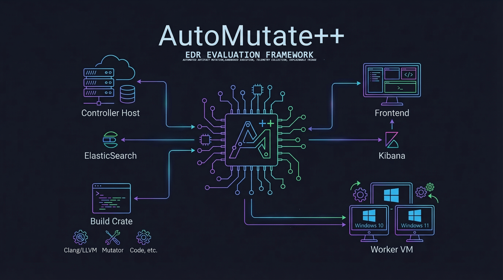
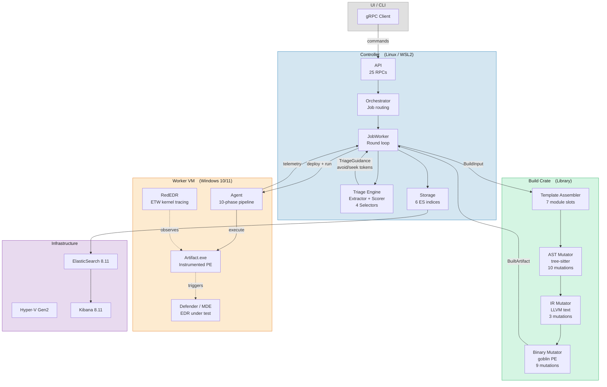
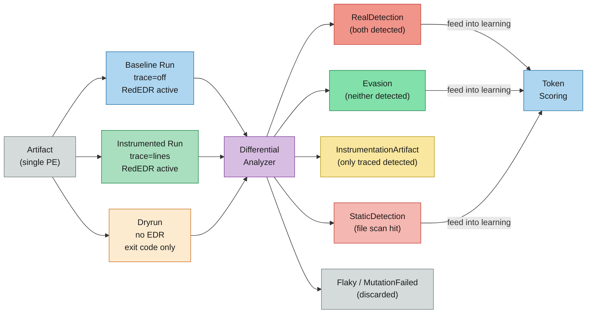

<!-- Improved compatibility of back to top link: See: https://github.com/othneildrew/Best-README-Template/pull/73 -->
<a id="readme-top"></a>

<!-- PROJECT SHIELDS -->
[![Contributors][contributors-shield]][contributors-url]
[![Forks][forks-shield]][forks-url]
[![Stargazers][stars-shield]][stars-url]
[![Issues][issues-shield]][issues-url]
[![GPLv3 License][license-shield]][license-url]
[![LinkedIn][linkedin-shield]][linkedin-url]

<!-- PROJECT LOGO -->
<br />
<div align="center">
  <a href="https://github.com/2Tricky4u/Automated-Analysis-and-Mutation-of-Software-Artifacts-against-AV-EDR">
    
  </a>

<h3 align="center">AutoMutate++</h3>

  <p align="center">
    Automated Analysis and Mutation of Software Artifacts against AV/EDR
    <br />
    <em>M.Sc. Cybersecurity Thesis &mdash; EPFL, 2026</em>
    <br />
    <br />
    <a href="https://github.com/2Tricky4u/Automated-Analysis-and-Mutation-of-Software-Artifacts-against-AV-EDR"><strong>Explore the docs</strong></a>
    <a href="https://github.com/2Tricky4u/Automated-Analysis-and-Mutation-of-Software-Artifacts-against-AV-EDR/blob/main/Automated_Analysis_and_Mutation_of_Software_Artifacts_against_EDR.pdf"><strong>Explore the report</strong></a>
    <br />
    <br />
    <a href="https://github.com/2Tricky4u/Automated-Analysis-and-Mutation-of-Software-Artifacts-against-AV-EDR/issues/new?labels=bug&template=bug-report---.md">Report Bug</a>
    &middot;
    <a href="https://github.com/2Tricky4u/Automated-Analysis-and-Mutation-of-Software-Artifacts-against-AV-EDR/issues/new?labels=enhancement&template=feature-request---.md">Request Feature</a>
  </p>
</div>

<!-- TABLE OF CONTENTS -->
<details>
  <summary>Table of Contents</summary>
  <ol>
    <li>
      <a href="#about-the-project">About The Project</a>
      <ul>
        <li><a href="#built-with">Built With</a></li>
      </ul>
    </li>
    <li>
      <a href="#architecture">Architecture</a>
      <ul>
        <li><a href="#system-overview">System Overview</a></li>
        <li><a href="#closed-experimental-loop">Closed Experimental Loop</a></li>
        <li><a href="#two-run-differential-protocol">Three-Run Differential Protocol</a></li>
        <li><a href="#mutation-engine">Mutation Engine</a></li>
        <li><a href="#triage-token-system">Triage Token System</a></li>
        <li><a href="#project-structure">Project Structure</a></li>
      </ul>
    </li>
    <li>
      <a href="#getting-started">Getting Started</a>
      <ul>
        <li><a href="#prerequisites">Prerequisites</a></li>
        <li><a href="#installation">Installation</a></li>
      </ul>
    </li>
    <li><a href="#usage">Usage</a></li>
    <li><a href="#roadmap">Roadmap</a></li>
    <li><a href="#documentation">Documentation</a></li>
    <li><a href="#license">License</a></li>
    <li><a href="#contact">Contact</a></li>
    <li><a href="#acknowledgments">Acknowledgments</a></li>
  </ol>
</details>

<!-- ABOUT THE PROJECT -->
## About The Project

<!-- TODO: Add a product screenshot or architecture diagram -->
<!-- [![AutoMutate++ Screenshot][product-screenshot]](https://github.com/2Tricky4u/Automated-Analysis-and-Mutation-of-Software-Artifacts-against-AV-EDR) -->

EDR systems employ layered detection mechanisms: static file analysis, behavioral monitoring, memory scanning, and ML classifiers. Making manual evaluation of *why* an artifact is detected a slow, opaque process. AutoMutate++ addresses this by implementing a **closed experimental loop**: mutate an artifact, execute it under monitoring, collect telemetry, extract normalized tokens, score tokens by correlation with detection, and use those scores to guide the next round of mutations. The system automates the entire cycle, trying to produce **explainable, evidence-driven hypotheses** about which observable behaviors trigger EDR detections.

**Goal:** Understand *why* EDR detections fire, not just *whether* they fire, enabling defenders to reason about detection blind spots and adversarial adaptation patterns.

**Key capabilities:**

- **Closed-loop automation:** Token-driven mutation selection replaces manual trial-and-error with evidence-guided iteration across build, execution, collection, and triage stages
- **Three-run differential protocol:** Each mutation round runs the same artifact under baseline, instrumented, and dryrun conditions to isolate real detections from instrumentation artifacts and carrier bugs
- **Multi-layer mutation engine:** Source-level (AST via tree-sitter), LLVM IR, binary (PE), and behavioral mutations applied in a deterministic pipeline
- **Explainability:** Ranked hypotheses with confidence scores (e.g., "RWX memory protection triggers detection with 0.95 lift") rather than black-box evasion results
- **Multi-EDR support:** Parallel evaluation across Windows Defender, MDE, and Cortex XDR on isolated Hyper-V VMs or Remote VMs.
- **Safety:** Lab-only experiments using non-operational, behaviorally faithful artifacts.

The loader template is based on the modular architecture from [SuperMega](https://github.com/dobin/SuperMega) by Dobin Rutishauser, adapted with pluggable gene modules (carrier, decoder, anti-emulation, guardrails, decoys) and extended with instrumentation support for line tracing, BB coverage, and API checkpoints.

<p align="right">(<a href="#readme-top">back to top</a>)</p>

### Built With

* [![Rust][Rust-badge]][Rust-url]
* [![Tokio][Tokio-badge]][Tokio-url]
* [![Tonic][Tonic-badge]][Tonic-url]
* [![Prost][Prost-badge]][Prost-url]
* [![LLVM][LLVM-badge]][LLVM-url]
* [![xwin][Xwin-badge]][Xwin-url]
* [![tree-sitter][TreeSitter-badge]][TreeSitter-url]
* [![iced][Iced-badge]][Iced-url]
* [![RedEDR][RedEDR-badge]][RedEDR-url]
* [![Elasticsearch][Elastic-badge]][Elastic-url]
* [![Kibana][Kibana-badge]][Kibana-url]
* [![PowerShell][PowerShell-badge]][PowerShell-url]
* [![Hyper-V][HyperV-badge]][HyperV-url]

<p align="right">(<a href="#readme-top">back to top</a>)</p>

<!-- ARCHITECTURE -->
## Architecture

### System Overview



<p align="right">(<a href="#readme-top">back to top</a>)</p>

### Closed Experimental Loop

Each **job** runs multiple **rounds**. Each round passes through 11 stages, with triage feedback closing the loop:

```mermaid
flowchart LR
    SELECT["SELECT\nMutation selection\n(Selector)"]
    BUILD["BUILD\nTemplate + encode\n+ AST/IR/Binary\n(Build crate)"]
    SCAN["SCAN\nStatic Defender\ncheck\n(Controller)"]
    DEPLOY["DEPLOY\nChunked gRPC\ntransfer\n(VMExecutor)"]
    EXECUTE["EXECUTE\nThree-run protocol\nbaseline+traced+dryrun\n(Worker Agent)"]
    COLLECT["COLLECT\nRedEDR + traces\n+ coverage\n(Telemetry)"]
    AGGREGATE["AGGREGATE\nDifferential\ncategory\n(RoundAgg)"]
    EXTRACT["EXTRACT\n9 token categories\n(Extractor)"]
    SCORE["SCORE\nLift x confidence\nper token\n(Scorer)"]
    GUIDE["GUIDE\nAvoid/seek\ntoken lists\n(TriageGuidance)"]

    SELECT --> BUILD --> SCAN --> DEPLOY --> EXECUTE --> COLLECT
    COLLECT --> AGGREGATE --> EXTRACT --> SCORE --> GUIDE
    GUIDE -->|"next round"| SELECT

    style SELECT fill:#aed6f1,stroke:#2471a3,color:#1a1a1a
    style BUILD fill:#a9dfbf,stroke:#1e8449,color:#1a1a1a
    style SCAN fill:#a9dfbf,stroke:#1e8449,color:#1a1a1a
    style DEPLOY fill:#f9e79f,stroke:#b7950b,color:#1a1a1a
    style EXECUTE fill:#f5cba7,stroke:#ca6f1e,color:#1a1a1a
    style COLLECT fill:#f5cba7,stroke:#ca6f1e,color:#1a1a1a
    style AGGREGATE fill:#f1948a,stroke:#c0392b,color:#1a1a1a
    style EXTRACT fill:#f1948a,stroke:#c0392b,color:#1a1a1a
    style SCORE fill:#d7bde2,stroke:#7d3c98,color:#1a1a1a
    style GUIDE fill:#d7bde2,stroke:#7d3c98,color:#1a1a1a
```



After each round, triage results feed back to the selector. The system converges on mutations that shift detection-correlated tokens toward evasion while maintaining artifact functionality.

<p align="right">(<a href="#readme-top">back to top</a>)</p>

### Three-Run Differential Protocol

Each mutation round executes the **same artifact** (identical mutations set, same args) three times: a baseline run (no instrumentation), an instrumented run (tracing enabled), and a dryrun on a clean VM without AV. Comparing the three outcomes isolates real detections from instrumentation artifacts and carrier bugs. Only baseline-consistent detections feed into the learning loop.



| Baseline | Instrumented | Dryrun | Category | Used for learning? |
|:--------:|:------------:|:------:|----------|:------------------:|
| Detected | Detected | Clean | `RealDetection` | Yes |
| Clean | Detected | Clean | `InstrumentationArtifact` | No |
| Detected | Clean | Clean | `Flaky` | No |
| Clean | Clean | Clean | `Evasion` | Yes |
| -- | -- | Crash | `MutationFailed` | No |
| File scan | -- | -- | `StaticDetection` | Yes |

<p align="right">(<a href="#readme-top">back to top</a>)</p>

### Mutation Engine

Mutations are applied across three layers, each with different trade-offs in expressiveness, persistence through compilation, and scope of effect:

| Layer | Phase | Engine | Count | Scope |
|-------|-------|--------|:-----:|-------|
| **AST** (Source) | Pre-compilation | tree-sitter C parser | 10 | Structural transforms, string encoding, API call insertion |
| **IR** (Intermediate) | Post-compile, pre-link | LLVM IR text manipulation | 3 | NOP insertion, opaque predicates, dead code blocks |
| **Binary** (PE) | Post-link | goblin PE parsing | 9 | Rich header, imports, resources, sections, entropy, timestamps |

**Selector Strategies:**

| Selector | Algorithm | Signal | Role |
|----------|-----------|--------|------|
| **CoverageSelector** | Epsilon-greedy (eps=0.3) | Evasion scores from round history | Exploitation with exploration (default) |
| **FuzzerSelector** | Genetic algorithm (tournament + crossover) | Evasion fitness | Evolutionary search |
| **TokenSelector** | Token-biased epsilon-greedy | Evasion scores + avoid/seek tokens | Token-driven exploitation |
| **RandomSelector** | Uniform random | None | Evaluation baseline |

Binary mutations (9) + 1 IR mutation are **always applied** (PE normalization). The 10 AST mutations are **explored** by the selector -- one selected per round based on strategy.

<p align="right">(<a href="#readme-top">back to top</a>)</p>

### Triage Token System

Raw telemetry is converted into **normalized triage tokens** -- deterministic, comparable identifiers that abstract over specific telemetry formats. Tokens are the unit of learning.

| # | Category | Example | Source |
|---|----------|---------|--------|
| 1 | Module | `module:carrier=peb_walk` | Build input |
| 2 | Mutation | `mutation:ast.string_xor:xor_key=0xBB` | Build input |
| 3 | API call | `api:VirtualProtect` | RedEDR ETW |
| 4 | API argument | `api_arg:VirtualProtect:flProtect=RWX` | RedEDR ETW |
| 5 | Sequence (2-gram) | `seq2:VirtualAlloc->memcpy` | RedEDR ETW |
| 6 | Image load | `image:ntdll.dll` | RedEDR ETW |
| 7 | ETW provider | `etw:Microsoft-Windows-Kernel-Process` | RedEDR ETW |
| 8 | ETW event | `etw_event:ProcessStart/1` | RedEDR ETW |
| 9 | Checkpoint | `checkpoint:Launching` | Artifact runtime |

**Scoring:**

```
lift(T)       = P(detected | T) / P(detected)
confidence(T) = min(1.0, observations / 5)
importance(T) = lift(T) x confidence(T)
```

| Category | Condition | Action |
|----------|-----------|--------|
| **Avoid** | `lift > 1.5 AND confidence > 0.3` | Selector penalizes mutations producing this token |
| **Seek** | `lift < 0.667 AND confidence > 0.3` | Selector favors mutations producing this token |

<p align="right">(<a href="#readme-top">back to top</a>)</p>

### Project Structure

```
.
├── controller/                  # Central orchestration
│   └── src/
│       ├── api/                 # gRPC boundary — RPCs, zero business logic
│       ├── dispatch/            # Orchestrator, JobWorker, RunPool, VMExecutor
│       ├── triage/              # Token extraction, scoring, 4 selector strategies
│       ├── storage/             # ElasticSearch — 6 index families
│       └── vm/                  # DashMap-backed target manager, bidi streams
├── build/                       # Artifact factory (library crate)
│   ├── src/                     # ArtifactBuilder, Assembler, Mutator, Instrumenter
│   ├── runtime/                 # C runtime libraries (minimal + instrumentation)
│   └── templates/               # Modular loader template + 7 module slots
├── worker/
│   └── agent/                   # Windows VM agent
│       └── src/
│           ├── execution/       # 10-phase pipeline, 7 verdicts
│           ├── telemetry/       # 6 sources (RedEDR, traces, coverage, checkpoints)
│           ├── api/             # gRPC thin adapters
│           └── session/         # Bidirectional stream lifecycle
├── proto/                       # gRPC definitions (5 services)
│   ├── common.proto             # Shared domain types
│   ├── controller.proto         # Controller inbound API
│   └── worker.proto             # Worker inbound API
├── config/                      # Shared configuration types (TOML)
├── common/                      # Shared Rust utilities
├── evaluation/                  # Evaluation framework
├── ui/
│   ├── backend/                 # Dashboard REST API
│   ├── frontend/                # Web frontend
│   └── kibana-dashboards/       # Kibana visualizations
├── automation/                  # Lab infrastructure scripts
│   ├── scripts/                 # PowerShell/Bash — setup, deploy, operate
│   ├── templates/               # TOML config templates
│   └── generated/               # Per-worker generated configs
├── telemetry/                   # RedEDR and ETW collection tools
└── docs/                        # Documentation and images
```

| Component | Crate | Role |
|-----------|-------|------|
| **Controller** | `scheduler` | gRPC server, orchestrator, job workers, triage engine, ES storage |
| **Build System** | `build` | Template assembly, encoding, AST/IR/binary mutations, instrumentation |
| **Worker Agent** | `worker-agent` | Execution engine, telemetry collection, detection classification |
| **Proto** | -- | gRPC contract — 5 services, shared domain types |
| **Automation** | -- | Hyper-V provisioning, WSL2 bootstrap, deployment, operations |

<p align="right">(<a href="#readme-top">back to top</a>)</p>

<!-- GETTING STARTED -->
## Getting Started

### Prerequisites

**Controller host (Linux / WSL2):**

* Rust toolchain (edition 2024)
  ```sh
  curl --proto '=https' --tlsv1.2 -sSf https://sh.rustup.rs | sh
  ```
* Clang/LLVM 17+ (for cross-compilation)
  ```sh
  sudo apt install clang-17 llvm-17 lld-17
  ```
* xwin SDK (Windows headers/libraries for cross-compilation)
  ```sh
  cargo install xwin
  xwin --accept-license splat --output /root/.xwin
  ```
* protobuf compiler
  ```sh
  sudo apt install protobuf-compiler
  ```
* Docker Engine + Compose (for ElasticSearch and Kibana)
  ```sh
  sudo apt install docker.io docker-compose-plugin
  ```

**Worker VMs (Windows 10/11):**

* Windows with Defender / MDE / Cortex XDR (depending on test target)
* RedEDR installed and running (ETW telemetry collector)
* Rust toolchain (for building the worker agent natively)
* Hyper-V Gen2 VM or remote Windows host with network access to controller

### Installation

1. **Clone the repo**
   ```sh
   git clone https://github.com/2Tricky4u/Automated-Analysis-and-Mutation-of-Software-Artifacts-against-AV-EDR.git
   cd Automated-Analysis-and-Mutation-of-Software-Artifacts-against-AV-EDR
   ```

2. **Run automated setup** (Windows host, as Administrator)
   ```powershell
   cd automation
   .\setup-all.ps1
   ```
   This runs the full setup flow: host configuration, WSL2 bootstrap (Rust, Docker, ES+Kibana), VM creation, worker initialization, and baseline snapshots.

3. **Or set up manually -- build the controller** (on Linux/WSL2)
   ```sh
   cargo build -p scheduler
   ```

4. **Build the worker agent** (on Windows VM)
   ```sh
   cargo build -p worker-agent --release
   ```

5. **Configure workers**

   Edit `automation/config.yaml` with your VM details, then generate per-worker configs:
   ```powershell
   .\scripts\generate-configs.ps1
   ```

6. **Start the environment**
   ```powershell
   .\scripts\start-environment.ps1
   ```

7. **Validate**
   ```powershell
   .\scripts\validate-environment.ps1
   ```

<p align="right">(<a href="#readme-top">back to top</a>)</p>

<!-- USAGE EXAMPLES -->
## Usage

### Schedule a Job

```bash
grpcurl -plaintext -d '{
  "name": "test-analysis",
  "artifact_type": "exe",
  "source": "/path/to/payload.bin",
  "max_rounds": 10,
  "target_os": "win10",
  "encoding": "xor",
  "modules": {
    "carrier": "alloc_rw_rx",
    "decoder": "xor",
    "antiemulation": "none",
    "guardrail": "none",
    "virtualprotect": "standard",
    "decoy": "none"
  }
}' localhost:50051 automutate.controller.Controller/ScheduleJob
```

### Check Job Progress

```bash
grpcurl -plaintext -d '{
  "job_id": "job-000001"
}' localhost:50051 automutate.controller.Controller/GetJobProgress
```

### Build an Artifact Directly

```bash
grpcurl -plaintext -d '{
  "modular_build": {
    "modules": {
      "carrier": "change_rw_rx",
      "decoder": "english",
      "antiemulation": "timeraw"
    },
    "payload": "<base64-encoded-bytes>",
    "encoding": "english"
  },
  "trace_mode": "api+bb"
}' localhost:50051 automutate.controller.Controller/BuildArtifact
```

### Run Tests

```bash
# All workspace tests
cargo test --workspace

# Build crate tests only
cargo test -p build

# Worker agent tests
cargo test -p worker-agent
```

### Service Endpoints

| Service | Address | Protocol |
|---------|---------|----------|
| Controller gRPC | `localhost:50051` | gRPC |
| Worker Agent gRPC | `<vm-ip>:50052` | gRPC |
| Elasticsearch | `localhost:9200` | HTTP |
| Kibana | `localhost:5601` | HTTP |
| RedEDR API | `<vm-ip>:8080` | HTTP |

### Automation Quick Reference

```powershell
# Full setup (run once, as Administrator)
.\setup-all.ps1

# Day-to-day operations
.\scripts\start-environment.ps1          # Start everything
.\scripts\stop-environment.ps1           # Stop everything
.\scripts\validate-environment.ps1       # Health check

# Security controls
.\scripts\toggle-vm-internet.ps1 -Action Disable    # Air-gap VMs
.\scripts\toggle-vm-internet.ps1 -Action Enable     # Restore internet

# Remote workers
.\scripts\workers\deploy-remote-worker.ps1 -RemoteHost 20.1.2.3 -Username admin
.\scripts\workers\list-workers.ps1

# Build artifacts (from WSL2)
./scripts/build-modular.sh --carrier peb_walk --decoder xor --antiemulation timeraw
```

<p align="right">(<a href="#readme-top">back to top</a>)</p>

<!-- ROADMAP -->
## Roadmap

- [x] Controller + Worker gRPC communication (37 RPCs, 5 services)
- [x] Modular template build system (Clang cross-compilation, 7 module slots)
- [x] Instrumentation pipeline (BB coverage, API checkpoints, line tracing, 7 trace modes)
- [x] Bidirectional gRPC streaming (real-time status + telemetry)
- [x] Dynamic worker registration with capability detection
- [x] Three-run differential protocol (baseline + instrumented + dryrun, 7 categories)
- [x] Token extraction (9 categories from telemetry + build metadata)
- [x] Token scoring (lift x confidence, incremental per-round updates)
- [x] 4 selector strategies (Coverage, Fuzzer, Token, Random)
- [x] Triage-to-selector feedback loop (avoid/seek token lists via channel)
- [x] ElasticSearch persistence (6 index families, typed writes)
- [x] Infrastructure automation (Hyper-V + remote modes, 10-step VM init)
- [x] 22 mutations across 3 layers (10 AST + 3 IR + 9 Binary)
- [ ] Temporal tokens (`dt:write->protect_ms<20`)
- [ ] Truncation tokens (`trunc:loader.c:143`)
- [ ] Trace compressor integration (implemented, 3 blockers remain)
- [ ] Kibana dashboards for triage visualization
- [ ] UI dashboard (web frontend)
- [ ] Multi-EDR campaign orchestration (MDE/Cortex parallel comparison)
- [ ] Automated hypothesis report generation (UI rendering)

<p align="right">(<a href="#readme-top">back to top</a>)</p>

<!-- DOCUMENTATION -->
## Documentation

| Document | Path | Description |
|----------|------|-------------|
| **Global Overview** | [`PROJECT-GLOBAL-OVERVIEW.md`](PROJECT-GLOBAL-OVERVIEW.md) | Unified system architecture, data flow, design decisions |
| **Automation** | [`automation/AUTOMATION.md`](automation/AUTOMATION.md) | Lab infrastructure, VM provisioning, network topology, setup flow |
| **Build System** | [`build/BUILD-SYSTEM-ARCHITECTURE.md`](build/BUILD-SYSTEM-ARCHITECTURE.md) | Artifact factory -- compilation, mutation engines, runtime libraries |
| **Controller** | [`controller/CONTROLLER-ARCHITECTURE-2.md`](controller/CONTROLLER-ARCHITECTURE-2.md) | Central orchestration -- job lifecycle, dispatch, triage, storage |
| **Proto Contract** | [`proto/PROTO-DEEP-ANALYSIS.md`](proto/PROTO-DEEP-ANALYSIS.md) | gRPC communication -- all messages, services, streaming patterns |
| **Worker Agent** | [`worker/agent/WORKER-AGENT-ARCHITECTURE-2.md`](worker/agent/WORKER-AGENT-ARCHITECTURE-2.md) | Execution daemon -- monitoring, classification, telemetry collection |

<p align="right">(<a href="#readme-top">back to top</a>)</p>

<!-- LICENSE -->
## License

Distributed under the **GNU General Public License v3.0**. See [`LICENSE`](LICENSE) for the full text.

This project is for **educational and research purposes only**. All experiments run in isolated lab environments. No operational payloads are produced or distributed. Use responsibly and in compliance with applicable laws.

<p align="right">(<a href="#readme-top">back to top</a>)</p>

<!-- CONTACT -->
## Contact

Xavier Ogay - [@2Tricky4u](https://github.com/2Tricky4u)

Project Link: [https://github.com/2Tricky4u/Automated-Analysis-and-Mutation-of-Software-Artifacts-against-AV-EDR](https://github.com/2Tricky4u/Automated-Analysis-and-Mutation-of-Software-Artifacts-against-AV-EDR)

<p align="right">(<a href="#readme-top">back to top</a>)</p>

<!-- ACKNOWLEDGMENTS -->
## Acknowledgments

* [SuperMega](https://github.com/dobin/SuperMega) by Dobin Rutishauser -- Modular loader architecture that inspired the template gene system
* [RedEDR](https://github.com/dobin/RedEdr) by Dobin Rutishauser -- Open-source EDR telemetry collector (ETW kernel tracing)
* [iced](https://github.com/icedland/iced) -- x86/x64 disassembler and assembler used for ASM-level instrumentation
* [Tonic](https://github.com/hyperium/tonic) -- Rust gRPC implementation
* [tree-sitter](https://tree-sitter.github.io/) -- Incremental parsing for AST-level transforms
* [xwin](https://github.com/Jake-Shadle/xwin) -- Cross-compilation to Windows from Linux
* [LLVM](https://llvm.org/) -- Compiler infrastructure for IR mutations and SanitizerCoverage
* [goblin](https://github.com/m4b/goblin) -- PE parsing for binary-level mutations
* [Elastic Stack](https://www.elastic.co/elastic-stack) -- Telemetry storage and visualization
* [Best-README-Template](https://github.com/othneildrew/Best-README-Template) -- README structure
* Lepori, A. (2023) -- Line-level tracing methodology inspiration

<p align="right">(<a href="#readme-top">back to top</a>)</p>

<!-- MARKDOWN LINKS & IMAGES -->
<!-- https://www.markdownguide.org/basic-syntax/#reference-style-links -->
[contributors-shield]: https://img.shields.io/github/contributors/2Tricky4u/Automated-Analysis-and-Mutation-of-Software-Artifacts-against-AV-EDR.svg?style=for-the-badge
[contributors-url]: https://github.com/2Tricky4u/Automated-Analysis-and-Mutation-of-Software-Artifacts-against-AV-EDR/graphs/contributors
[forks-shield]: https://img.shields.io/github/forks/2Tricky4u/Automated-Analysis-and-Mutation-of-Software-Artifacts-against-AV-EDR.svg?style=for-the-badge
[forks-url]: https://github.com/2Tricky4u/Automated-Analysis-and-Mutation-of-Software-Artifacts-against-AV-EDR/network/members
[stars-shield]: https://img.shields.io/github/stars/2Tricky4u/Automated-Analysis-and-Mutation-of-Software-Artifacts-against-AV-EDR.svg?style=for-the-badge
[stars-url]: https://github.com/2Tricky4u/Automated-Analysis-and-Mutation-of-Software-Artifacts-against-AV-EDR/stargazers
[issues-shield]: https://img.shields.io/github/issues/2Tricky4u/Automated-Analysis-and-Mutation-of-Software-Artifacts-against-AV-EDR.svg?style=for-the-badge
[issues-url]: https://github.com/2Tricky4u/Automated-Analysis-and-Mutation-of-Software-Artifacts-against-AV-EDR/issues
[license-shield]: https://img.shields.io/github/license/2Tricky4u/Automated-Analysis-and-Mutation-of-Software-Artifacts-against-AV-EDR.svg?style=for-the-badge
[license-url]: https://github.com/2Tricky4u/Automated-Analysis-and-Mutation-of-Software-Artifacts-against-AV-EDR/blob/main/LICENSE
[linkedin-shield]: https://img.shields.io/badge/-LinkedIn-black.svg?style=for-the-badge&logo=linkedin&colorB=555
[linkedin-url]: https://linkedin.com/in/xavier-ogay
[product-screenshot]: docs/images/api.png

<!-- Tech stack badges -->
[Rust-badge]: https://img.shields.io/badge/Rust-000000?style=for-the-badge&logo=rust&logoColor=white
[Rust-url]: https://www.rust-lang.org/
[Tokio-badge]: https://img.shields.io/badge/Tokio-232323?style=for-the-badge&logo=rust&logoColor=white
[Tokio-url]: https://tokio.rs/
[Tonic-badge]: https://img.shields.io/badge/Tonic%20(gRPC)-244c5a?style=for-the-badge&logo=google&logoColor=white
[Tonic-url]: https://github.com/hyperium/tonic
[Prost-badge]: https://img.shields.io/badge/Prost%20(protobuf)-2D4999?style=for-the-badge&logo=google&logoColor=white
[Prost-url]: https://github.com/tokio-rs/prost
[LLVM-badge]: https://img.shields.io/badge/LLVM%2FClang-262D3A?style=for-the-badge&logo=llvm&logoColor=white
[LLVM-url]: https://llvm.org/
[Xwin-badge]: https://img.shields.io/badge/xwin%20SDK-0078D6?style=for-the-badge&logo=windows&logoColor=white
[Xwin-url]: https://github.com/Jake-Shadle/xwin
[TreeSitter-badge]: https://img.shields.io/badge/tree--sitter-4B8BBE?style=for-the-badge&logo=treesitter&logoColor=white
[TreeSitter-url]: https://tree-sitter.github.io/tree-sitter/
[Iced-badge]: https://img.shields.io/badge/iced%20(x86%20asm)-4682B4?style=for-the-badge&logo=rust&logoColor=white
[Iced-url]: https://github.com/icedland/iced
[RedEDR-badge]: https://img.shields.io/badge/RedEDR%20(ETW)-B7312C?style=for-the-badge&logo=windows-terminal&logoColor=white
[RedEDR-url]: https://github.com/dobin/RedEdr
[Elastic-badge]: https://img.shields.io/badge/Elasticsearch-005571?style=for-the-badge&logo=elasticsearch&logoColor=white
[Elastic-url]: https://www.elastic.co/elasticsearch
[Kibana-badge]: https://img.shields.io/badge/Kibana-005571?style=for-the-badge&logo=kibana&logoColor=white
[Kibana-url]: https://www.elastic.co/kibana
[PowerShell-badge]: https://img.shields.io/badge/PowerShell-5391FE?style=for-the-badge&logo=powershell&logoColor=white
[PowerShell-url]: https://docs.microsoft.com/en-us/powershell/
[HyperV-badge]: https://img.shields.io/badge/Hyper--V-0078D6?style=for-the-badge&logo=microsoft&logoColor=white
[HyperV-url]: https://docs.microsoft.com/en-us/virtualization/hyper-v-on-windows/
