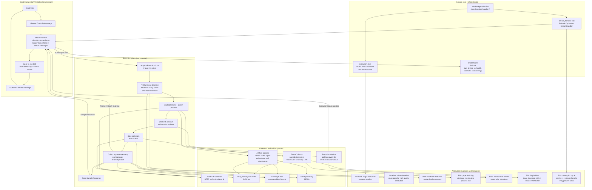

# Overview

```mermaid
flowchart TB
  %% =========================
  %% CONTROL PLANE (gRPC stream)
  %% =========================
  subgraph CP["Control plane (gRPC bidirectional stream)"]
    CTRL["Controller"]
    IN["Inbound ControllerMessage"]
    OUT["Outbound WorkerMessage"]
    SH["StreamHandler\n(handle_stream loop)\nkeeps WorkerState + sends messages"]
    TX["mpsc tx cap 100\nWorkerMessage -> tonic stream"]
    CTRL --> IN --> SH
    SH --> TX --> OUT --> CTRL
  end

  %% =========================
  %% SERVICE + STATE
  %% =========================
  subgraph SVC["Service core + shared state"]
    S["WorkerAgentService\n(Arc clone into handlers)"]
    WL["execution_lock\nMutex ExecutionState\none run at a time"]
    ST["WorkerState\nRwLock\n(run_id, job_id, health,\ncontroller connectivity)"]
    SHREF["stream_handler slot\nRwLock Option Arc StreamHandler"]
    S --> WL
    S --> SHREF
    SH --> ST
    SHREF --> SH
  end

  %% =========================
  %% EXECUTION ENGINE (run_sample)
  %% =========================
  subgraph EX["Execution plane (run_sample)"]
    PRE["PreRunClean baseline\nRedEDR sanity check\nand reset if needed"]
    LOCK["Acquire ExecutionLock\nif busy => reject"]
    START["Start collectors + spawn process"]
    WAIT["Wait with timeout\nand monitor updates"]
    STOP["Stop collectors\nfinalize files"]
    COLLECT["Collect + parse telemetry\nand package TelemetryBatch"]
    RESP["Send SampleResponse"]
  end

  SH -->|RunSample cmd| LOCK
  LOCK --> PRE --> START --> WAIT --> STOP --> COLLECT --> RESP
  COLLECT -->|TelemetryBatch final true| SH
  RESP -->|SampleResponse| SH

  %% =========================
  %% COLLECTORS + ARTIFACT
  %% =========================
  subgraph COL["Collectors and artifact process"]
    ART["Artifact process\nstdout stderr piped\nwrites trace and checkpoints"]
    RED["RedEDR collector\nHTTP poll and collect_all"]
    PIPE["TraceCollector\nnamed pipe server\nTraceEvent chan cap 100k"]
    WR["trace_events.jsonl writer\nBufWriter"]
    COV["Coverage files\ncoverage.bin + bbs.txt"]
    CKP["checkpoints.log\nJSONL"]
    MON["ExecutionMonitor\npoll loop every 3s\nsends ExecutionStatus"]
  end

  START --> ART
  START --> RED
  START --> PIPE
  PIPE --> WR
  ART --> WR
  ART --> COV
  ART --> CKP
  WAIT --> MON
  MON -->|ExecutionStatus updates| SH

  STOP --> RED
  STOP --> PIPE
  STOP --> WR

  COLLECT --> RED
  COLLECT --> WR
  COLLECT --> COV
  COLLECT --> CKP

  %% =========================
  %% INVARIANTS + RISK POINTS
  %% =========================
  subgraph RISK["Attribution invariants and risk points"]
    INV1["Invariant: single execution\nreduces overlap"]
    INV2["Invariant: clean baseline\nmust pass for high-quality attribution"]
    RP1["Risk: RedEDR reset fails\ncontamination persists"]
    RP2["Risk: pipe drain lag\nlate trace events after process exit"]
    RP3["Risk: monitor late events\nstatus after shutdown"]
    RP4["Risk: big buffers\ntrace chan cap 100k = implicit RAM buffer"]
    RP5["Risk: strong Arc cycle\nservice <-> stream handler\nmay prevent Drop"]
  end

  WL --> INV1
  PRE --> INV2
  PRE --> RP1
  PIPE --> RP2
  MON --> RP3
  PIPE --> RP4
  SHREF --> RP5


```

# Pipe

```mermaid
flowchart LR
  subgraph ART["Inside artifact (instrumentation runtime)"]
    TRACE_CALL["__trace_line_binary(file,line,func)\nOR base64 variant"]
    CHOOSE["Target selection\n1) \\\\.\\pipe\\rededr_trace\n2) trace.log\n3) fallback path"]
    WRITE["Write InstRecordHeader + payload\nflush aggressively"]
    TRACE_CALL --> CHOOSE --> WRITE
  end

  subgraph PIPE["Worker side named pipe server"]
    ACCEPT["CreateNamedPipe + accept client"]
    DETECT["Auto-detect protocol\nmagic ISTR => binary\nelse => base64 text"]
    PARSE["Parse events\nline, checkpoint, success, failure"]
    TX["mpsc TraceEvent sender\ncap 100k"]
    ACCEPT --> DETECT --> PARSE --> TX
  end

  subgraph SINK["Persistence"]
    WRITER["trace_events.jsonl writer"]
    COMP["optional compression\nwhen large"]
    TX --> WRITER --> COMP
  end

  WRITE --> ACCEPT

```