# Build Crate — Mermaid Diagrams

Visual companion to `BUILD-SYSTEM-ARCHITECTURE.md` (behavior) and `BUILD-STRUCTS-REFERENCE.md` (types). The **Overview** diagram is conceptual; all others detail specific subsystems.

---

## 1. Overview — Conceptual Architecture

High-level view of the build crate showing the major subsystems and how data flows from input to artifact output. Each colored zone maps to a detailed diagram below.

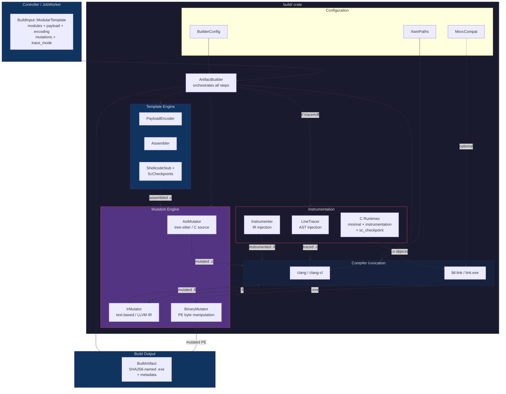

---

## 2. Build Pipeline — The 7-Step Orchestration

Details `ArtifactBuilder::build_modular_template()`. Shows the exact step order, branching at Step 5 (LLVM vs direct path), and the optional instrumentation re-build.

```mermaid
flowchart TD
    START(["BuildInput::ModularTemplate"])

    S0["Step 0: Decoder Sync
    auto-match modules.decoder
    to encoding type"]

    S1["Step 1: Payload Encoding
    prepare_payload()"]
    S1a{"precomputed_payload
    provided?"}
    S1b["PayloadEncoder.encode()
    + shellcode_stub
    + sc_checkpoints"]
    S1c["Use cached
    PreparedPayload"]

    S2["Step 2: Template Assembly
    Assembler.assemble()
    @MODULE markers → module code"]

    S3["Step 3: Marker Scoping
    strip_markers_outside_targets()
    scope @MUTATE to target modules"]

    S4["Step 4: AST Mutations
    Mutator::apply(ast.* specs)
    then strip_mutation_markers()"]

    S5{"LLVM mutations
    present?"}

    S5A["LLVM Path:
    C → .ll (clang -S -emit-llvm)
    → IrMutator.apply()
    → .o (clang -c)
    → link_baseline_exe()"]

    S5B["Direct Path:
    invoke_clang_internal()
    C → .exe (single step)"]

    S6{"binary.*
    mutations?"}
    S6A["BinaryMutator.apply()
    on PE bytes"]

    S7["Step 6: Finalize
    SHA256 → rename to hash.exe
    → BuiltArtifact"]

    S8{"trace_mode
    ≠ off?"}
    S8A["apply_instrumentation()
    re-build with:
    • line traces (AST)
    • coverage (clang flag)
    • API tracing (IR)
    • link runtimes"]

    S8B{"binary mutations
    on instrumented?"}
    S8C["Re-apply BinaryMutator
    on instrumented .exe"]

    DONE(["BuiltArtifact returned"])

    START --> S0 --> S1
    S1 --> S1a
    S1a -->|No| S1b --> S2
    S1a -->|Yes| S1c --> S2
    S2 --> S3 --> S4 --> S5
    S5 -->|Yes| S5A --> S6
    S5 -->|No| S5B --> S6
    S6 -->|Yes| S6A --> S7
    S6 -->|No| S7
    S7 --> S8
    S8 -->|No| DONE
    S8 -->|Yes| S8A --> S8B
    S8B -->|Yes| S8C --> DONE
    S8B -->|No| DONE
```

---

## 3. Mutation Routing — MutationSpec Dispatch

Shows how `MutationSpec` is parsed, categorized, and routed to three independent engines at different build stages.

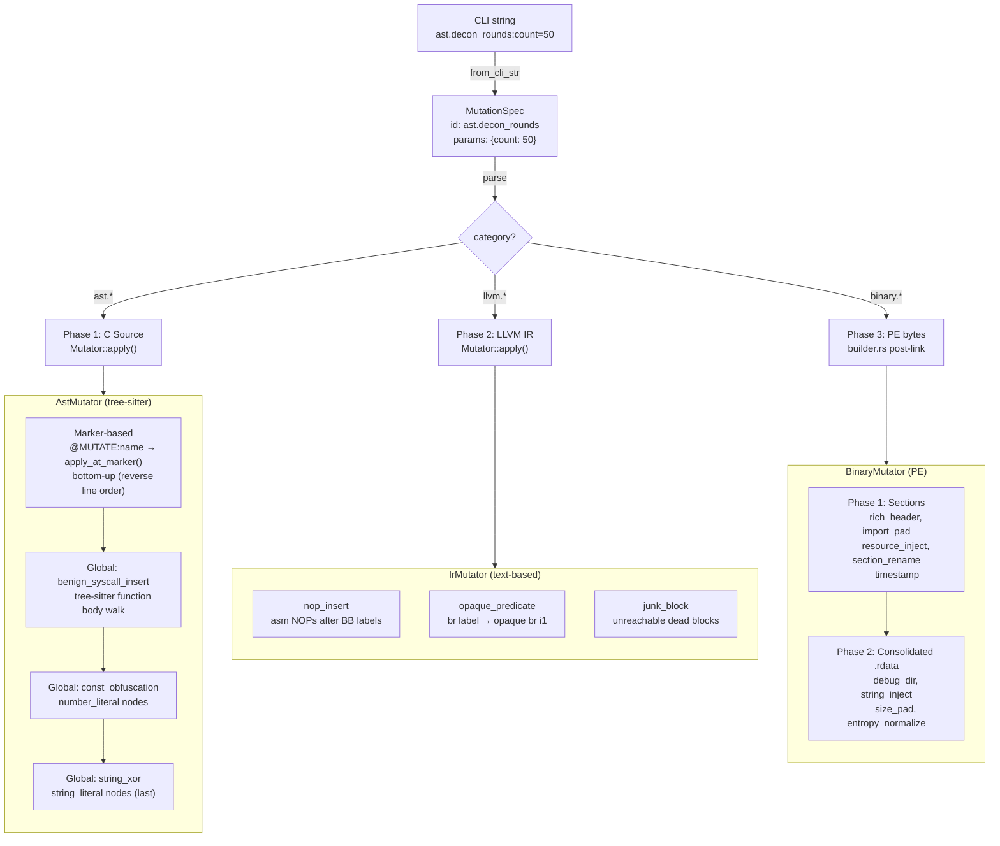

---

## 4. Template Assembly — Modules into Source

Shows how `Assembler` replaces `@MODULE` markers in `loader_template.c` with selected module implementations, producing a single compilable `.c` file.

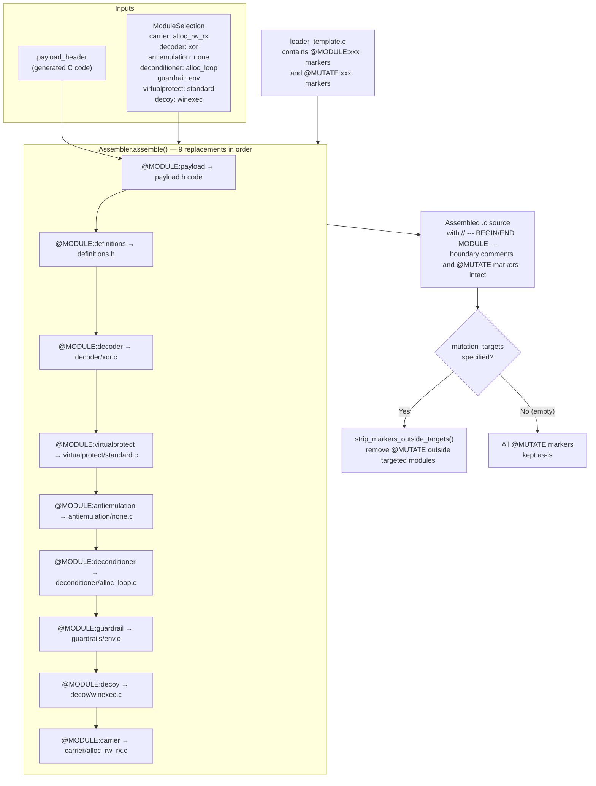

---

## 5. Payload Encoding Pipeline

Details the shellcode preparation flow: optional checkpoint stub prepend, optional INT3 patching, encoding, and C header generation.

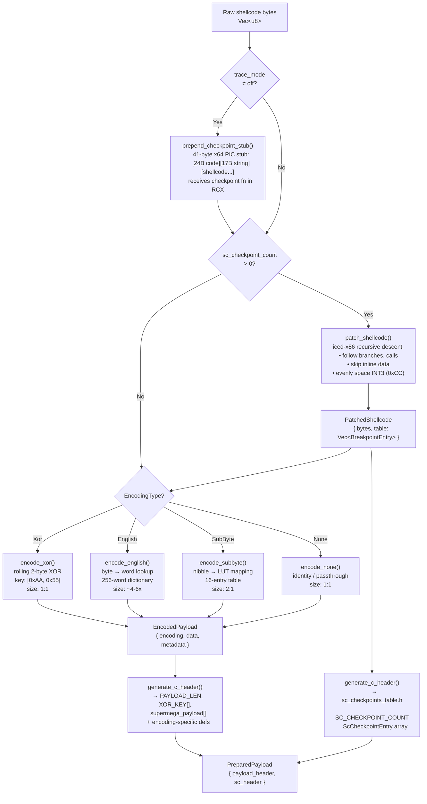

---

## 6. AST Mutator — Processing Phases

Details the four-phase processing order inside `AstMutator::apply()` and the marker-based dispatch table.

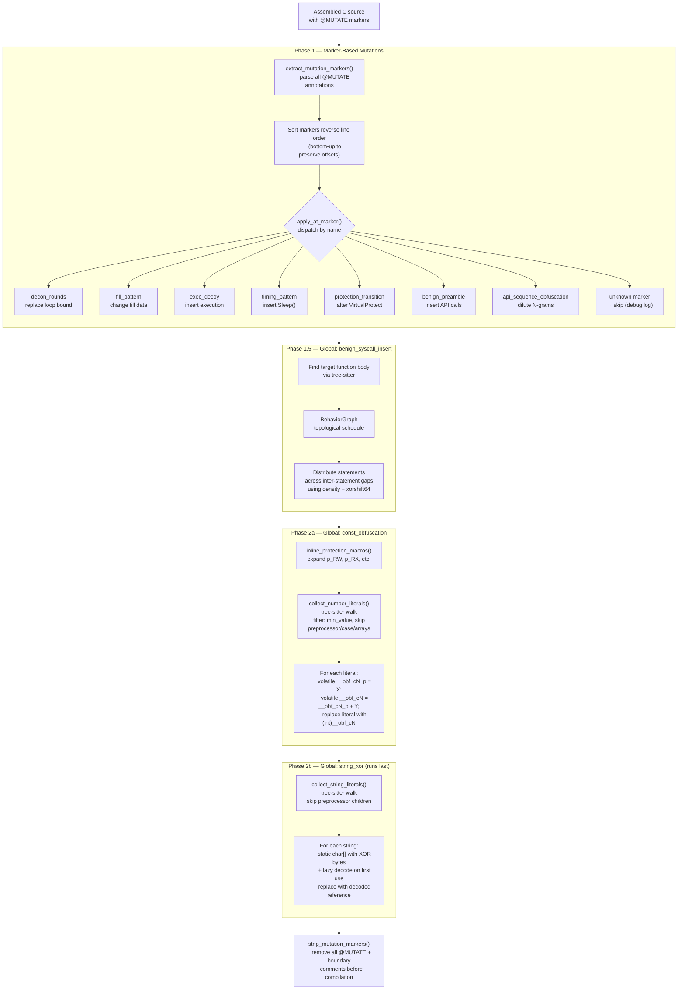

---

## 7. Binary Mutator — Two-Phase PE Transforms

Details the `BinaryMutator::apply()` two-phase architecture and the data sources for each transform.

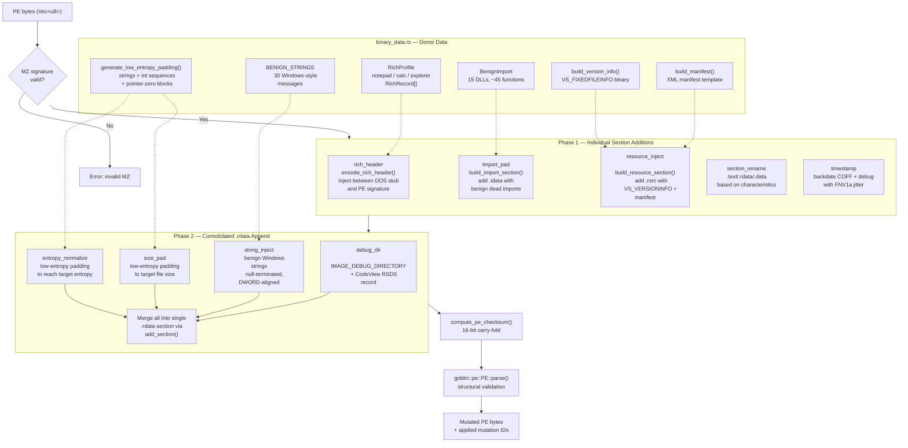

---

## 8. Benign Catalog — Dependency Graph Scheduling

Shows how `BehaviorGraph` performs topological scheduling of benign API call insertion, respecting chained dependencies within groups.

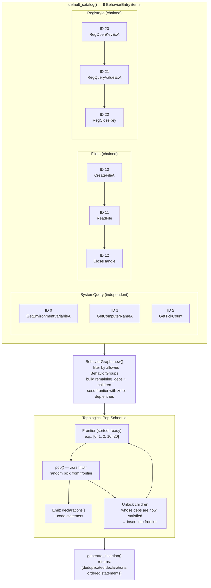

---

## 9. Instrumentation — Baseline vs Instrumented Paths

Compares the two build modes side-by-side, showing which components activate for each.

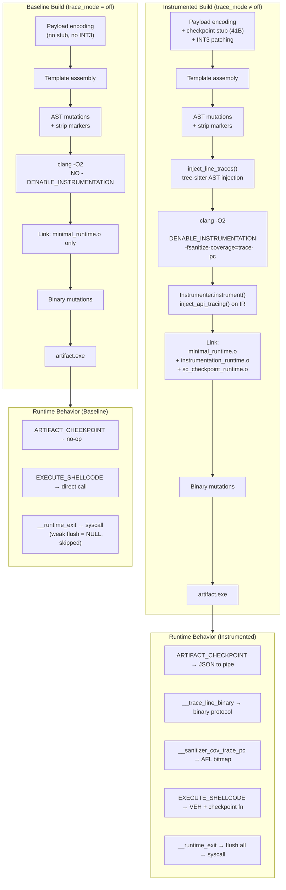

---

## 10. Compilation Modes — Standard vs MSVC-Compat

Shows the two compiler/linker paths and how `MsvcCompat` switches the toolchain.

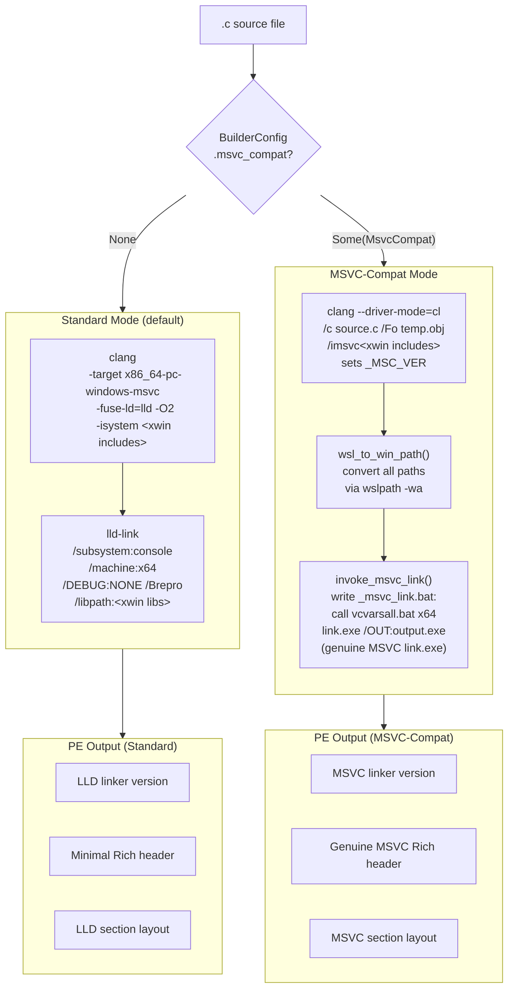

---

## 11. Struct Relationships — Type-Level Class Diagram

Shows ownership and usage relationships between the key structs in the build crate.

```mermaid
classDiagram
    class ArtifactBuilder {
        -config: BuilderConfig
        -xwin: XwinPaths
        +new(BuilderConfig) Result~Self~
        +build(BuildInput) Result~BuiltArtifact~
    }

    class BuilderConfig {
        +output_dir: PathBuf
        +xwin_dir: PathBuf
        +runtime_src: PathBuf
        +minimal_runtime_src: PathBuf
        +modular_template_dir: PathBuf
        +msvc_compat: Option~MsvcCompat~
    }

    class XwinPaths {
        +crt_include: String
        +sdk_ucrt_include: String
        +crt_lib: String
        +sdk_ucrt_lib: String
        +sdk_um_lib: String
        +include_args() Vec
        +lib_args() Vec
    }

    class MsvcCompat {
        +vcvarsall_path: PathBuf
        +default_vcvarsall() PathBuf
    }

    class BuildInput {
        <<enum>>
        ModularTemplate
    }

    class ModuleSelection {
        +carrier: String
        +decoder: String
        +antiemulation: String
        +deconditioner: String
        +guardrail: String
        +virtualprotect: String
        +decoy: String
        +validate(Path) Result
    }

    class BuiltArtifact {
        +artifact_id: String
        +source_path: PathBuf
        +output_path: PathBuf
        +size_bytes: u64
        +sha256: String
        +mutations_applied: Vec~String~
        +assembled_source: Option~String~
    }

    class PreparedPayload {
        +payload_header: String
        +sc_header: Option~String~
    }

    class MutationSpec {
        +id: String
        +params: HashMap
        +from_cli_str(str) Self
        +parse() (str, str)
    }

    class Assembler {
        -template_dir: PathBuf
        -module_cache: HashMap
        +assemble(ModuleSelection, str) Result~String~
    }

    class PayloadEncoder {
        +xor_key: u8 array
        +dictionary: Vec~String~
        +subbyte_mapping: u8 array
        +encode(bytes, EncodingType) EncodedPayload
        +generate_c_header(EncodedPayload) String
    }

    class EncodedPayload {
        +encoding: EncodingType
        +data: Vec~u8~
        +metadata: HashMap
    }

    class AstMutator {
        -parser: tree_sitter Parser
        +apply(str, MutationSpec[]) Result
    }

    class IrMutator {
        -rng_state: u32
        +apply(str, MutationSpec[]) Result
    }

    class BinaryMutator {
        -pe_bytes: Vec~u8~
        +apply(MutationSpec[]) Result
    }

    class BehaviorGraph {
        -entries: HashMap
        -frontier: Vec
        -consumed: HashSet
        -rng_state: u64
        +new(BehaviorEntry[], BehaviorGroup[], u64) Self
        +pop() Option~BehaviorEntry~
    }

    class BehaviorEntry {
        +id: u32
        +group: BehaviorGroup
        +deps: Vec~u32~
        +declarations: Vec~str~
        +code: str
    }

    class PatchedShellcode {
        +bytes: Vec~u8~
        +table: Vec~BreakpointEntry~
    }

    class BreakpointEntry {
        +offset: usize
        +original_byte: u8
        +name: String
        +progress_pct: u8
    }

    class Instrumenter {
        +instrument(Path, TraceMode, Path) Result
    }

    ArtifactBuilder *-- BuilderConfig : owns
    ArtifactBuilder *-- XwinPaths : owns
    BuilderConfig o-- MsvcCompat : optional
    ArtifactBuilder ..> BuildInput : consumes
    ArtifactBuilder ..> BuiltArtifact : produces

    BuildInput *-- ModuleSelection : contains
    BuildInput *-- MutationSpec : contains list
    BuildInput o-- PreparedPayload : optional cache

    Assembler ..> ModuleSelection : reads
    PayloadEncoder ..> EncodedPayload : produces

    AstMutator ..> MutationSpec : reads
    AstMutator ..> BehaviorGraph : uses
    BehaviorGraph *-- BehaviorEntry : schedules
    IrMutator ..> MutationSpec : reads
    BinaryMutator ..> MutationSpec : reads

    PatchedShellcode *-- BreakpointEntry : contains

    ArtifactBuilder ..> Assembler : creates
    ArtifactBuilder ..> PayloadEncoder : creates
    ArtifactBuilder ..> AstMutator : delegates to
    ArtifactBuilder ..> IrMutator : delegates to
    ArtifactBuilder ..> BinaryMutator : delegates to
    ArtifactBuilder ..> Instrumenter : delegates to
```

---

## 12. Loader Runtime Execution Flow

Shows what happens at runtime when the compiled artifact executes, including the module call order and instrumentation hooks.

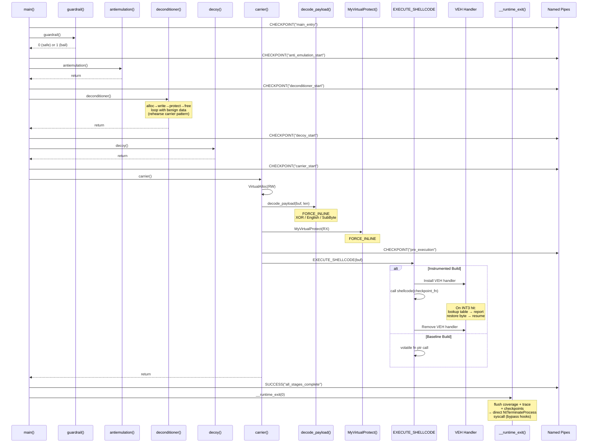

---

## Diagram Index

| # | Diagram | Scope | Purpose |
|---|---------|-------|---------|
| 1 | Overview | Whole crate | Conceptual — understand subsystem boundaries and data flow |
| 2 | Build Pipeline | `builder.rs` | Step-by-step orchestration with branching paths |
| 3 | Mutation Routing | `mutator/` + `transform/` | How MutationSpec dispatches to 3 engines |
| 4 | Template Assembly | `template/assembler.rs` | @MODULE replacement and marker scoping |
| 5 | Payload Encoding | `template/payload.rs` + `sc_checkpoints.rs` | Shellcode preparation: stub → INT3 → encode → header |
| 6 | AST Mutator | `transform/ast_mutator.rs` | 4-phase processing and marker dispatch table |
| 7 | Binary Mutator | `transform/binary_mutator.rs` | Two-phase PE transforms with data sources |
| 8 | Benign Catalog | `transform/benign_catalog.rs` | Dependency-aware topological scheduling |
| 9 | Instrumentation | `builder.rs` + `instrument/` + `runtime/` | Baseline vs instrumented build comparison |
| 10 | Compilation Modes | `builder.rs` + `msvc_compat.rs` | Standard (Clang+LLD) vs MSVC-compat paths |
| 11 | Struct Relationships | All modules | UML class diagram of ownership and usage |
| 12 | Runtime Execution | `loader_template.c` + `runtime/` | Sequence diagram of artifact execution at runtime |
