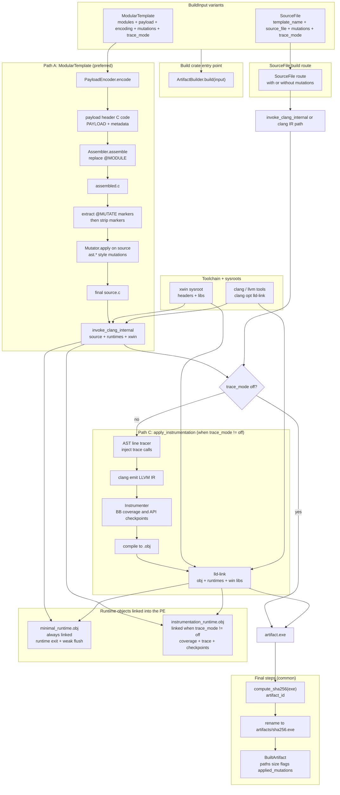

# Overview

```mermaid
flowchart TB
  %% =======================
  %% ENTRY / DISPATCH LAYER
  %% =======================
  subgraph ENTRY["Build crate entry point"]
    AB["ArtifactBuilder.build(input)"]
  end

  subgraph INPUTS["BuildInput variants"]
    IN_MOD["ModularTemplate\nmodules + payload + encoding + mutations + trace_mode"]
    IN_SRCFILE["SourceFile\ntemplate_name + source_file + mutations + trace_mode"]
  end

  INPUTS --> AB

  %% ==================================
  %% PRIMARY PATH: MODULAR TEMPLATE
  %% ==================================
  subgraph MODPATH["Path A: ModularTemplate (preferred)"]
    PE["PayloadEncoder.encode"]
    PH["payload header C code\nPAYLOAD + metadata"]
    AS["Assembler.assemble\nreplace @MODULE"]
    AC["assembled.c"]
    MM["extract @MUTATE markers\nthen strip markers"]
    MUTSRC["Mutator.apply on source\nast.* style mutations"]
    SRC_FINAL["final source.c"]
    CLANG_A["invoke_clang_internal\nsource + runtimes + xwin"]
  end

  IN_MOD --> PE --> PH --> AS --> AC --> MM --> MUTSRC --> SRC_FINAL --> CLANG_A

  %% ==================================
  %% SOURCEFILE PATH (DIRECT BUILD)
  %% ==================================
  subgraph DIRECTPATHS["SourceFile build route"]
    SRC_DISPATCH["SourceFile route\nwith or without mutations"]
  end

  IN_SRCFILE --> SRC_DISPATCH --> CLANG_D["invoke_clang_internal or clang IR path"]

  %% ==================================
  %% OPTIONAL POST-PASS: INSTRUMENTATION
  %% ==================================
  subgraph INSTR["Path C: apply_instrumentation (when trace_mode != off)"]
    LT["AST line tracer\ninject trace calls"]
    TOIR["clang emit LLVM IR"]
    IRINSTR["Instrumenter\nBB coverage and API checkpoints"]
    OBJ["compile to .obj"]
    LINK["lld-link\nobj + runtimes + win libs"]
  end

  CLANG_A --> MAYBE_I{"trace_mode off?"}
  CLANG_D --> MAYBE_I

  MAYBE_I -- "yes" --> OUT_EXE["artifact.exe"]
  MAYBE_I -- "no" --> LT --> TOIR --> IRINSTR --> OBJ --> LINK --> OUT_EXE

  %% ==================================
  %% RUNTIMES + TOOLCHAIN
  %% ==================================
  subgraph RUNTIME["Runtime objects linked into the PE"]
    MINRT["minimal_runtime.obj\nalways linked\nruntime exit + weak flush"]
    INSTRRT["instrumentation_runtime.obj\nlinked when trace_mode != off\ncoverage + trace + checkpoints"]
  end

  subgraph TOOLCHAIN["Toolchain + sysroots"]
    XWIN["xwin sysroot\nheaders + libs"]
    CLANG["clang / llvm tools\nclang opt lld-link"]
  end

  CLANG_A --> MINRT
  CLANG_A --> INSTRRT
  LINK --> MINRT
  LINK --> INSTRRT

  XWIN --> CLANG_A
  CLANG --> CLANG_A
  XWIN --> LINK
  CLANG --> LINK

  %% ==================================
  %% FINALIZATION
  %% ==================================
  subgraph FINAL["Final steps (common)"]
    SHA["compute_sha256(exe)\nartifact_id"]
    RENAME["rename to artifacts/sha256.exe"]
    META["BuiltArtifact\npaths size flags applied_mutations"]
  end

  OUT_EXE --> SHA --> RENAME --> META

```
