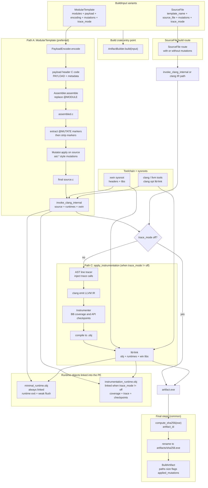

# Overview

```mermaid
flowchart TB
  %% =======================
  %% ENTRY / DISPATCH LAYER
  %% =======================
  subgraph ENTRY["Build crate entry point"]
    AB["ArtifactBuilder.build(input)"]
  end

  subgraph INPUTS["BuildInput variants"]
    IN_MOD["ModularTemplate\nmodules + payload + encoding + mutations + trace_mode"]
    IN_SRCFILE["SourceFile\ntemplate_name + source_file + mutations + trace_mode"]
  end

  INPUTS --> AB

  %% ==================================
  %% PRIMARY PATH: MODULAR TEMPLATE
  %% ==================================
  subgraph MODPATH["Path A: ModularTemplate (preferred)"]
    PE["PayloadEncoder.encode"]
    PH["payload header C code\nPAYLOAD + metadata"]
    AS["Assembler.assemble\nreplace @MODULE"]
    AC["assembled.c"]
    MM["extract @MUTATE markers\nthen strip markers"]
    MUTSRC["Mutator.apply on source\nast.* style mutations"]
    SRC_FINAL["final source.c"]
    CLANG_A["invoke_clang_internal\nsource + runtimes + xwin"]
  end

  IN_MOD --> PE --> PH --> AS --> AC --> MM --> MUTSRC --> SRC_FINAL --> CLANG_A

  %% ==================================
  %% SOURCEFILE PATH (DIRECT BUILD)
  %% ==================================
  subgraph DIRECTPATHS["SourceFile build route"]
    SRC_DISPATCH["SourceFile route\nwith or without mutations"]
  end

  IN_SRCFILE --> SRC_DISPATCH --> CLANG_D["invoke_clang_internal or clang IR path"]

  %% ==================================
  %% OPTIONAL POST-PASS: INSTRUMENTATION
  %% ==================================
  subgraph INSTR["Path C: apply_instrumentation (when trace_mode != off)"]
    LT["AST line tracer\ninject trace calls"]
    TOIR["clang emit LLVM IR"]
    IRINSTR["Instrumenter\nBB coverage and API checkpoints"]
    OBJ["compile to .obj"]
    LINK["lld-link\nobj + runtimes + win libs"]
  end

  CLANG_A --> MAYBE_I{"trace_mode off?"}
  CLANG_D --> MAYBE_I

  MAYBE_I -- "yes" --> OUT_EXE["artifact.exe"]
  MAYBE_I -- "no" --> LT --> TOIR --> IRINSTR --> OBJ --> LINK --> OUT_EXE

  %% ==================================
  %% RUNTIMES + TOOLCHAIN
  %% ==================================
  subgraph RUNTIME["Runtime objects linked into the PE"]
    MINRT["minimal_runtime.obj\nalways linked\nruntime exit + weak flush"]
    INSTRRT["instrumentation_runtime.obj\nlinked when trace_mode != off\ncoverage + trace + checkpoints"]
  end

  subgraph TOOLCHAIN["Toolchain + sysroots"]
    XWIN["xwin sysroot\nheaders + libs"]
    CLANG["clang / llvm tools\nclang opt lld-link"]
  end

  CLANG_A --> MINRT
  CLANG_A --> INSTRRT
  LINK --> MINRT
  LINK --> INSTRRT

  XWIN --> CLANG_A
  CLANG --> CLANG_A
  XWIN --> LINK
  CLANG --> LINK

  %% ==================================
  %% FINALIZATION
  %% ==================================
  subgraph FINAL["Final steps (common)"]
    SHA["compute_sha256(exe)\nartifact_id"]
    RENAME["rename to artifacts/sha256.exe"]
    META["BuiltArtifact\npaths size flags applied_mutations"]
  end

  OUT_EXE --> SHA --> RENAME --> META

```

# Global

```mermaid
flowchart TB
  %% ---------------------------
  %% CRATE AND MAJOR MODULES
  %% ---------------------------
  subgraph crate_build["crate_build"]
    lib_rs["lib_rs\nTraceMode"]
    builder_mod["builder\nArtifactBuilder BuilderConfig BuildInput BuiltArtifact"]
    template_mod["template\nAssembler PayloadEncoder ModuleSelection EncodingType MutationMarker"]
    mutator_mod["mutator\nMutator MutationSpec"]
    instrument_mod["instrument\nLineTracer Instrumenter"]
    transform_mod["transform\nAstMutator IrMutator\n(stubs)"]
    compiler_mod["compiler\n(placeholder)"]
  end

  lib_rs --> builder_mod
  builder_mod --> template_mod
  builder_mod --> mutator_mod
  builder_mod --> instrument_mod
  builder_mod --> transform_mod
  builder_mod --> compiler_mod

  %% ---------------------------
  %% ENTRYPOINT
  %% ---------------------------
  input["BuildInput\nSourceFile or ModularTemplate"] --> build_dispatch["ArtifactBuilder_build\ndispatch"]

  build_dispatch -->|SourceFile| source_path["Path_SourceFile"]
  build_dispatch -->|ModularTemplate| modular_path["Path_ModularTemplate"]

  %% ---------------------------
  %% PATH B: SOURCEFILE BUILD
  %% ---------------------------
  subgraph path_sourcefile["path_sourcefile"]
    source_has_muts{"mutations_empty"}
    source_path --> source_has_muts

    build_no_muts["build_template_with_runtime"]
    build_with_muts["build_template_with_mutations_and_runtime"]

    source_has_muts -->|true| build_no_muts
    source_has_muts -->|false| build_with_muts

    muts_split{"has_ast_or_llvm_mutations"}
    build_with_muts --> muts_split

    ast_apply["Mutator_apply_ast\n(ast_string_xor)"]
    llvm_flow["compile_source_to_ir\nclang_emit_llvm_O0\nthen Mutator_apply_llvm\n(llvm_nop_insert)\nthen compile_ir_to_exe"]
    direct_compile["invoke_clang_internal\nclang_target_windows_msvc\nlink_minimal_runtime\nmaybe link_instrumentation_runtime"]

    muts_split -->|ast_only_or_ast_present| ast_apply
    ast_apply --> direct_compile

    muts_split -->|llvm_present| llvm_flow
    llvm_flow --> direct_compile

    muts_split -->|no_special_case| direct_compile

    direct_compile --> built_artifact_a["BuiltArtifact\nsha256 output_path flags"]
  end

  %% ---------------------------
  %% PATH A: MODULAR TEMPLATE BUILD (PREFERRED)
  %% ---------------------------
  subgraph path_modular["path_modular_template"]
    encode_payload["PayloadEncoder_encode\nEncodingType_Xor_or_English\nemit_payload_header_c"]
    assemble_template["Assembler_assemble\nreplace_MODULE_markers\nemit_assembled_c"]
    mutate_markers["extract_or_strip_MUTATE_markers"]
    apply_mutations_modular["Mutator_apply_optional\nor strip_markers_only"]
    compile_modular["invoke_clang_internal\ncompile_and_link\nminimal_runtime_always"]

    modular_path --> encode_payload --> assemble_template --> mutate_markers
    mutate_markers --> apply_mutations_modular --> compile_modular
    compile_modular --> built_artifact_b["BuiltArtifact\nsha256 output_path flags"]
  end

  %% ---------------------------
  %% COMMON POST STEP: SHA256 AND RENAME
  %% ---------------------------
  built_artifact_a --> finalize["finalize_artifact\ncompute_sha256\nrename_to_sha256_exe"]
  built_artifact_b --> finalize

  %% ---------------------------
  %% OPTIONAL POST BUILD: INSTRUMENTATION
  %% ---------------------------
  finalize --> trace_check{"trace_mode_is_off"}
  trace_check -->|true| done_no_trace["done\nminimal_runtime_only"]
  trace_check -->|false| apply_instr["apply_instrumentation"]

  subgraph instrumentation["apply_instrumentation_pipeline"]
    line_mode{"trace_mode_has_lines"}
    bb_mode{"trace_mode_has_bb"}
    api_mode{"trace_mode_has_api"}

    step1_line["Step1_AST_line_tracing\nLineTracer_inject_line_traces\nemit_source_line_traced_c"]
    step2_ir["Step2_compile_to_llvm_ir\nclang_emit_llvm_O0\nemit_source_ll"]
    step3_ir_instr["Step3_IR_instrumentation\nInstrumenter\nbb_sancov_optional\napi_checkpoint_optional\nadd_runtime_decls"]
    step4_link["Step4_compile_and_link\nclang_or_lld_link\nlink_minimal_runtime\nlink_instrumentation_runtime"]

    apply_instr --> line_mode
    line_mode -->|true| step1_line --> step2_ir
    line_mode -->|false| step2_ir

    step2_ir --> bb_mode
    bb_mode -->|true| step3_ir_instr
    bb_mode -->|false| api_mode

    api_mode -->|true| step3_ir_instr
    api_mode -->|false| step3_ir_instr

    step3_ir_instr --> step4_link --> done_trace["done\ninstrumented_exe"]
  end

  %% ---------------------------
  %% RUNTIME LINKING MODEL
  %% ---------------------------
  subgraph runtime["runtime_c_libraries"]
    minimal_rt["minimal_runtime\nalways_linked\nruntime_exit_and_weak_flush"]
    instr_rt["instrumentation_runtime\nlinked_if_trace_not_off\ncoverage_trace_checkpoints"]
  end

  done_no_trace --> minimal_rt
  done_trace --> minimal_rt
  done_trace --> instr_rt

```
