# Controller Architecture — Mermaid Diagrams

## 1. Overview: Controller Conceptual Architecture

High-level view showing how the five modules form the closed experimental loop.

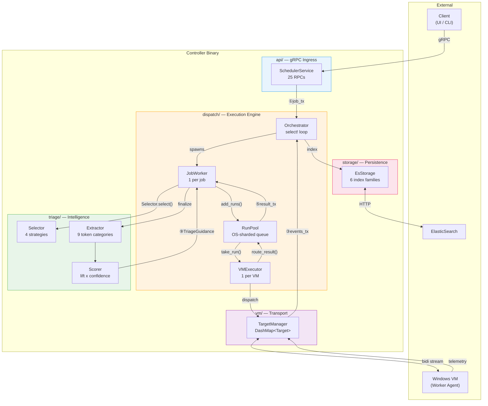
```mermaid
graph TB
    subgraph External
        Client["Client<br/>(UI / CLI)"]
        VM["Windows VM<br/>(Worker Agent)"]
        ES["ElasticSearch"]
    end

    subgraph Controller["Controller Binary"]
        subgraph API["api/ — gRPC Ingress"]
            SS["SchedulerService<br/>25 RPCs"]
        end

        subgraph Dispatch["dispatch/ — Execution Engine"]
            Orch["Orchestrator<br/>select! loop"]
            JW["JobWorker<br/>1 per job"]
            RP["RunPool<br/>OS-sharded queue"]
            VME["VMExecutor<br/>1 per VM"]
        end

        subgraph Triage["triage/ — Intelligence"]
            Sel["Selector<br/>4 strategies"]
            Ext["Extractor<br/>9 token categories"]
            Scr["Scorer<br/>lift x confidence"]
        end

        subgraph Storage["storage/ — Persistence"]
            ESS["EsStorage<br/>6 index families"]
        end

        subgraph VMod["vm/ — Transport"]
            TM["TargetManager<br/>DashMap&lt;Target&gt;"]
        end
    end

    Client -->|"gRPC"| SS
    SS -->|"①job_tx"| Orch
    Orch -->|"spawns"| JW
    JW -->|"Selector.select()"| Sel
    JW -->|"add_runs()"| RP
    RP -->|"take_run()"| VME
    VME -->|"dispatch"| TM
    TM <-->|"bidi stream"| VM
    VME -->|"route_result()"| RP
    RP -->|"⑤result_tx"| JW
    JW -->|"finalize"| Ext
    Ext --> Scr
    Scr -->|"⑨TriageGuidance"| JW
    Orch -->|"index"| ESS
    ESS <-->|"HTTP"| ES
    VM -->|"telemetry"| TM
    TM -->|"③events_tx"| Orch

    style API fill:#e8f4fd,stroke:#2196F3
    style Dispatch fill:#fff3e0,stroke:#FF9800
    style Triage fill:#e8f5e9,stroke:#4CAF50
    style Storage fill:#fce4ec,stroke:#E91E63
    style VMod fill:#f3e5f5,stroke:#9C27B0
```

---

## 2. Component Hierarchy & Ownership

What `main.rs` creates and how components relate.

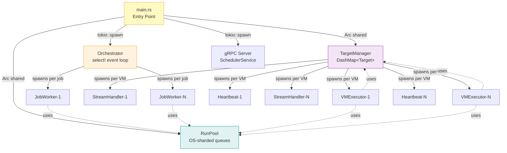
```mermaid
graph TD
    Main["main.rs<br/>Entry Point"]

    Main -->|"Arc shared"| TM["TargetManager<br/>DashMap&lt;Target&gt;"]
    Main -->|"Arc shared"| RP["RunPool<br/>OS-sharded queues"]
    Main -->|"tokio::spawn"| Orch["Orchestrator<br/>select! event loop"]
    Main -->|"tokio::spawn"| GRPC["gRPC Server<br/>SchedulerService"]

    Orch -->|"spawns per job"| JW1["JobWorker-1"]
    Orch -->|"spawns per job"| JW2["JobWorker-N"]

    TM -->|"spawns per VM"| SH1["StreamHandler-1"]
    TM -->|"spawns per VM"| VME1["VMExecutor-1"]
    TM -->|"spawns per VM"| HB1["Heartbeat-1"]

    TM -->|"spawns per VM"| SH2["StreamHandler-N"]
    TM -->|"spawns per VM"| VME2["VMExecutor-N"]
    TM -->|"spawns per VM"| HB2["Heartbeat-N"]

    JW1 -.->|"uses"| RP
    JW2 -.->|"uses"| RP
    VME1 -.->|"uses"| RP
    VME2 -.->|"uses"| RP
    VME1 -.->|"uses"| TM
    VME2 -.->|"uses"| TM

    style Main fill:#fff9c4,stroke:#F9A825
    style Orch fill:#fff3e0,stroke:#FF9800
    style RP fill:#e0f2f1,stroke:#009688
    style TM fill:#f3e5f5,stroke:#9C27B0
```

---

## 3. Channel Topology

All 9 channels connecting components.

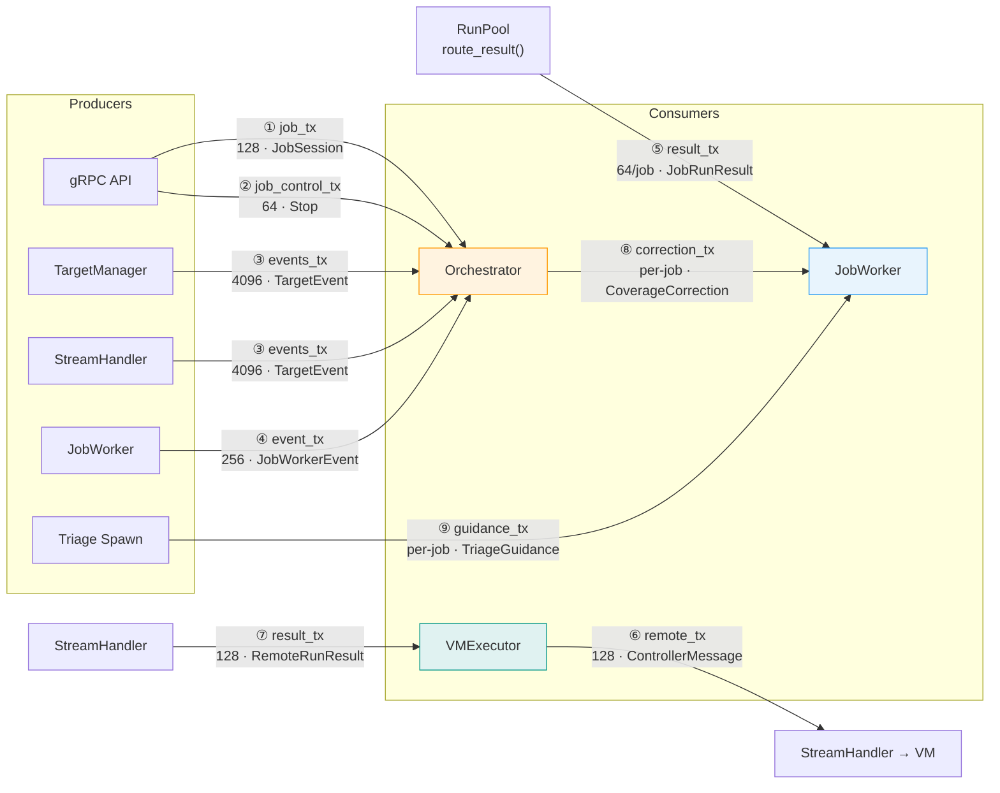
```mermaid
graph LR
    subgraph Producers
        API["gRPC API"]
        TM["TargetManager"]
        SH["StreamHandler"]
        JW["JobWorker"]
        Triage["Triage Spawn"]
    end

    subgraph Consumers
        Orch["Orchestrator"]
        JWr["JobWorker"]
        VME["VMExecutor"]
    end

    API -->|"① job_tx<br/>128 · JobSession"| Orch
    API -->|"② job_control_tx<br/>64 · Stop"| Orch
    TM -->|"③ events_tx<br/>4096 · TargetEvent"| Orch
    SH -->|"③ events_tx<br/>4096 · TargetEvent"| Orch
    JW -->|"④ event_tx<br/>256 · JobWorkerEvent"| Orch
    RP["RunPool<br/>route_result()"] -->|"⑤ result_tx<br/>64/job · JobRunResult"| JWr
    VME -->|"⑥ remote_tx<br/>128 · ControllerMessage"| SH2["StreamHandler → VM"]
    SH3["StreamHandler"] -->|"⑦ result_tx<br/>128 · RemoteRunResult"| VME
    Orch -->|"⑧ correction_tx<br/>per-job · CoverageCorrection"| JWr
    Triage -->|"⑨ guidance_tx<br/>per-job · TriageGuidance"| JWr

    style Orch fill:#fff3e0,stroke:#FF9800
    style JWr fill:#e8f4fd,stroke:#2196F3
    style VME fill:#e0f2f1,stroke:#009688
```

---

## 4. Job Lifecycle — Sequence

End-to-end flow from job submission to completion.

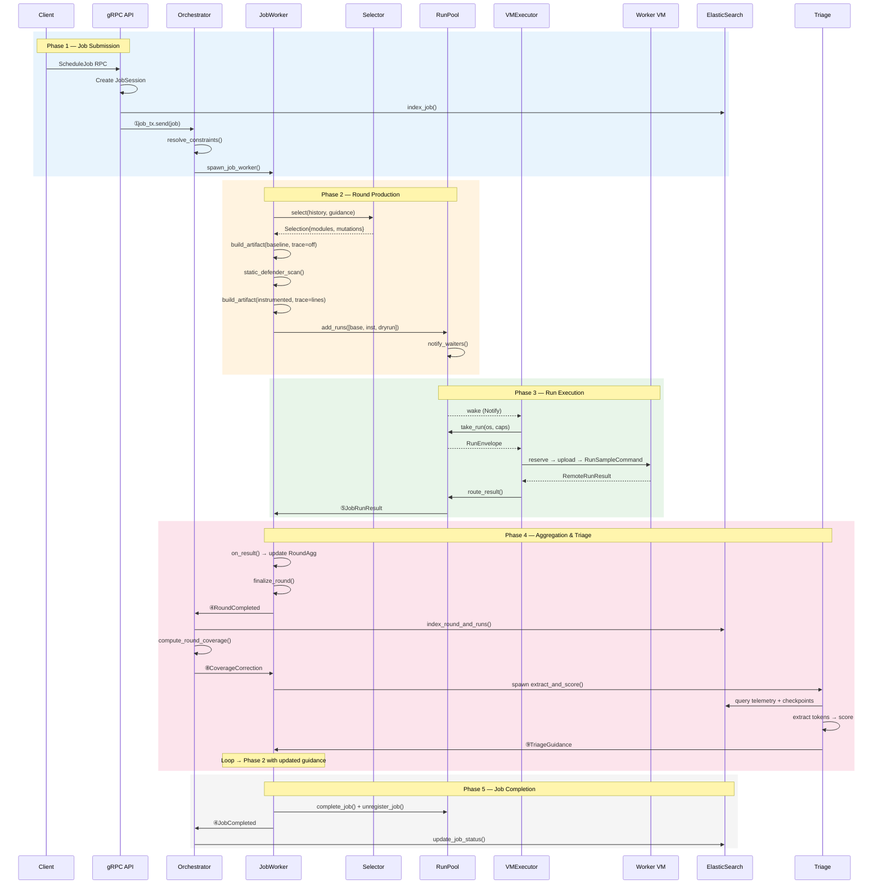
```mermaid
sequenceDiagram
    participant C as Client
    participant API as gRPC API
    participant O as Orchestrator
    participant JW as JobWorker
    participant Sel as Selector
    participant RP as RunPool
    participant VME as VMExecutor
    participant VM as Worker VM
    participant ES as ElasticSearch
    participant Tr as Triage

    rect rgb(232,244,253)
    Note over C,API: Phase 1 — Job Submission
    C->>API: ScheduleJob RPC
    API->>API: Create JobSession
    API->>ES: index_job()
    API->>O: ①job_tx.send(job)
    O->>O: resolve_constraints()
    O->>JW: spawn_job_worker()
    end

    rect rgb(255,243,224)
    Note over JW,RP: Phase 2 — Round Production
    JW->>Sel: select(history, guidance)
    Sel-->>JW: Selection{modules, mutations}
    JW->>JW: build_artifact(baseline, trace=off)
    JW->>JW: static_defender_scan()
    JW->>JW: build_artifact(instrumented, trace=lines)
    JW->>RP: add_runs([base, inst, dryrun])
    RP->>RP: notify_waiters()
    end

    rect rgb(232,245,233)
    Note over RP,VM: Phase 3 — Run Execution
    RP-->>VME: wake (Notify)
    VME->>RP: take_run(os, caps)
    RP-->>VME: RunEnvelope
    VME->>VM: reserve → upload → RunSampleCommand
    VM-->>VME: RemoteRunResult
    VME->>RP: route_result()
    RP->>JW: ⑤JobRunResult
    end

    rect rgb(252,228,236)
    Note over JW,Tr: Phase 4 — Aggregation & Triage
    JW->>JW: on_result() → update RoundAgg
    JW->>JW: finalize_round()
    JW->>O: ④RoundCompleted
    O->>ES: index_round_and_runs()
    O->>O: compute_round_coverage()
    O->>JW: ⑧CoverageCorrection
    JW->>Tr: spawn extract_and_score()
    Tr->>ES: query telemetry + checkpoints
    Tr->>Tr: extract tokens → score
    Tr->>JW: ⑨TriageGuidance

    Note over JW: Loop → Phase 2 with updated guidance
    end

    rect rgb(245,245,245)
    Note over JW,ES: Phase 5 — Job Completion
    JW->>RP: complete_job() + unregister_job()
    JW->>O: ④JobCompleted
    O->>ES: update_job_status()
    end
```

---

## 5. Round Production Detail

`JobWorker::produce_round()` — the core build-and-dispatch flow.

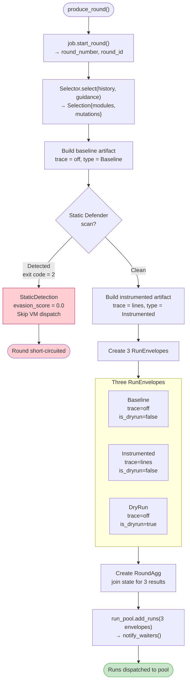
```mermaid
flowchart TD
    Start(["produce_round()"])
    Start --> StartRound["job.start_round()<br/>→ round_number, round_id"]
    StartRound --> Select["Selector.select(history, guidance)<br/>→ Selection{modules, mutations}"]

    Select --> BuildBase["Build baseline artifact<br/>trace = off, type = Baseline"]
    BuildBase --> Scan{"Static Defender<br/>scan?"}

    Scan -->|"Detected<br/>exit code = 2"| Static["StaticDetection<br/>evasion_score = 0.0<br/>Skip VM dispatch"]
    Static --> Done(["Round short-circuited"])

    Scan -->|"Clean"| BuildInst["Build instrumented artifact<br/>trace = lines, type = Instrumented"]
    BuildInst --> Envelopes["Create 3 RunEnvelopes"]

    subgraph Envelopes3["Three RunEnvelopes"]
        E1["Baseline<br/>trace=off<br/>is_dryrun=false"]
        E2["Instrumented<br/>trace=lines<br/>is_dryrun=false"]
        E3["DryRun<br/>trace=off<br/>is_dryrun=true"]
    end

    Envelopes --> Envelopes3
    Envelopes3 --> Agg["Create RoundAgg<br/>join state for 3 results"]
    Agg --> Add["run_pool.add_runs(3 envelopes)<br/>→ notify_waiters()"]
    Add --> Done2(["Runs dispatched to pool"])

    style Static fill:#ffcdd2,stroke:#E91E63
    style Done fill:#ffcdd2
    style Done2 fill:#c8e6c9,stroke:#4CAF50
```

---

## 6. RunPool: Producer-Consumer Dispatch

OS-sharded queue with capability filtering and result routing.

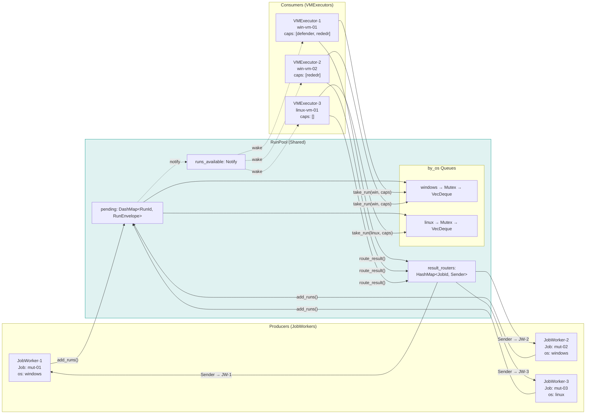
```mermaid
flowchart LR
    subgraph Producers["Producers (JobWorkers)"]
        JW1["JobWorker-1<br/>Job: mut-01<br/>os: windows"]
        JW2["JobWorker-2<br/>Job: mut-02<br/>os: windows"]
        JW3["JobWorker-3<br/>Job: mut-03<br/>os: linux"]
    end

    subgraph Pool["RunPool (Shared)"]
        direction TB
        P["pending: DashMap&lt;RunId, RunEnvelope&gt;"]
        subgraph Queues["by_os Queues"]
            WQ["windows → Mutex → VecDeque"]
            LQ["linux → Mutex → VecDeque"]
        end
        N["runs_available: Notify"]
        RR["result_routers:<br/>HashMap&lt;JobId, Sender&gt;"]
    end

    subgraph Consumers["Consumers (VMExecutors)"]
        V1["VMExecutor-1<br/>win-vm-01<br/>caps: [defender, rededr]"]
        V2["VMExecutor-2<br/>win-vm-02<br/>caps: [rededr]"]
        V3["VMExecutor-3<br/>linux-vm-01<br/>caps: []"]
    end

    JW1 -->|"add_runs()"| P
    JW2 -->|"add_runs()"| P
    JW3 -->|"add_runs()"| P
    P --> WQ
    P --> LQ
    P -.->|"notify"| N

    N -.->|"wake"| V1
    N -.->|"wake"| V2
    N -.->|"wake"| V3

    V1 -->|"take_run(win, caps)"| WQ
    V2 -->|"take_run(win, caps)"| WQ
    V3 -->|"take_run(linux, caps)"| LQ

    V1 -->|"route_result()"| RR
    V2 -->|"route_result()"| RR
    V3 -->|"route_result()"| RR

    RR -->|"Sender → JW-1"| JW1
    RR -->|"Sender → JW-2"| JW2
    RR -->|"Sender → JW-3"| JW3

    style Pool fill:#e0f2f1,stroke:#009688
```

---

## 7. VMExecutor Select Loop

Signal-driven main loop with three branches.

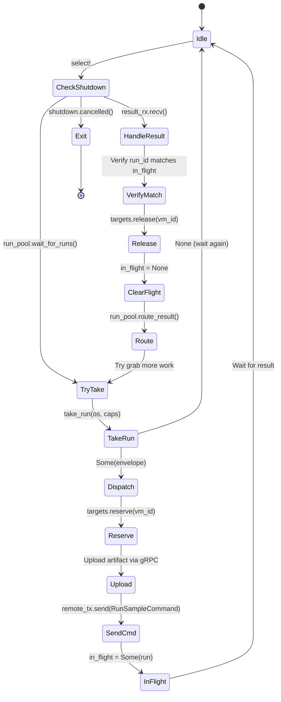
```mermaid
stateDiagram-v2
    [*] --> Idle

    Idle --> CheckShutdown: select!
    CheckShutdown --> Exit: shutdown.cancelled()
    CheckShutdown --> HandleResult: result_rx.recv()
    CheckShutdown --> TryTake: run_pool.wait_for_runs()

    HandleResult --> VerifyMatch: Verify run_id matches in_flight
    VerifyMatch --> Release: targets.release(vm_id)
    Release --> ClearFlight: in_flight = None
    ClearFlight --> Route: run_pool.route_result()
    Route --> TryTake: Try grab more work

    TryTake --> TakeRun: take_run(os, caps)
    TakeRun --> Dispatch: Some(envelope)
    TakeRun --> Idle: None (wait again)

    Dispatch --> Reserve: targets.reserve(vm_id)
    Reserve --> Upload: Upload artifact via gRPC
    Upload --> SendCmd: remote_tx.send(RunSampleCommand)
    SendCmd --> InFlight: in_flight = Some(run)
    InFlight --> Idle: Wait for result

    Exit --> [*]
```

---

## 8. Result Aggregation & Differential Category

How `RoundAgg` joins 2–3 results and computes the outcome.

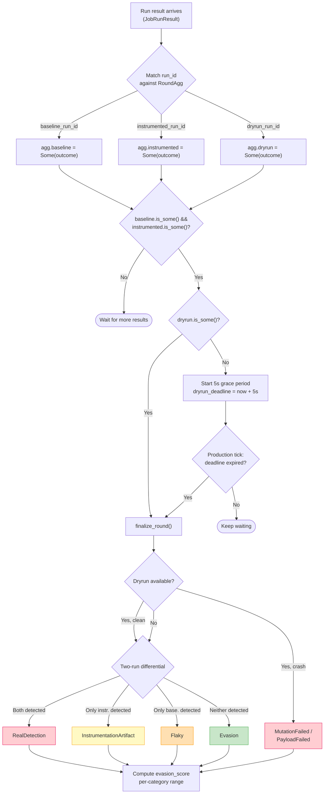
```mermaid
flowchart TD
    R1["Run result arrives<br/>(JobRunResult)"]
    R1 --> Match{"Match run_id<br/>against RoundAgg"}

    Match -->|"baseline_run_id"| SetBase["agg.baseline = Some(outcome)"]
    Match -->|"instrumented_run_id"| SetInst["agg.instrumented = Some(outcome)"]
    Match -->|"dryrun_run_id"| SetDry["agg.dryrun = Some(outcome)"]

    SetBase --> Check
    SetInst --> Check
    SetDry --> Check

    Check{"baseline.is_some() &&<br/>instrumented.is_some()?"}
    Check -->|"No"| Wait(["Wait for more results"])
    Check -->|"Yes"| DryCheck{"dryrun.is_some()?"}

    DryCheck -->|"Yes"| Finalize["finalize_round()"]
    DryCheck -->|"No"| Grace["Start 5s grace period<br/>dryrun_deadline = now + 5s"]
    Grace --> Tick{"Production tick:<br/>deadline expired?"}
    Tick -->|"No"| Wait2(["Keep waiting"])
    Tick -->|"Yes"| Finalize

    Finalize --> DryOverride{"Dryrun available?"}
    DryOverride -->|"Yes, crash"| MF["MutationFailed /<br/>PayloadFailed"]
    DryOverride -->|"Yes, clean"| TwoRun
    DryOverride -->|"No"| TwoRun

    TwoRun{"Two-run differential"}
    TwoRun -->|"Both detected"| RD["RealDetection"]
    TwoRun -->|"Only instr. detected"| IA["InstrumentationArtifact"]
    TwoRun -->|"Only base. detected"| FL["Flaky"]
    TwoRun -->|"Neither detected"| EV["Evasion"]

    RD --> Score
    IA --> Score
    FL --> Score
    EV --> Score
    MF --> Score

    Score["Compute evasion_score<br/>per-category range"]

    style RD fill:#ffcdd2,stroke:#E91E63
    style IA fill:#fff9c4,stroke:#F9A825
    style FL fill:#ffe0b2,stroke:#FF9800
    style EV fill:#c8e6c9,stroke:#4CAF50
    style MF fill:#ffcdd2,stroke:#E91E63
```

---

## 9. Evasion Scoring Ranges

Per-category score computation.

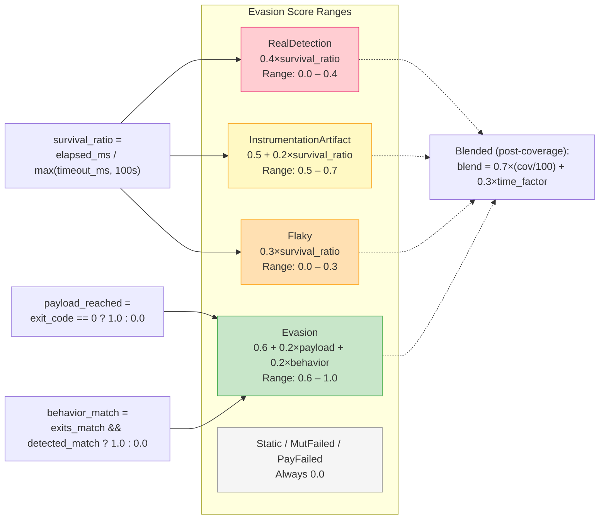
```mermaid
graph LR
    subgraph Scores["Evasion Score Ranges"]
        direction TB
        E["Evasion<br/>0.6 + 0.2×payload + 0.2×behavior<br/>Range: 0.6 – 1.0"]
        IA["InstrumentationArtifact<br/>0.5 + 0.2×survival_ratio<br/>Range: 0.5 – 0.7"]
        RD["RealDetection<br/>0.4×survival_ratio<br/>Range: 0.0 – 0.4"]
        FL["Flaky<br/>0.3×survival_ratio<br/>Range: 0.0 – 0.3"]
        ZR["Static / MutFailed / PayFailed<br/>Always 0.0"]
    end

    SR["survival_ratio =<br/>elapsed_ms / max(timeout_ms, 100s)"]
    PR["payload_reached =<br/>exit_code == 0 ? 1.0 : 0.0"]
    BM["behavior_match =<br/>exits_match && detected_match ? 1.0 : 0.0"]

    SR --> RD
    SR --> IA
    SR --> FL
    PR --> E
    BM --> E

    Blend["Blended (post-coverage):<br/>blend = 0.7×(cov/100) + 0.3×time_factor"]
    RD -.-> Blend
    IA -.-> Blend
    FL -.-> Blend
    E -.-> Blend

    style E fill:#c8e6c9,stroke:#4CAF50
    style IA fill:#fff9c4,stroke:#F9A825
    style RD fill:#ffcdd2,stroke:#E91E63
    style FL fill:#ffe0b2,stroke:#FF9800
    style ZR fill:#f5f5f5,stroke:#9E9E9E
```

---

## 10. Triage Feedback Loop

Token extraction → scoring → guidance → mutation selection.

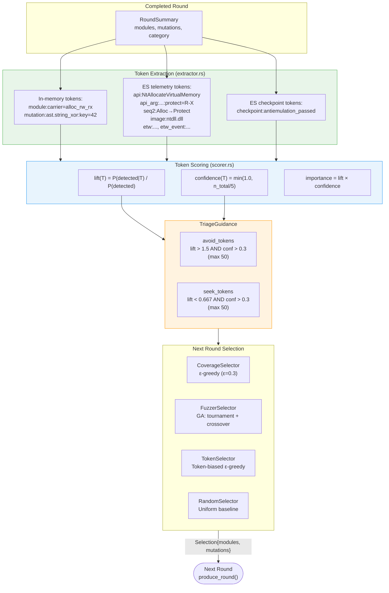
```mermaid
flowchart TD
    subgraph Round["Completed Round"]
        RS["RoundSummary<br/>modules, mutations, category"]
    end

    subgraph Extract["Token Extraction (extractor.rs)"]
        direction TB
        IM["In-memory tokens:<br/>module:carrier=alloc_rw_rx<br/>mutation:ast.string_xor:key=42"]
        ET["ES telemetry tokens:<br/>api:NtAllocateVirtualMemory<br/>api_arg:...:protect=R-X<br/>seq2:Alloc→Protect<br/>image:ntdll.dll<br/>etw:..., etw_event:..."]
        CP["ES checkpoint tokens:<br/>checkpoint:antiemulation_passed"]
    end

    subgraph Score["Token Scoring (scorer.rs)"]
        direction TB
        Lift["lift(T) = P(detected|T) / P(detected)"]
        Conf["confidence(T) = min(1.0, n_total/5)"]
        Imp["importance = lift × confidence"]
    end

    subgraph Guidance["TriageGuidance"]
        Avoid["avoid_tokens<br/>lift > 1.5 AND conf > 0.3<br/>(max 50)"]
        Seek["seek_tokens<br/>lift < 0.667 AND conf > 0.3<br/>(max 50)"]
    end

    subgraph Selection["Next Round Selection"]
        S1["CoverageSelector<br/>ε-greedy (ε=0.3)"]
        S2["FuzzerSelector<br/>GA: tournament + crossover"]
        S3["TokenSelector<br/>Token-biased ε-greedy"]
        S4["RandomSelector<br/>Uniform baseline"]
    end

    RS --> IM
    RS --> ET
    RS --> CP
    IM --> Score
    ET --> Score
    CP --> Score
    Lift --> Guidance
    Conf --> Guidance
    Guidance --> Selection

    Selection -->|"Selection{modules, mutations}"| NR(["Next Round<br/>produce_round()"])

    style Extract fill:#e8f5e9,stroke:#4CAF50
    style Score fill:#e8f4fd,stroke:#2196F3
    style Guidance fill:#fff3e0,stroke:#FF9800
```

---

## 11. Selector Strategies Comparison

Four selector implementations and their algorithms.

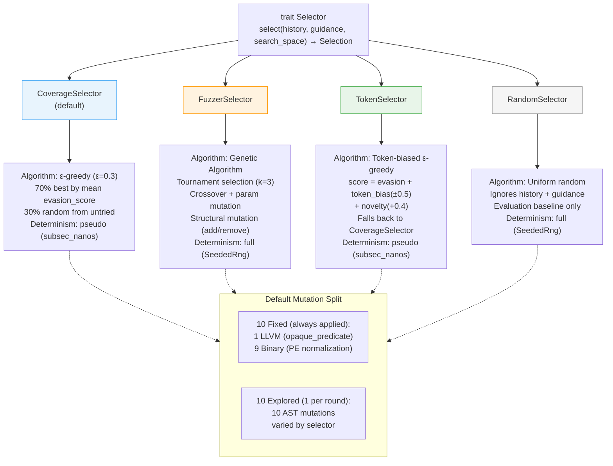
```mermaid
graph TD
    Trait["trait Selector<br/>select(history, guidance, search_space) → Selection"]

    Trait --> CS["CoverageSelector<br/>(default)"]
    Trait --> FS["FuzzerSelector"]
    Trait --> TS["TokenSelector"]
    Trait --> RS["RandomSelector"]

    CS --> CS1["Algorithm: ε-greedy (ε=0.3)<br/>70% best by mean evasion_score<br/>30% random from untried<br/>Determinism: pseudo (subsec_nanos)"]

    FS --> FS1["Algorithm: Genetic Algorithm<br/>Tournament selection (k=3)<br/>Crossover + param mutation<br/>Structural mutation (add/remove)<br/>Determinism: full (SeededRng)"]

    TS --> TS1["Algorithm: Token-biased ε-greedy<br/>score = evasion + token_bias(±0.5)<br/>+ novelty(+0.4)<br/>Falls back to CoverageSelector<br/>Determinism: pseudo (subsec_nanos)"]

    RS --> RS1["Algorithm: Uniform random<br/>Ignores history + guidance<br/>Evaluation baseline only<br/>Determinism: full (SeededRng)"]

    subgraph Mutations["Default Mutation Split"]
        Fixed["10 Fixed (always applied):<br/>1 LLVM (opaque_predicate)<br/>9 Binary (PE normalization)"]
        Explored["10 Explored (1 per round):<br/>10 AST mutations<br/>varied by selector"]
    end

    CS1 -.-> Mutations
    FS1 -.-> Mutations
    TS1 -.-> Mutations
    RS1 -.-> Mutations

    style CS fill:#e8f4fd,stroke:#2196F3
    style FS fill:#fff3e0,stroke:#FF9800
    style TS fill:#e8f5e9,stroke:#4CAF50
    style RS fill:#f5f5f5,stroke:#9E9E9E
```

---

## 12. VM Connection Lifecycle

`TargetManager.establish_stream()` — deferred VMExecutor spawn.

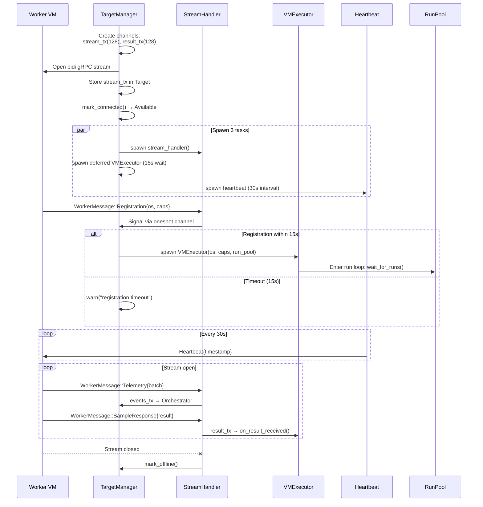
```mermaid
sequenceDiagram
    participant VM as Worker VM
    participant TM as TargetManager
    participant SH as StreamHandler
    participant VME as VMExecutor
    participant HB as Heartbeat
    participant RP as RunPool

    TM->>TM: Create channels:<br/>stream_tx(128), result_tx(128)
    TM->>VM: Open bidi gRPC stream
    TM->>TM: Store stream_tx in Target
    TM->>TM: mark_connected() → Available

    par Spawn 3 tasks
        TM->>SH: spawn stream_handler()
        TM->>TM: spawn deferred VMExecutor (15s wait)
        TM->>HB: spawn heartbeat (30s interval)
    end

    VM->>SH: WorkerMessage::Registration{os, caps}
    SH->>TM: Signal via oneshot channel

    alt Registration within 15s
        TM->>VME: spawn VMExecutor(os, caps, run_pool)
        VME->>RP: Enter run loop: wait_for_runs()
    else Timeout (15s)
        TM->>TM: warn("registration timeout")
    end

    loop Every 30s
        HB->>VM: Heartbeat{timestamp}
    end

    loop Stream open
        VM->>SH: WorkerMessage::Telemetry{batch}
        SH->>TM: events_tx → Orchestrator

        VM->>SH: WorkerMessage::SampleResponse{result}
        SH->>VME: result_tx → on_result_received()
    end

    VM--xSH: Stream closed
    SH->>TM: mark_offline()
```

---

## 13. Target State Machine

VM lifecycle states and transitions.

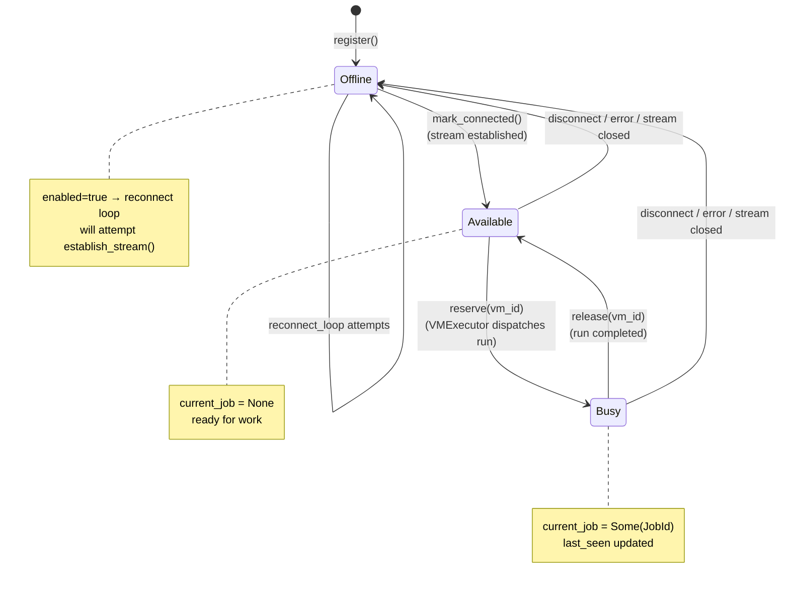
```mermaid
stateDiagram-v2
    [*] --> Offline: register()

    Offline --> Available: mark_connected()<br/>(stream established)
    Available --> Busy: reserve(vm_id)<br/>(VMExecutor dispatches run)
    Busy --> Available: release(vm_id)<br/>(run completed)

    Available --> Offline: disconnect / error / stream closed
    Busy --> Offline: disconnect / error / stream closed

    Offline --> Offline: reconnect_loop attempts

    note right of Offline
        enabled=true → reconnect loop
        will attempt establish_stream()
    end note

    note right of Busy
        current_job = Some(JobId)
        last_seen updated
    end note

    note right of Available
        current_job = None
        ready for work
    end note
```

---

## 14. Telemetry Data Flow

From VM execution through to ElasticSearch.

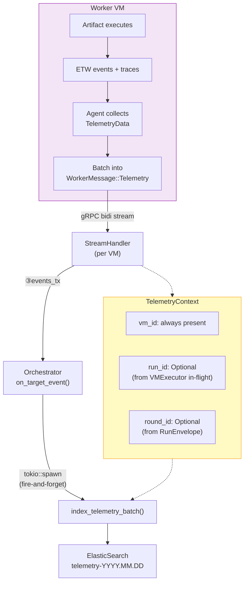
```mermaid
flowchart TD
    subgraph VM["Worker VM"]
        Exec["Artifact executes"]
        ETW["ETW events + traces"]
        Agent["Agent collects<br/>TelemetryData"]
        Batch["Batch into<br/>WorkerMessage::Telemetry"]
    end

    Exec --> ETW --> Agent --> Batch

    Batch -->|"gRPC bidi stream"| SH["StreamHandler<br/>(per VM)"]

    SH -->|"③events_tx"| Orch["Orchestrator<br/>on_target_event()"]

    Orch -->|"tokio::spawn<br/>(fire-and-forget)"| Index["index_telemetry_batch()"]

    Index --> ES["ElasticSearch<br/>telemetry-YYYY.MM.DD"]

    subgraph Correlation["TelemetryContext"]
        vid["vm_id: always present"]
        rid["run_id: Optional<br/>(from VMExecutor in-flight)"]
        roid["round_id: Optional<br/>(from RunEnvelope)"]
    end

    SH -.-> Correlation
    Correlation -.-> Index

    style VM fill:#f3e5f5,stroke:#9C27B0
    style Correlation fill:#fff9c4,stroke:#F9A825
```

---

## 15. Concurrency Model

Single-threaded coordination + multi-threaded execution.

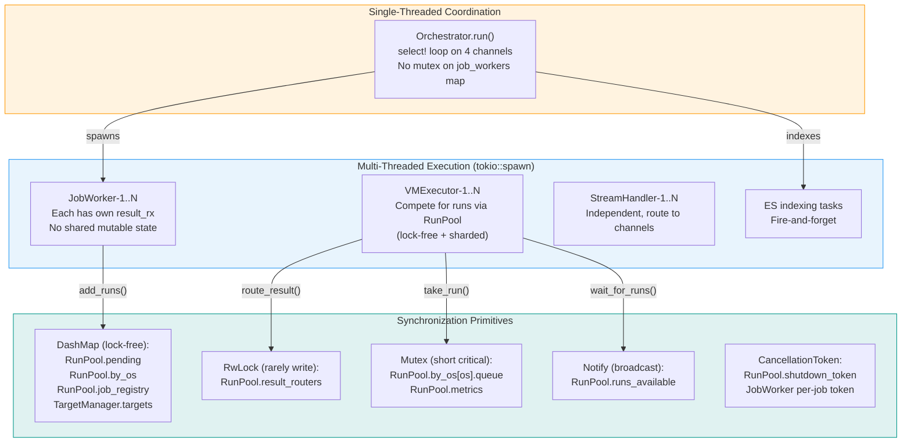
```mermaid
graph TD
    subgraph SingleThread["Single-Threaded Coordination"]
        Orch["Orchestrator.run()<br/>select! loop on 4 channels<br/>No mutex on job_workers map"]
    end

    subgraph MultiThread["Multi-Threaded Execution (tokio::spawn)"]
        JW["JobWorker-1..N<br/>Each has own result_rx<br/>No shared mutable state"]
        VME["VMExecutor-1..N<br/>Compete for runs via RunPool<br/>(lock-free + sharded)"]
        SH["StreamHandler-1..N<br/>Independent, route to channels"]
        ESI["ES indexing tasks<br/>Fire-and-forget"]
    end

    subgraph Primitives["Synchronization Primitives"]
        DM["DashMap (lock-free):<br/>RunPool.pending<br/>RunPool.by_os<br/>RunPool.job_registry<br/>TargetManager.targets"]
        RW["RwLock (rarely write):<br/>RunPool.result_routers"]
        MX["Mutex (short critical):<br/>RunPool.by_os[os].queue<br/>RunPool.metrics"]
        NT["Notify (broadcast):<br/>RunPool.runs_available"]
        CT["CancellationToken:<br/>RunPool.shutdown_token<br/>JobWorker per-job token"]
    end

    Orch -->|"spawns"| JW
    Orch -->|"indexes"| ESI
    JW -->|"add_runs()"| DM
    VME -->|"take_run()"| MX
    VME -->|"route_result()"| RW
    VME -->|"wait_for_runs()"| NT

    style SingleThread fill:#fff3e0,stroke:#FF9800
    style MultiThread fill:#e8f4fd,stroke:#2196F3
    style Primitives fill:#e0f2f1,stroke:#009688
```

---

## 16. Backpressure & Flow Control

Constants governing the system's throughput limits.

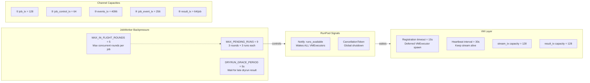
```mermaid
flowchart LR
    subgraph JobWorker["JobWorker Backpressure"]
        BP1["MAX_IN_FLIGHT_ROUNDS = 5<br/>Max concurrent rounds per job"]
        BP2["MAX_PENDING_RUNS = 9<br/>3 rounds × 3 runs each"]
        BP3["DRYRUN_GRACE_PERIOD = 5s<br/>Wait for late dryrun result"]
    end

    subgraph Pool["RunPool Signals"]
        N["Notify: runs_available<br/>Wakes ALL VMExecutors"]
        SD["CancellationToken<br/>Global shutdown"]
    end

    subgraph VM["VM Layer"]
        REG["Registration timeout = 15s<br/>Deferred VMExecutor spawn"]
        HB["Heartbeat interval = 30s<br/>Keep stream alive"]
        CH1["stream_tx capacity = 128"]
        CH2["result_tx capacity = 128"]
    end

    subgraph Channels["Channel Capacities"]
        C1["① job_tx = 128"]
        C2["② job_control_tx = 64"]
        C3["③ events_tx = 4096"]
        C4["④ job_event_tx = 256"]
        C5["⑤ result_tx = 64/job"]
    end

    BP1 -.-> BP2
    BP2 -->|"controls"| Pool
    Pool -->|"wakes"| VM
```

---

## 17. Storage: ES Index Families

Six index families with their rotation patterns.

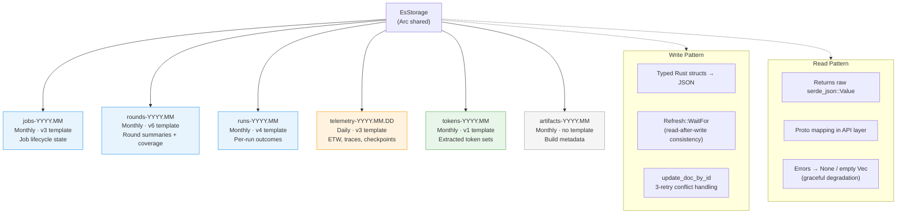
```mermaid
graph TD
    ES["EsStorage<br/>(Arc shared)"]

    ES --> Jobs["jobs-YYYY.MM<br/>Monthly · v3 template<br/>Job lifecycle state"]
    ES --> Rounds["rounds-YYYY.MM<br/>Monthly · v6 template<br/>Round summaries + coverage"]
    ES --> Runs["runs-YYYY.MM<br/>Monthly · v4 template<br/>Per-run outcomes"]
    ES --> Telem["telemetry-YYYY.MM.DD<br/>Daily · v3 template<br/>ETW, traces, checkpoints"]
    ES --> Tokens["tokens-YYYY.MM<br/>Monthly · v1 template<br/>Extracted token sets"]
    ES --> Arts["artifacts-YYYY.MM<br/>Monthly · no template<br/>Build metadata"]

    subgraph WritePattern["Write Pattern"]
        W1["Typed Rust structs → JSON"]
        W2["Refresh::WaitFor<br/>(read-after-write consistency)"]
        W3["update_doc_by_id<br/>3-retry conflict handling"]
    end

    subgraph ReadPattern["Read Pattern"]
        R1["Returns raw serde_json::Value"]
        R2["Proto mapping in API layer"]
        R3["Errors → None / empty Vec<br/>(graceful degradation)"]
    end

    ES -.-> WritePattern
    ES -.-> ReadPattern

    style Jobs fill:#e8f4fd,stroke:#2196F3
    style Rounds fill:#e8f4fd,stroke:#2196F3
    style Runs fill:#e8f4fd,stroke:#2196F3
    style Telem fill:#fff3e0,stroke:#FF9800
    style Tokens fill:#e8f5e9,stroke:#4CAF50
    style Arts fill:#f5f5f5,stroke:#9E9E9E
```

---

## 18. Differential Protocol: Two-Run + DryRun

The three-run protocol with dryrun override logic.

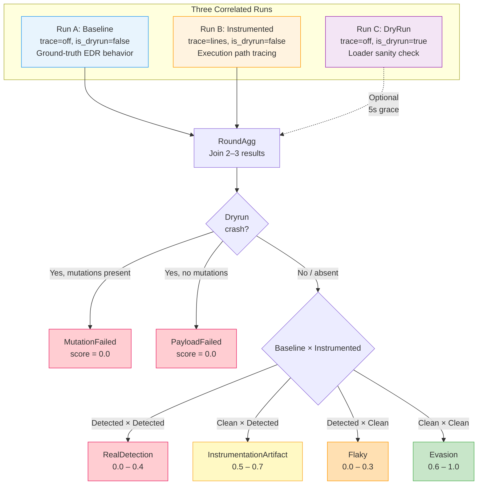
```mermaid
flowchart TD
    subgraph ThreeRuns["Three Correlated Runs"]
        B["Run A: Baseline<br/>trace=off, is_dryrun=false<br/>Ground-truth EDR behavior"]
        I["Run B: Instrumented<br/>trace=lines, is_dryrun=false<br/>Execution path tracing"]
        D["Run C: DryRun<br/>trace=off, is_dryrun=true<br/>Loader sanity check"]
    end

    B --> Join["RoundAgg<br/>Join 2–3 results"]
    I --> Join
    D -.->|"Optional<br/>5s grace"| Join

    Join --> DryQ{"Dryrun<br/>crash?"}

    DryQ -->|"Yes, mutations present"| MF["MutationFailed<br/>score = 0.0"]
    DryQ -->|"Yes, no mutations"| PF["PayloadFailed<br/>score = 0.0"]
    DryQ -->|"No / absent"| TwoRun

    TwoRun{"Baseline × Instrumented"}
    TwoRun -->|"Detected × Detected"| RD["RealDetection<br/>0.0 – 0.4"]
    TwoRun -->|"Clean × Detected"| IA["InstrumentationArtifact<br/>0.5 – 0.7"]
    TwoRun -->|"Detected × Clean"| FL["Flaky<br/>0.0 – 0.3"]
    TwoRun -->|"Clean × Clean"| EV["Evasion<br/>0.6 – 1.0"]

    style B fill:#e8f4fd,stroke:#2196F3
    style I fill:#fff3e0,stroke:#FF9800
    style D fill:#f3e5f5,stroke:#9C27B0
    style RD fill:#ffcdd2,stroke:#E91E63
    style IA fill:#fff9c4,stroke:#F9A825
    style FL fill:#ffe0b2,stroke:#FF9800
    style EV fill:#c8e6c9,stroke:#4CAF50
    style MF fill:#ffcdd2,stroke:#E91E63
    style PF fill:#ffcdd2,stroke:#E91E63
```

---

## 19. Module Dependencies

How the 5 controller modules depend on each other.

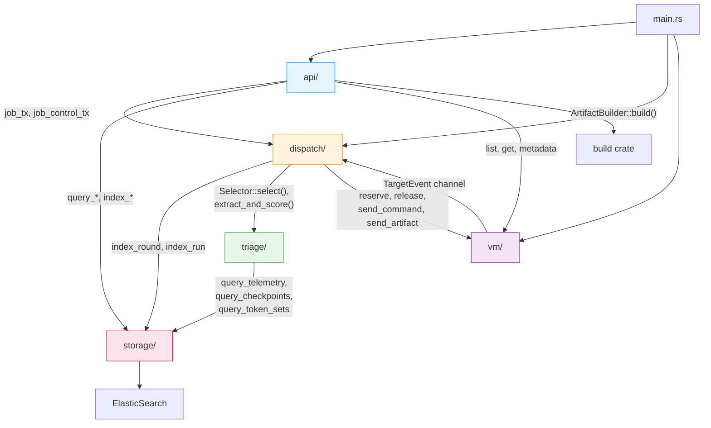
```mermaid
graph TD
    Main["main.rs"]

    Main --> API["api/"]
    Main --> Dispatch["dispatch/"]
    Main --> VMod["vm/"]

    API -->|"job_tx, job_control_tx"| Dispatch
    API -->|"query_*, index_*"| Storage["storage/"]
    API -->|"list, get, metadata"| VMod
    API -->|"ArtifactBuilder::build()"| Build["build crate"]

    Dispatch -->|"index_round, index_run"| Storage
    Dispatch -->|"Selector::select(),<br/>extract_and_score()"| Triage["triage/"]
    Dispatch -->|"reserve, release,<br/>send_command, send_artifact"| VMod

    Triage -->|"query_telemetry,<br/>query_checkpoints,<br/>query_token_sets"| Storage

    VMod -->|"TargetEvent channel"| Dispatch

    Storage --> ES["ElasticSearch"]

    style API fill:#e8f4fd,stroke:#2196F3
    style Dispatch fill:#fff3e0,stroke:#FF9800
    style Storage fill:#fce4ec,stroke:#E91E63
    style Triage fill:#e8f5e9,stroke:#4CAF50
    style VMod fill:#f3e5f5,stroke:#9C27B0
```

---

## 20. Startup Sequence

`main.rs` initialization order.

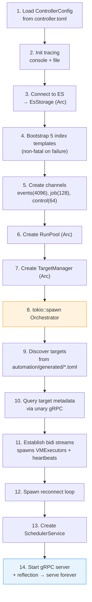
```mermaid
flowchart TD
    S1["1. Load ControllerConfig<br/>from controller.toml"]
    S2["2. Init tracing<br/>console + file"]
    S3["3. Connect to ES<br/>→ EsStorage (Arc)"]
    S4["4. Bootstrap 5 index templates<br/>(non-fatal on failure)"]
    S5["5. Create channels<br/>events(4096), job(128), control(64)"]
    S6["6. Create RunPool (Arc)"]
    S7["7. Create TargetManager (Arc)"]
    S8["8. tokio::spawn Orchestrator"]
    S9["9. Discover targets<br/>from automation/generated/*.toml"]
    S10["10. Query target metadata<br/>via unary gRPC"]
    S11["11. Establish bidi streams<br/>spawns VMExecutors + heartbeats"]
    S12["12. Spawn reconnect loop"]
    S13["13. Create SchedulerService"]
    S14["14. Start gRPC server<br/>+ reflection → serve forever"]

    S1 --> S2 --> S3 --> S4 --> S5 --> S6 --> S7 --> S8
    S8 --> S9 --> S10 --> S11 --> S12 --> S13 --> S14

    style S8 fill:#fff3e0,stroke:#FF9800
    style S14 fill:#e8f4fd,stroke:#2196F3
```
