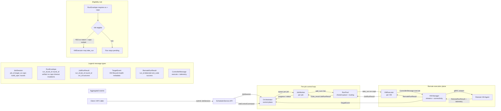
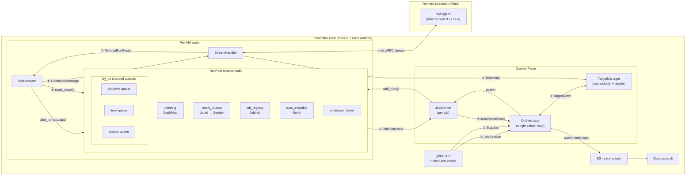
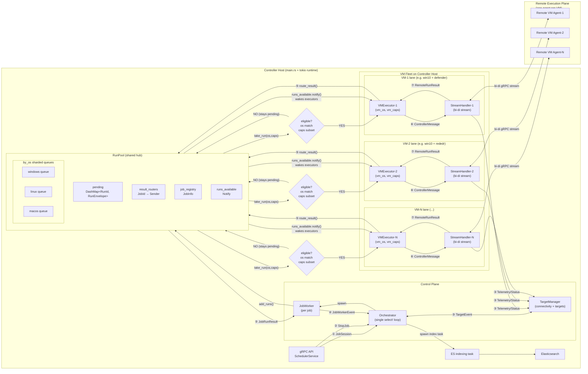
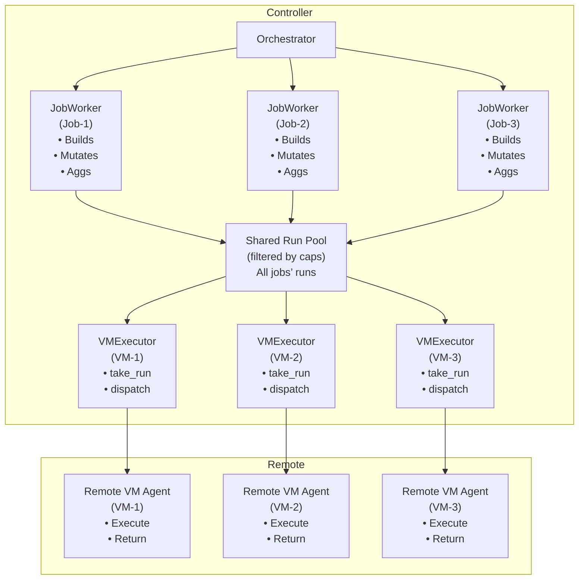

# Controller – Functional Flow Diagram

```mermaid
flowchart LR

    C[Client / API Caller] -->|submit JobSession| API[SchedulerService API]

    API -->|JobSession| ORCH[Orchestrator<br/>control plane]
    API -->|JobControlCommand| ORCH

    subgraph JOBS[Per-job control loop]
        direction TB
        ORCH -->|spawn per job| JW[JobWorker<br/>per job]
        JW -->|add_runs Vec<RunEnvelope>| POOL[RunPool<br/>shared queue + routing]
        POOL -->|route_result JobRunResult| JW
        JW -->|progress / status| ORCH
    end

    subgraph VMS[Remote execution plane]
        direction TB
        POOL -->|take_run os+caps| VME[VMExecutor<br/>per VM]
        VME -->|ControllerMessage execute| TM[VM Manager<br/>streams + connectivity]
        TM -->|gRPC stream| AGENT[Remote VM Agent]
        AGENT -->|RemoteRunResult + telemetry| TM
        TM -->|RemoteRunResult| VME
        VME -->|JobRunResult| POOL
    end

    subgraph EVENTS[Aggregated events]
        direction TB
        TM -->|TargetEvent| ORCH
    end

    subgraph LEGEND[Legend message types]
        direction TB
        L1[JobSession<br/>job_id target_os caps build_spec rounds]
        L2[RunEnvelope<br/>run_id job_id round_id artifact os caps timeout mutations]
        L3[JobRunResult<br/>run_id job_id round_id vm_id outcome]
        L4[TargetEvent<br/>VM lifecycle health metadata]
        L5[RemoteRunResult<br/>run_id detected exit_code success]
        L6[ControllerMessage<br/>execute + telemetry]
    end

    subgraph INSET[Eligibility rule]
        direction TB
        R[RunEnvelope requires os + caps] --> M{VM eligible}
        M -->|YES os match + caps subset| OK[VMExecutor may take_run]
        M -->|NO| NO[Run stays pending]
    end
```

# Global Overview

```mermaid
flowchart LR

%% =====================
%% Controller Host
%% =====================
    subgraph HOST["Controller Host (main.rs + tokio runtime)"]
        direction LR

        API["gRPC API\nSchedulerService"]
        ORCH["Orchestrator\n(single select! loop)"]

        API -->|"① JobSession"| ORCH
        API -->|"② StopJob"| ORCH

    %% ---------------------
    %% Control Plane
    %% ---------------------
        subgraph CTRL["Control Plane"]
            direction TB
            JW["JobWorker\n(per job)"]
            TM["TargetManager\n(connectivity + targets)"]

            ORCH -->|"spawn"| JW
            ORCH <-->|"③ TargetEvent"| TM
            JW -->|"④ JobWorkerEvent"| ORCH
        end

    %% ---------------------
    %% Shared RunPool
    %% ---------------------
        subgraph POOL["RunPool (shared hub)"]
            direction TB

            PENDING["pending\nDashMap<RunId, RunEnvelope>"]
            ROUTERS["result_routers\nJobId → Sender"]
            REGISTRY["job_registry\nJobInfo"]
            NOTIFY["runs_available\nNotify"]
            SHUTDOWN["shutdown_token"]

            subgraph QUEUES["by_os sharded queues"]
                direction LR
                WQ["windows queue"]
                LQ["linux queue"]
                MQ["macos queue"]
            end
        end

        JW -->|"add_runs()"| POOL
        POOL -->|"⑤ JobRunResult"| JW

    %% ---------------------
    %% Per-VM execution
    %% ---------------------
        subgraph EXEC["Per-VM tasks"]
            direction TB
            VME["VMExecutor"]
            SH["StreamHandler"]

            VME -->|"⑥ ControllerMessage"| SH
            SH -->|"⑦ RemoteRunResult"| VME
            SH -->|"③ Telemetry"| TM
            VME -->|"take_run(os,caps)"| POOL
            VME -->|"⑤ route_result()"| POOL
        end

        ORCH -->|"spawn index task"| ESIDX["ES indexing task"]
        ESIDX --> ES["Elasticsearch"]
    end

%% =====================
%% Remote Execution Plane
%% =====================
    subgraph REMOTE["Remote Execution Plane"]
        AGENT["VM Agent\n(Win10 / Win11 / Linux)"]
    end

    SH <-->|"bi-di gRPC stream"| AGENT

```

# different VMs

```mermaid
flowchart LR

    subgraph HOST["Controller Host (main.rs + tokio runtime)"]
        direction LR

        API["gRPC API<br/>SchedulerService"]
        ORCH["Orchestrator<br/>(single select! loop)"]

        API -->|"① JobSession"| ORCH
        API -->|"② StopJob"| ORCH

        subgraph CTRL["Control Plane"]
            direction TB
            JW["JobWorker<br/>(per job)"]
            TM["TargetManager<br/>(connectivity + targets)"]

            ORCH -->|"spawn"| JW
            ORCH <-->|"③ TargetEvent"| TM
            JW -->|"④ JobWorkerEvent"| ORCH
        end

        subgraph POOL["RunPool (shared hub)"]
            direction TB
            PENDING["pending<br/>DashMap&lt;RunId, RunEnvelope&gt;"]
            ROUTERS["result_routers<br/>JobId → Sender"]
            REGISTRY["job_registry<br/>JobInfo"]
            NOTIFY["runs_available<br/>Notify"]

            subgraph QUEUES["by_os sharded queues"]
                direction LR
                WQ["windows queue"]
                LQ["linux queue"]
                MQ["macos queue"]
            end
        end

        JW -->|"add_runs()"| POOL
        POOL -->|"⑤ JobRunResult"| JW

    %% VM fleet: one executor per connected VM/target
        subgraph FLEET["VM Fleet on Controller Host<br/>(one executor per connected target)"]
            direction TB

            subgraph VM1["VM-1 lane (e.g. win10 + defender)"]
                direction TB
                VME1["VMExecutor-1<br/>(vm_os, vm_caps)"]
                SH1["StreamHandler-1<br/>(bi-di stream)"]
                VME1 -->|"⑥ ControllerMessage"| SH1
                SH1 -->|"⑦ RemoteRunResult"| VME1
                SH1 -->|"③ Telemetry/Status"| TM
            end

            subgraph VM2["VM-2 lane (e.g. win10 + rededr)"]
                direction TB
                VME2["VMExecutor-2<br/>(vm_os, vm_caps)"]
                SH2["StreamHandler-2<br/>(bi-di stream)"]
                VME2 -->|"⑥ ControllerMessage"| SH2
                SH2 -->|"⑦ RemoteRunResult"| VME2
                SH2 -->|"③ Telemetry/Status"| TM
            end

            subgraph VMN["VM-N lane (...)"]
                direction TB
                VMEN["VMExecutor-N<br/>(vm_os, vm_caps)"]
                SHN["StreamHandler-N<br/>(bi-di stream)"]
                VMEN -->|"⑥ ControllerMessage"| SHN
                SHN -->|"⑦ RemoteRunResult"| VMEN
                SHN -->|"③ Telemetry/Status"| TM
            end
        end

    %% Wake-up signal (Notify wakes all, they compete)
        POOL -->|"runs_available.notify()<br/>wakes executors"| VME1
        POOL -->|"runs_available.notify()<br/>wakes executors"| VME2
        POOL -->|"runs_available.notify()<br/>wakes executors"| VMEN

    %% Eligibility gates + take_run
        POOL -->|"take_run(os,caps)"| G1{"eligible?<br/>os match<br/>caps subset"}
        G1 -->|"YES"| VME1
        G1 -->|"NO (stays pending)"| POOL

        POOL -->|"take_run(os,caps)"| G2{"eligible?<br/>os match<br/>caps subset"}
        G2 -->|"YES"| VME2
        G2 -->|"NO (stays pending)"| POOL

        POOL -->|"take_run(os,caps)"| GN{"eligible?<br/>os match<br/>caps subset"}
        GN -->|"YES"| VMEN
        GN -->|"NO (stays pending)"| POOL

    %% Results route back into pool
        VME1 -->|"⑤ route_result()"| POOL
        VME2 -->|"⑤ route_result()"| POOL
        VMEN -->|"⑤ route_result()"| POOL

        ORCH -->|"spawn index task"| ESIDX["ES indexing task"]
        ESIDX --> ES["Elasticsearch"]
    end

    subgraph REMOTE["Remote Execution Plane<br/>(one agent per VM)"]
        direction TB
        A1["Remote VM Agent-1"]
        A2["Remote VM Agent-2"]
        AN["Remote VM Agent-N"]
    end

    SH1 <-->|"bi-di gRPC stream"| A1
    SH2 <-->|"bi-di gRPC stream"| A2
    SHN <-->|"bi-di gRPC stream"| AN

```
# Overview

```mermaid
flowchart TB

subgraph HOST["Controller"]
    ORCH["Orchestrator"]
    
    %% --------------------
    %% Job workers (per job)
    %% --------------------
    ORCH --> JW1
    ORCH --> JW2
    ORCH --> JW3
    
    JW1["JobWorker<br/>(Job-1)<br/>• Builds<br/>• Mutates<br/>• Aggs"]
    JW2["JobWorker<br/>(Job-2)<br/>• Builds<br/>• Mutates<br/>• Aggs"]
    JW3["JobWorker<br/>(Job-3)<br/>• Builds<br/>• Mutates<br/>• Aggs"]
    
    %% --------------------
    %% Shared Run Pool
    %% --------------------
    JW1 --> POOL
    JW2 --> POOL
    JW3 --> POOL
    
    POOL["Shared Run Pool<br/>(filtered by caps)<br/>All jobs’ runs"]
    
    %% --------------------
    %% VM executors (controller-side)
    %% --------------------
    POOL --> VME1
    POOL --> VME2
    POOL --> VME3
    
    VME1["VMExecutor<br/>(VM-1)<br/>• take_run<br/>• dispatch"]
    VME2["VMExecutor<br/>(VM-2)<br/>• take_run<br/>• dispatch"]
    VME3["VMExecutor<br/>(VM-3)<br/>• take_run<br/>• dispatch"]
end
%% --------------------
%% Remote VM agents
%% --------------------
subgraph REMOTE["Remote"]
    VME1 --> AG1
    VME2 --> AG2
    VME3 --> AG3
    
    AG1["Remote VM Agent<br/>(VM-1)<br/>• Execute<br/>• Return"]
    AG2["Remote VM Agent<br/>(VM-2)<br/>• Execute<br/>• Return"]
    AG3["Remote VM Agent<br/>(VM-3)<br/>• Execute<br/>• Return"]
end

```