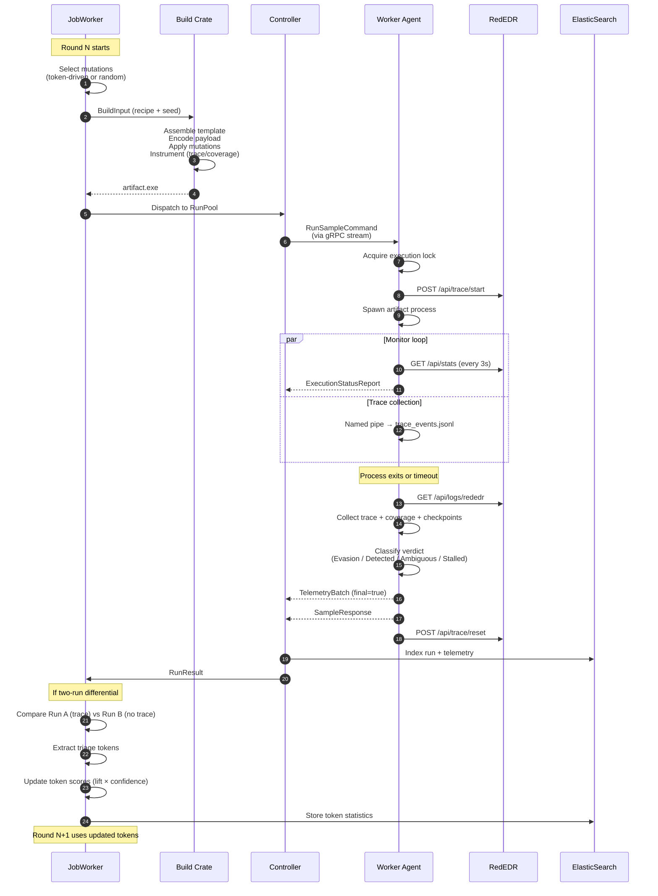
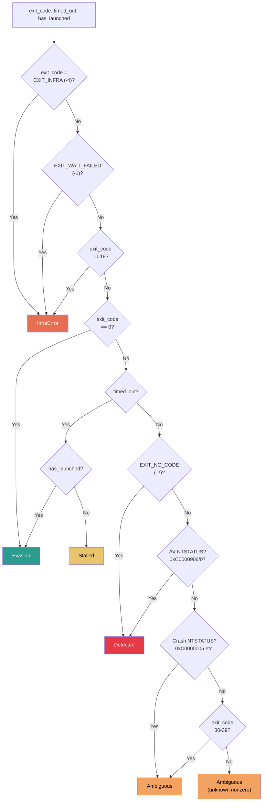

# AutoMutate++ — System Architecture

> Render with GitHub, VS Code Mermaid preview, or paste into [mermaid.live](https://mermaid.live).

## Full Infrastructure Diagram

```mermaid
graph TB
    %% ════════════════════════════════════════════════════════════════
    %% STYLING
    %% ════════════════════════════════════════════════════════════════
    classDef controller fill:#1a1a2e,stroke:#e94560,color:#fff,stroke-width:2px
    classDef build fill:#16213e,stroke:#0f3460,color:#fff,stroke-width:2px
    classDef storage fill:#0f3460,stroke:#53a8b6,color:#fff,stroke-width:2px
    classDef worker fill:#2b2d42,stroke:#ef233c,color:#fff,stroke-width:2px
    classDef agent fill:#3d405b,stroke:#81b29a,color:#fff,stroke-width:2px
    classDef edr fill:#264653,stroke:#2a9d8f,color:#fff,stroke-width:2px
    classDef ui fill:#1b263b,stroke:#778da9,color:#fff,stroke-width:2px
    classDef proto fill:#4a4e69,stroke:#c9ada7,color:#fff,stroke-width:1px,stroke-dasharray:5 5

    %% ════════════════════════════════════════════════════════════════
    %% CONTROLLER HOST (WSL2 / Linux)
    %% ════════════════════════════════════════════════════════════════
    subgraph CTRL["<b>Controller Host</b> &ensp; WSL2 / Linux"]
        direction TB

        subgraph CTRL_CORE["Controller &ensp; (Rust · gRPC server)"]
            direction LR
            ORC["<b>Orchestrator</b><br/>Round scheduler<br/>Job dispatch"]
            JW["<b>JobWorker</b><br/>Selector · Builder<br/>Round aggregation"]
            VME["<b>VMExecutor</b><br/>Per-VM task<br/>Artifact transfer"]
            RP["<b>RunPool</b><br/>Routing · Results<br/>OS affinity"]
            ORC --> JW
            JW --> RP
            RP --> VME
        end

        subgraph BUILD["Build Crate &ensp; (Rust · cross-compile)"]
            direction LR
            TPL["<b>Template Assembler</b><br/>loader.c + modules<br/>@MODULE markers"]
            ENC["<b>Encoder</b><br/>XOR / ENGLISH / SUBBYTES<br/>payload.h generation"]
            MUT["<b>Mutator</b><br/>AST · IR · Binary<br/>Behavioral layers"]
            INST["<b>Instrumenter</b><br/>Line tracer (AST/IR)<br/>BB coverage · Checkpoints"]
            CLANG["<b>Clang/LLVM + xwin</b><br/>C → IR → PE (.exe)<br/>Linux → Win x64"]
            TPL --> ENC --> MUT --> INST --> CLANG
        end

        subgraph TRIAGE["Triage Engine"]
            direction LR
            EXT["<b>Token Extractor</b><br/>ETW · API · seq · dt"]
            SCR["<b>Scorer</b><br/>Lift · Confidence<br/>Importance ranking"]
            DIFF["<b>Token Diff</b><br/>Round-over-round<br/>Avoid / Seek tokens"]
            EXT --> SCR --> DIFF
        end

        subgraph STORE["Storage"]
            direction LR
            ES[("<b>ElasticSearch</b><br/>Runs · Telemetry<br/>Rounds · Tokens")]
            KIB["<b>Kibana</b><br/>Dashboards<br/>Source viewer"]
            ES --- KIB
        end

        subgraph UISUB["UI Layer"]
            direction LR
            UIBE["<b>Backend</b><br/>Axum REST API<br/>gRPC→controller"]
            UIFE["<b>Frontend</b><br/>HTML · JS<br/>Job/Run views"]
            UIBE --- UIFE
        end
    end

    %% ════════════════════════════════════════════════════════════════
    %% WORKER VMs
    %% ════════════════════════════════════════════════════════════════
    subgraph VM1["<b>Worker VM 1</b> &ensp; Windows 11 · Defender + MDE"]
        direction TB
        AG1["<b>Worker Agent</b><br/>gRPC server<br/>Execution engine"]
        RE1["<b>RedEDR</b><br/>ETW collector<br/>HTTP API :8081"]
        DEF1["<b>Windows Defender</b><br/>+ MDE sensor"]
        MON1["<b>Monitor</b><br/>Poll /api/stats<br/>CPU · Mem · Idle"]
        PIPE1["<b>Trace Pipe</b><br/>Named pipe collector<br/>Binary + Base64"]
        AG1 --- RE1
        AG1 --- MON1
        AG1 --- PIPE1
        RE1 -.- DEF1
    end

    subgraph VM2["<b>Worker VM 2</b> &ensp; Windows 10 · Cortex XDR"]
        direction TB
        AG2["<b>Worker Agent</b><br/>gRPC server<br/>Execution engine"]
        RE2["<b>RedEDR</b><br/>ETW collector<br/>HTTP API :8081"]
        CX2["<b>Cortex XDR</b><br/>Agent"]
        MON2["<b>Monitor</b><br/>Poll /api/stats<br/>CPU · Mem · Idle"]
        PIPE2["<b>Trace Pipe</b><br/>Named pipe collector<br/>Binary + Base64"]
        AG2 --- RE2
        AG2 --- MON2
        AG2 --- PIPE2
        RE2 -.- CX2
    end

    subgraph VM3["<b>Worker VM 3</b> &ensp; Windows 11 · Dryrun (no AV)"]
        direction TB
        AG3["<b>Worker Agent</b><br/>gRPC server<br/>Dryrun mode"]
        NOTE3["No AV/EDR<br/>Baseline carrier<br/>error detection"]
        AG3 -.- NOTE3
    end

    %% ════════════════════════════════════════════════════════════════
    %% CONNECTIONS
    %% ════════════════════════════════════════════════════════════════

    %% Controller ↔ Workers (bidirectional gRPC stream)
    VME ===>|"gRPC stream<br/>Commands · Artifacts"| AG1
    AG1 ===>|"gRPC stream<br/>Telemetry · Results"| VME
    VME ===>|"gRPC stream"| AG2
    AG2 ===>|"gRPC stream"| VME
    VME ===>|"gRPC stream"| AG3
    AG3 ===>|"gRPC stream"| VME

    %% Internal controller flows
    JW -->|"BuildInput"| BUILD
    BUILD -->|".exe artifact"| JW
    JW -->|"RunResult"| TRIAGE
    TRIAGE -->|"Avoid/Seek tokens"| JW
    ORC -->|"Index runs/rounds"| STORE
    JW -->|"Store telemetry"| STORE
    TRIAGE -->|"Store token stats"| STORE

    %% UI
    UIBE -->|"gRPC client"| CTRL_CORE
    UIBE -->|"ES queries"| ES

    %% ════════════════════════════════════════════════════════════════
    %% APPLY STYLES
    %% ════════════════════════════════════════════════════════════════
    class ORC,JW,VME,RP controller
    class TPL,ENC,MUT,INST,CLANG build
    class ES,KIB storage
    class AG1,AG2,AG3 agent
    class RE1,RE2,DEF1,CX2 edr
    class MON1,MON2,PIPE1,PIPE2,NOTE3 worker
    class UIBE,UIFE ui
    class EXT,SCR,DIFF proto
```

## Data Flow — Single Mutation Round

## Execution Engine Detail (Worker Agent)

```mermaid
flowchart LR
    subgraph Input
        RQ["RunRequest<br/>job_id · artifact_id<br/>timeout · run_id"]
    end

    subgraph Engine["execute_run()"]
        direction TB
        V["Validate artifact"]
        RS["Setup RedEDR<br/>Contamination check<br/>Start tracing"]
        ENV["Prepare env<br/>Telemetry dir<br/>Trace collector"]
        SP["Spawn process<br/>Capture stdout/stderr"]
        MON["Monitor<br/>Poll RedEDR stats<br/>Idle/timeout detect"]
        WAIT["Wait for exit<br/>or timeout kill"]
        COL["Collect telemetry<br/>RedEDR · Trace<br/>Coverage · Checkpoints"]
        CLS["Classify verdict"]
        STR["Stream to controller<br/>via ControlPlaneSink"]
        RST["Reset RedEDR<br/>Cleanup artifacts"]

        V --> RS --> ENV --> SP --> MON --> WAIT --> COL --> CLS --> STR --> RST
    end

    subgraph Output
        RO["RunOutcome<br/>exit_code · verdict<br/>telemetry · timings"]
    end

    RQ --> V
    RST --> RO
```

## Detection Verdict Decision Tree

