# Worker Agent — Mermaid Diagrams

Visual diagrams for the `worker/agent/` crate architecture. The **Overview** provides a conceptual understanding of the whole module; subsequent diagrams detail each important subsystem.

---

## 1. Overview — Conceptual Architecture

The big picture: what the worker agent does, how data flows through it, and how it fits in the AutoMutate++ pipeline.

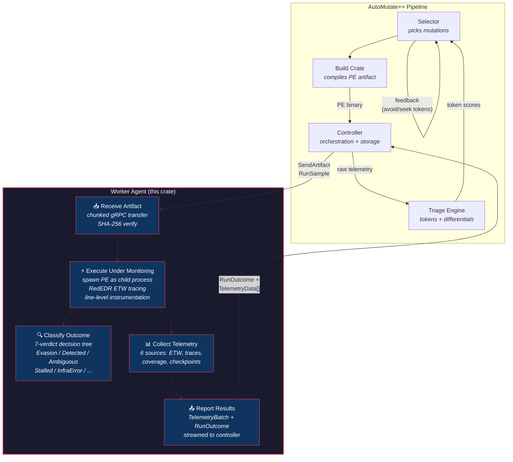

---

## 2. Layered Architecture

The crate's strict 5-layer design: each layer only depends on layers below it.

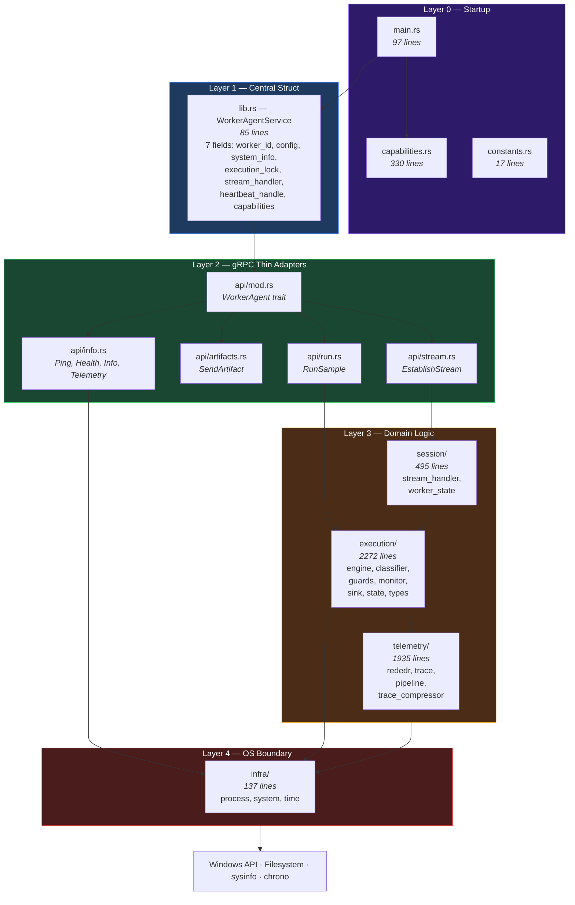

---

## 3. Inter-Module Dependency Graph

Detailed module-level dependency map showing which files call which.

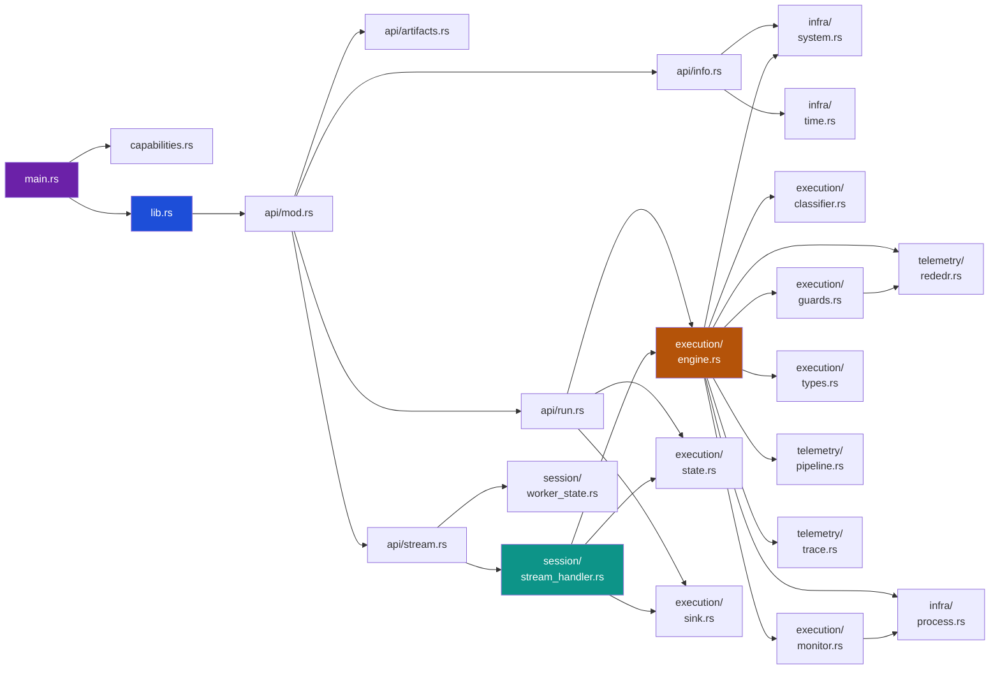

---

## 4. RunSample — Detailed Sequence

The complete lifecycle of a RunSample request from arrival through all 10 execution phases to response delivery. Two entry points (unary RPC and stream command) converge on the same execution engine.

```mermaid
sequenceDiagram
    autonumber
    participant C as Controller
    participant SH as StreamHandler
    participant U as api/run.rs
    participant L as ExecutionState lock
    participant S as ControlPlaneSink
    participant E as execute_run engine
    participant RE as RedEDR collector
    participant T as TraceCollector
    participant P as Artifact process
    participant M as ExecutionMonitor
    participant FS as Telemetry pipeline

    %% ─── ENTRY POINTS ───
    alt Bidirectional stream path
        C->>SH: ControllerMessage RunSampleCommand
        SH->>C: send_ack(request_id, success=true)
        SH->>SH: tokio::spawn (non-blocking, stream loop continues)
        SH->>SH: Update WorkerState (current_job_id, current_run_id)
        SH->>L: state.acquire(job_id, artifact_name, run_id)
        alt Already Running
            L-->>SH: error
            SH->>C: WorkerMessage SampleResponse (error)
            SH->>SH: Clear WorkerState
        else Idle → Running
            L-->>SH: ExecutionLockGuard created
            SH->>S: build_sink(Some(tx))
            SH->>E: execute_run(RunRequest, RunContext, sink)
        end
    else Unary RPC path
        C->>U: RunSample(SampleRequest)
        U->>U: resolve_run_id (worker_state.current_run_id or UUID v4)
        U->>L: state.acquire(job_id, artifact_name, run_id)
        alt Already Running
            L-->>U: error
            U-->>C: Status RESOURCE_EXHAUSTED
        else Idle → Running
            L-->>U: ExecutionLockGuard created
            U->>S: build_sink(stream_handler.sender() or None)
            U->>E: execute_run(RunRequest, RunContext, sink)
        end
    end

    %% ─── PHASE 1: VALIDATE ───
    Note over E: Phase 1 — Validate
    E->>E: Check artifact_path.exists()

    %% ─── PHASE 2: REDEDR SETUP ───
    Note over E,RE: Phase 2 — RedEDR Setup
    E->>RE: RedEdrCollector::new(config)
    Note over E,RE: RedEdrGuard created (reset_on_drop=true)
    E->>RE: collect_all("sanity-check")
    RE-->>E: Vec events

    alt >1 stale events + strict_mode
        E-->>SH: RunError FailedPrecondition
    else clean (0-1 events)
        E->>RE: start_trace([artifact.exe])
        RE->>RE: POST /api/trace/start
    end

    %% ─── PHASE 3: ENVIRONMENT ───
    Note over E,FS: Phase 3 — Prepare Environment
    E->>FS: prepare_telemetry_dir() (remove stale + create fresh)
    E->>T: TraceCollector::new(event_tx, capacity=100K)
    E->>T: spawn start_server() (named pipe \\.\pipe\rededr_trace)
    E->>FS: spawn streaming_writer (trace_rx → BufWriter 256KB → trace_events.jsonl)

    %% ─── PHASE 4: SPAWN ───
    Note over E,P: Phase 4 — Spawn Process
    E->>P: spawn_artifact(artifact_path, telemetry_dir)
    Note over E,P: ProcessGuard created (should_kill=true)
    P-->>E: PID

    %% ─── PHASE 5: MONITORING ───
    Note over E,M: Phase 5 — Start Monitoring
    E->>E: spawn capture_stream(stdout)
    E->>E: spawn capture_stream(stderr)
    E->>M: ExecutionMonitor::new(config, sink)
    E->>M: spawn monitor.start(stop_rx, event_tx)
    Note over E,M: MonitorGuard created (stop_tx, handle, event_consumer)
    M->>S: send_status("started", initial ExecutionStatusReport)
    S->>C: WorkerMessage ExecutionStatus (or dropped by NullSink)

    %% ─── CONCURRENT EXECUTION ───
    par Artifact executes
        P->>P: PE artifact running (payload logic)
        P->>T: writes trace data to named pipe
        T->>T: auto-detect binary (ISTR) or Base64 protocol
        T->>FS: TraceEvent → trace_tx channel → trace_events.jsonl
    and Monitor polls every 3 seconds
        loop Every MONITOR_POLL_INTERVAL_SECS (3s)
            M->>P: is_process_alive(pid)
            M->>M: get_process_metrics(pid) via sysinfo
            M->>RE: GET /api/stats (events_count only)
            M->>M: idle detection (cpu<5% + no new events for 3 cycles)
            M->>M: timeout check (within 5s of deadline)
            M->>S: send_status(heartbeat | telemetry_idle | approaching_timeout)
            S->>C: WorkerMessage ExecutionStatus
        end
    end

    %% ─── PHASE 6: WAIT ───
    Note over E,P: Phase 6 — Wait for Completion or Timeout
    E->>E: tokio::time::timeout(duration, child.wait())

    alt Process exits normally
        P-->>E: exit status
        E->>E: exit_code = status.code() or EXIT_NO_CODE (-2)
    else Timeout fires
        E->>E: sleep 100ms (race window)
        E->>P: try_wait()
        alt Exited during race window
            P-->>E: real exit code
        else Still alive
            E->>P: kill_process_tree() (taskkill /F /T + child.kill)
            E->>P: is_process_alive(pid) verify kill
            E->>E: exit_code = EXIT_TIMEOUT (-3)
        end
    else wait() system call error
        E->>E: exit_code = EXIT_WAIT_FAILED (-1)
    end

    E->>E: ProcessGuard.disarm() (takes Child, should_kill=false)

    %% ─── CLEANUP MONITORING ───
    Note over E,M: Cleanup — Drain concurrent tasks
    E->>E: await stdout_handle, stderr_handle
    E->>M: MonitorGuard.stop() (stop_tx → abort consumer → await handle 10s)
    M-->>E: monitor stopped
    E->>E: sleep 500ms (trace pipe flush)
    E->>T: abort trace_handle
    E->>T: drop trace_tx (closes channel)
    E->>FS: await streaming_handle (CLEANUP_TIMEOUT_SECS)
    FS-->>E: trace_events.jsonl finalized

    %% ─── PHASE 7: COLLECT TELEMETRY ───
    Note over E,FS: Phase 7 — Collect Telemetry (5 sources)
    E->>RE: collect_all(job_id)
    RE->>RE: GET /api/logs/rededr
    RE-->>E: Vec TelemetryData (ETW events)
    E->>FS: package_trace_log(trace_events.jsonl)
    FS->>FS: deduplicate by (file,line,func) ~95% reduction
    FS->>FS: if >3.5MB: progressive tail truncation (binary search halving)
    FS-->>E: trace_log event
    E->>FS: collect_trace_log_binary(trace.log)
    FS-->>E: binary trace events
    E->>FS: collect_bb_coverage(coverage_bbs.txt)
    FS-->>E: CoverageEvent
    E->>FS: collect_api_checkpoints(checkpoints.log)
    FS-->>E: Vec CheckpointEvent

    %% ─── PHASE 7B: CLASSIFY ───
    Note over E: Phase 7b — Classify Detection Outcome
    E->>E: extract_evidence (scan checkpoints for has_launched, last_checkpoint)
    E->>E: classify_outcome (11-step decision tree)
    E->>E: detection_verdict + last_checkpoint
    E->>E: add phase_timings as telemetry event

    %% ─── PHASE 8: STREAM TELEMETRY ───
    Note over E,C: Phase 8 — Stream Telemetry to Controller
    E->>S: send_telemetry(TelemetryBatch is_final=true)
    S->>C: WorkerMessage Telemetry (or dropped by NullSink)

    %% ─── PHASE 9: RESET REDEDR ───
    Note over E,RE: Phase 9 — Reset RedEDR
    E->>RE: reset_now()
    RE->>RE: POST /api/trace/reset
    Note over E,RE: RedEdrGuard disarmed (reset_on_drop=false)

    %% ─── PHASE 10: CLEANUP ───
    Note over E,FS: Phase 10 — Cleanup
    E->>FS: cleanup_run_artifacts (remove artifact.exe + telemetry_dir)

    E-->>E: Return RunOutcome

    %% ─── RESPONSE ───
    alt Stream path response
        E-->>SH: RunOutcome
        SH->>SH: format_output() + sample_response_ok()
        SH->>C: WorkerMessage SampleResponse via tx
        SH->>SH: Clear WorkerState (job_id=None, run_id=None)
    else Unary path response
        E-->>U: RunOutcome
        U->>U: format_output() + sample_response_ok()
        U-->>C: Response SampleResponse
    end

    Note over L: ExecutionLockGuard Drop → tokio::spawn state.release() → Idle
```

**Key differences between paths:**

| Aspect | Unary RPC (api/run.rs) | Stream Command (stream_handler.rs) |
|--------|----------------------|-----------------------------------|
| Blocking | Blocks gRPC call until completion | Spawns async task, returns immediately |
| Run ID source | worker_state.current_run_id or UUID | request_id from RunSampleCommand |
| Response delivery | gRPC Response return value | WorkerMessage via tx channel |
| Worker state | Not updated | Sets/clears current_job_id and current_run_id |
| Ack | None | Immediate Ack before execution |
| Error handling | Returns gRPC Status error | Sends error SampleResponse via stream |

---

## 5. Execution Pipeline — 10 Phases

The core of the worker agent: the `execute_run()` function's 10-phase pipeline.

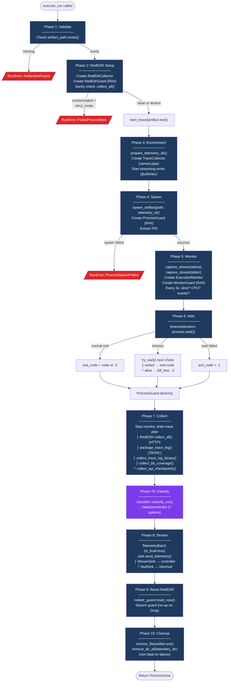

---

## 6. Detection Classifier — 11-Step Decision Tree

The `classify_run()` function that produces one of 7 verdicts from local signals.

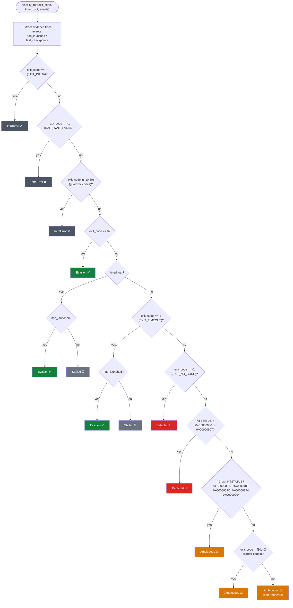

---

## 7. Telemetry Architecture — 6 Sources

Data flow from artifact execution through the 6 telemetry collection paths into the final `TelemetryBatch`.

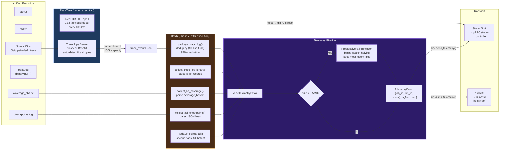

---

## 8. Communication Architecture — Unary vs Bidirectional Stream

Two coexisting gRPC communication models sharing the same execution engine.

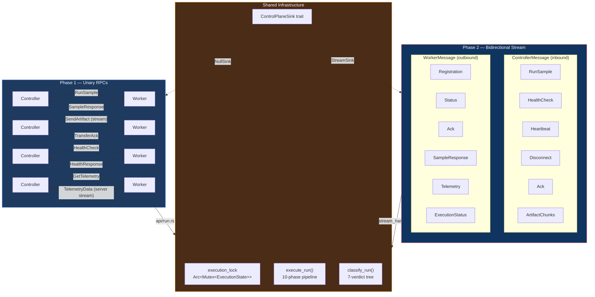

---

## 9. Stream Handler Lifecycle

How the bidirectional gRPC stream session is established, used, and replaced on reconnection.

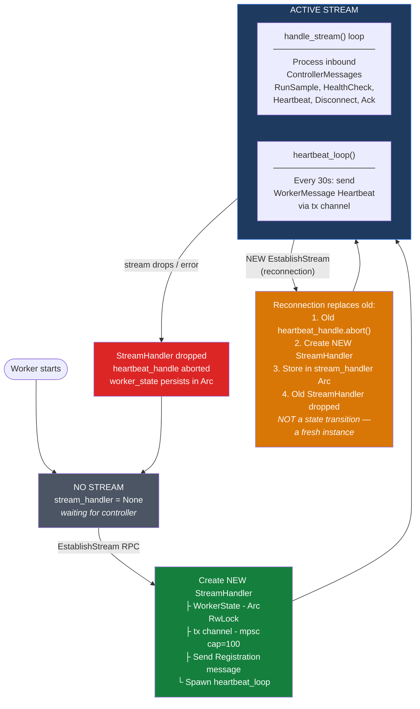

---

## 10. RAII Guard System

Three guard types that guarantee resource cleanup on all exit paths, including panics.

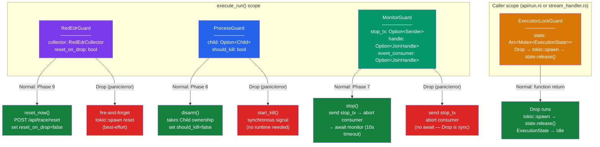

---

## 11. Shared State & Concurrency Model

How the `WorkerAgentService` struct's shared state is accessed by concurrent tasks.

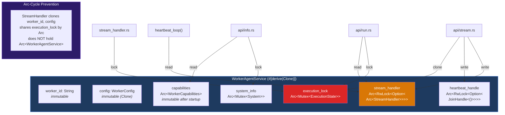

---

## 12. Execution Lock State Machine

The single-execution guarantee enforced by the `ExecutionState` enum.

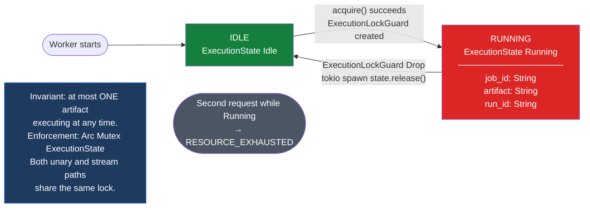

---

## 13. Execution Monitor Poll Loop

The `ExecutionMonitor` that runs every 3 seconds during artifact execution.

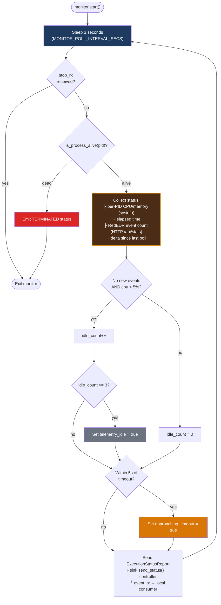

---

## 14. Artifact Transfer Flow

Chunked PE binary transfer with SHA-256 integrity verification.

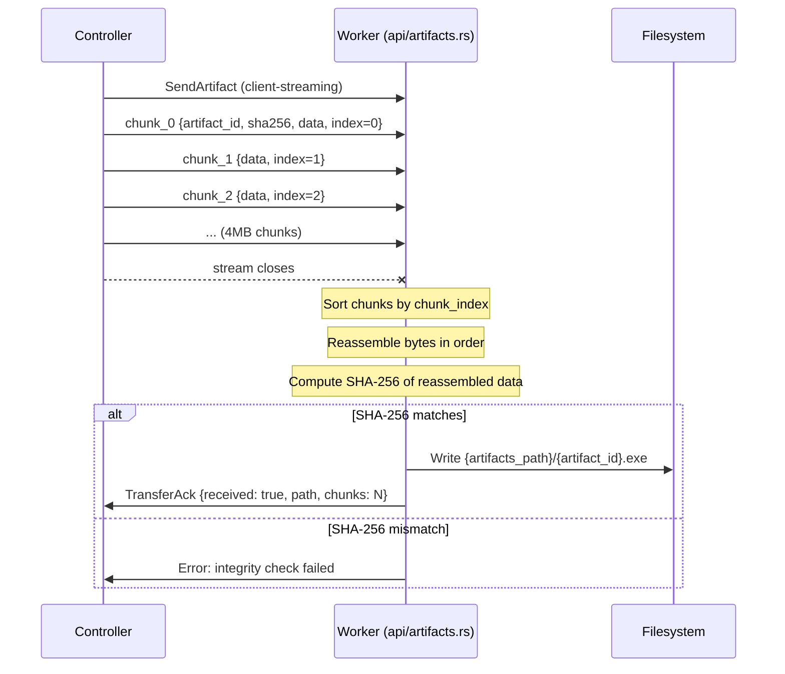

---

## 15. Capability Detection at Startup

Environment probing that runs once at startup and is cached for the process lifetime.

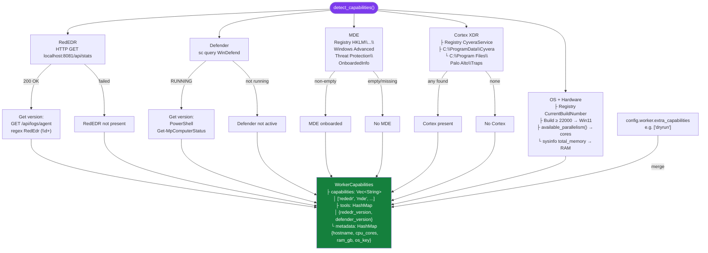

---

## 16. Dryrun Path — Lightweight 6-Phase Execution

Simplified execution for ground-truth behavior on clean VMs (no instrumentation, no monitoring).

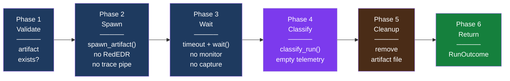

---

## 17. ControlPlaneSink — Strategy Pattern

Transport abstraction that decouples the execution engine from gRPC.

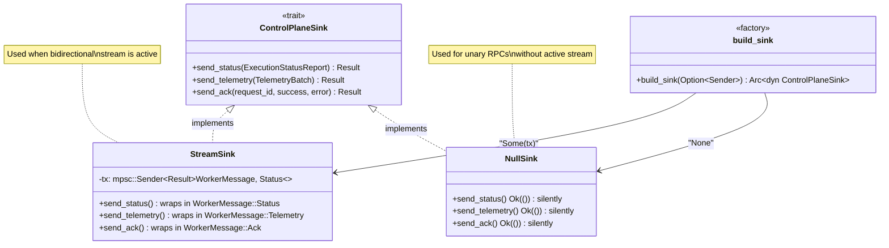

---

## 18. Trace Collector — Protocol Auto-Detection

Named pipe server that accepts line traces from the instrumented artifact, supporting two wire formats.

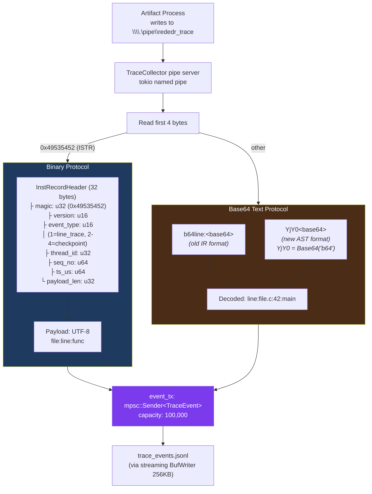

---

## 19. Concurrency — Task Tree for One Execution

All async tasks spawned during a single `execute_run()` invocation.

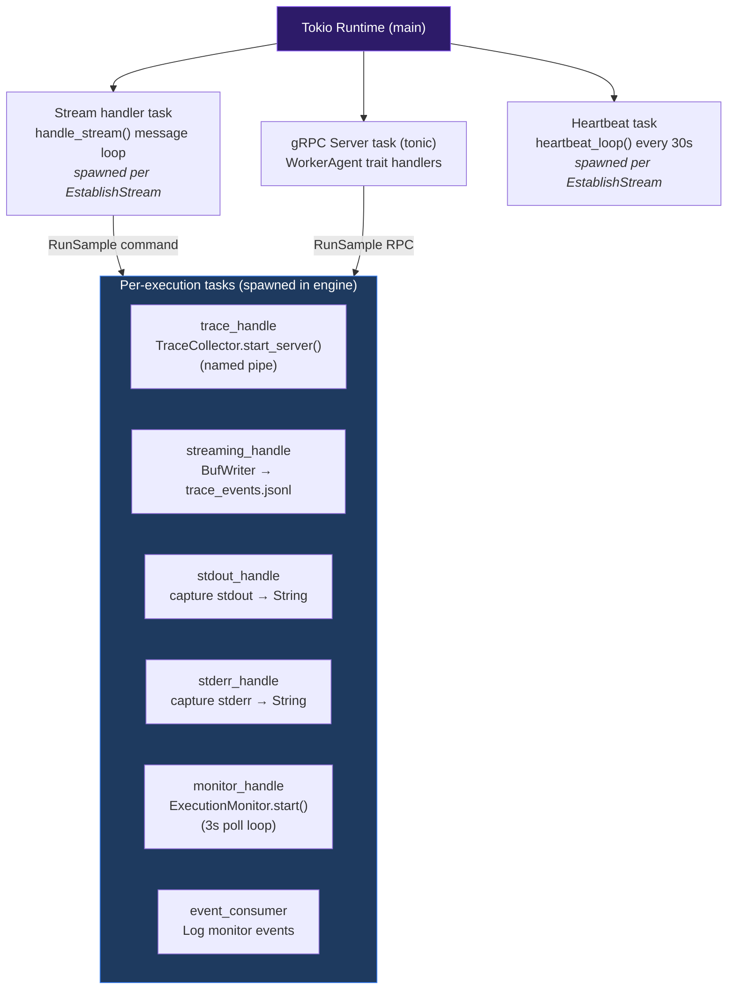

---

## 20. Two-Run Differential Protocol

How the worker agent supports the two-run differential that distinguishes real detections from instrumentation artifacts.

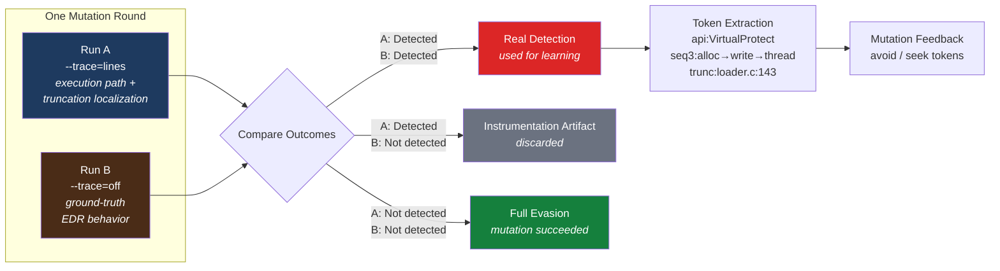
