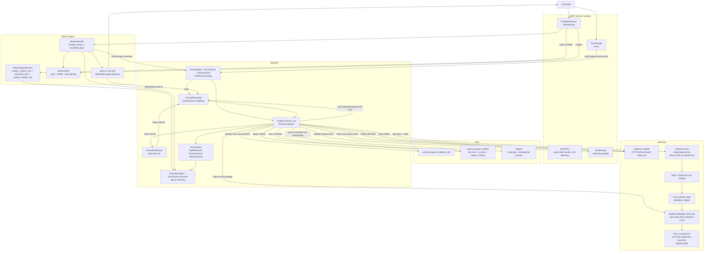
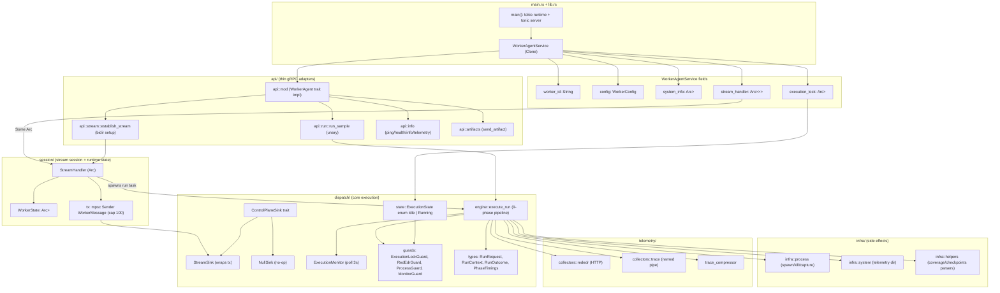
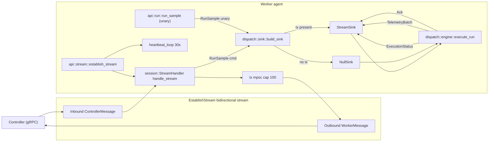
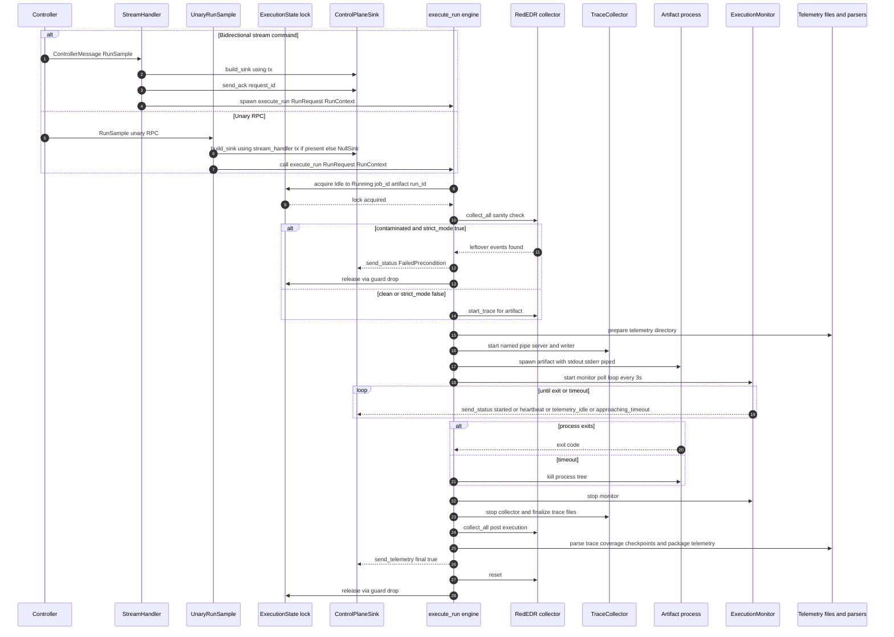
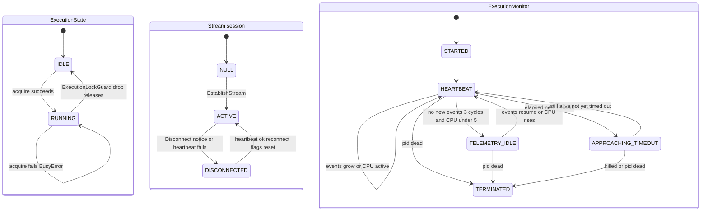
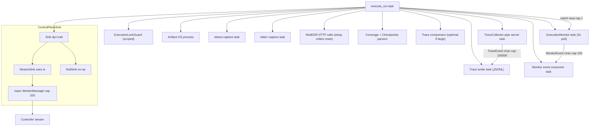

# Global

```mermaid
flowchart TB
  %% ===== Control plane =====
  C[Controller]
  subgraph GRPC[gRPC Service Surface]
    ES[EstablishStream<br/>bidirectional]
    UR[RunSample<br/>unary]
    HI[Info RPCs<br/>ping health worker_info telemetry]
    AR[SendArtifact<br/>streaming upload]
  end

  %% ===== Worker core =====
  subgraph W[Worker Agent]
    SVC[WorkerAgentService<br/>config + system_info + execution_lock + stream_handler_opt]
    SH[StreamHandler<br/>handle_stream + heartbeat_loop]
    WS[WorkerState<br/>caps + health + job tracking]
    TX[mpsc tx cap 100<br/>WorkerMessage outbound]
  end

  %% ===== Execution orchestration =====
  subgraph D[dispatch]
    LOCK[ExecutionState + ExecutionLockGuard<br/>Idle or Running]
    SINK[ControlPlaneSink<br/>StreamSink or NullSink]
    ENG[engine.execute_run<br/>9-phase pipeline]
    MON[ExecutionMonitor<br/>poll every 3s]
    G[RAII guards<br/>RedEdrGuard ProcessGuard MonitorGuard]
    TYPES[RunRequest + RunContext + RunOutcome<br/>RunPhaseTimings]
  end

  %% ===== Infra boundary =====
  subgraph I[infra]
    SYS[system.prepare_telemetry_dir]
    PROC[process.spawn_artifact<br/>kill_tree + is_alive + capture_stream]
    HELP[helpers<br/>coverage + checkpoints parsers]
  end

  %% ===== Telemetry =====
  subgraph T[telemetry]
    RED[collectors.rededr<br/>HTTP poll and batch collect_all]
    PIPE[collectors.trace<br/>named pipe server<br/>binary ISTR or base64 text]
    CH[mpsc TraceEvent cap 100000]
    WR[trace JSONL writer<br/>BufWriter 256KB]
    PKG[pipeline.package_trace_log<br/>size check then compress or tail]
    COMP[trace_compressor<br/>CLP then motifs then grammar<br/>optional gzip]
  end

  %% ===== Wiring: service and stream =====
  C --> ES --> SH
  SH --> TX --> C
  SH --> WS
  ES -->|creates| WS
  ES -->|stores handler| SVC
  SVC --> LOCK
  SH --> LOCK

  %% ===== Two entrypoints converge to engine =====
  C --> UR
  UR -->|build request and context| TYPES
  SH -->|RunSample command| TYPES
  TYPES -->|build| SINK
  TX -->|StreamSink uses tx| SINK
  TYPES --> ENG
  SINK --> ENG

  %% ===== Engine phases (collapsed) =====
  ENG -->|validate artifact exists| AR
  ENG -->|setup and sanity check| RED
  ENG -->|prepare dirs and collectors| SYS
  ENG -->|start pipe + writer| PIPE
  PIPE --> CH --> WR
  ENG -->|spawn artifact| PROC
  ENG -->|start monitor| MON
  MON -->|status reports| SINK
  ENG -->|wait or timeout| PROC
  ENG -->|collect telemetry| RED
  ENG -->|collect trace package| PKG
  WR --> PKG
  PKG --> COMP
  ENG -->|parse coverage and checkpoints| HELP
  ENG -->|send telemetry batch final true| SINK
  ENG -->|reset rededr| RED
  ENG --> G
  G --> LOCK
```

# Big picture

```mermaid
flowchart TB
  %% --- main.rs / lib.rs ---
  subgraph SG_MAIN["main.rs + lib.rs"]
    MAIN["main(): tokio runtime + tonic server"]
    SVC["WorkerAgentService (Clone)"]
    MAIN --> SVC
  end

  subgraph SG_SVC["WorkerAgentService fields"]
    WID["worker_id: String"]
    CFG["config: WorkerConfig"]
    SYS["system_info: Arc<Mutex<System>>"]
    EXLOCK["execution_lock: Arc<Mutex<ExecutionState>>"]
    SHSLOT["stream_handler: Arc<RwLock<Option<Arc<StreamHandler>>>>"]
  end

  SVC --> WID
  SVC --> CFG
  SVC --> SYS
  SVC --> EXLOCK
  SVC --> SHSLOT

  %% --- gRPC adapter layer ---
  subgraph SG_API["api/ (thin gRPC adapters)"]
    API_MOD["api::mod (WorkerAgent trait impl)"]
    API_RUN["api::run::run_sample (unary)"]
    API_STREAM["api::stream::establish_stream (bidir setup)"]
    API_INFO["api::info (ping/health/info/telemetry)"]
    API_ART["api::artifacts (send_artifact)"]
  end

  SVC --> API_MOD
  API_MOD --> API_RUN
  API_MOD --> API_STREAM
  API_MOD --> API_INFO
  API_MOD --> API_ART

  %% --- session (stream + runtime state) ---
  subgraph SG_SESSION["session/ (stream session + runtime state)"]
    SH["StreamHandler (Arc)"]
    WS["WorkerState: Arc<RwLock<WorkerState>>"]
    TX["tx: mpsc Sender WorkerMessage (cap 100)"]
    SH --> WS
    SH --> TX
  end

  SHSLOT -->|"Some Arc"| SH

  %% --- dispatch (core execution) ---
  subgraph SG_DISPATCH["dispatch/ (core execution)"]
    SINK["ControlPlaneSink trait"]
    SS["StreamSink (wraps tx)"]
    NS["NullSink (no-op)"]
    ENG["engine::execute_run (9-phase pipeline)"]
    MON["ExecutionMonitor (poll 3s)"]
    GUARDS["guards: ExecutionLockGuard, RedEdrGuard, ProcessGuard, MonitorGuard"]
    STATE["state::ExecutionState enum Idle | Running"]
    TYPES["types: RunRequest, RunContext, RunOutcome, PhaseTimings"]
  end

  TX --> SS
  SINK --> SS
  SINK --> NS
  API_RUN --> ENG
  API_STREAM --> SH
  SH -->|"spawns run task"| ENG
  ENG --> MON
  ENG --> GUARDS
  EXLOCK --> STATE
  STATE --> GUARDS
  ENG --> TYPES

  %% --- infra + telemetry ---
  subgraph SG_INFRA["infra/ (side effects)"]
    PROC["infra::process (spawn/kill/capture)"]
    SYSOP["infra::system (telemetry dir)"]
    HELP["infra::helpers (coverage/checkpoints parsers)"]
  end

  subgraph SG_TELE["telemetry/"]
    RED["collectors::rededr (HTTP)"]
    TRC["collectors::trace (named pipe)"]
    COMP["trace_compressor"]
  end

  ENG --> PROC
  ENG --> SYSOP
  ENG --> HELP
  ENG --> RED
  ENG --> TRC
  ENG --> COMP
```

# Control plane

```mermaid
flowchart LR
  CTRL["Controller (gRPC)"]

  subgraph BIDIR["EstablishStream bidirectional stream"]
    IN["Inbound ControllerMessage"]
    OUT["Outbound WorkerMessage"]
  end

  subgraph WORKER["Worker agent"]
    EST["api::stream::establish_stream"]
    SH["session::StreamHandler handle_stream"]
    HB["heartbeat_loop 30s"]
    TX["tx mpsc cap 100"]
    RUNU["api::run::run_sample (unary)"]
    ENG["dispatch::engine::execute_run"]
    SINKF["dispatch::sink::build_sink"]
    SS["StreamSink"]
    NS["NullSink"]
  end

  CTRL --> IN --> SH
  SH --> TX --> OUT --> CTRL

  EST --> SH
  EST --> HB
  SH -->|RunSample cmd| SINKF
  RUNU -->|RunSample unary| SINKF

  SINKF -->|tx present| SS
  SINKF -->|no tx| NS

  SS --> ENG
  NS --> ENG

  ENG -->|ExecutionStatus| SS
  ENG -->|TelemetryBatch| SS
  ENG -->|Ack| SS

```

# RunSample

```mermaid
sequenceDiagram
  autonumber
  participant C as Controller
  participant SH as StreamHandler
  participant U as UnaryRunSample
  participant L as ExecutionState lock
  participant S as ControlPlaneSink
  participant E as execute_run engine
  participant RE as RedEDR collector
  participant T as TraceCollector
  participant P as Artifact process
  participant M as ExecutionMonitor
  participant FS as Telemetry files and parsers

  alt Bidirectional stream command
    C->>SH: ControllerMessage RunSample
    SH->>S: build_sink using tx
    SH->>S: send_ack request_id
    SH->>E: spawn execute_run RunRequest RunContext
  else Unary RPC
    C->>U: RunSample unary RPC
    U->>S: build_sink using stream_handler tx if present else NullSink
    U->>E: call execute_run RunRequest RunContext
  end

  E->>L: acquire Idle to Running job_id artifact run_id
  L-->>E: lock acquired

  E->>RE: collect_all sanity check
  alt contaminated and strict_mode true
    RE-->>E: leftover events found
    E-->>S: send_status FailedPrecondition
    E->>L: release via guard drop
  else clean or strict_mode false
    E->>RE: start_trace for artifact
  end

  E->>FS: prepare telemetry directory
  E->>T: start named pipe server and writer
  E->>P: spawn artifact with stdout stderr piped
  E->>M: start monitor poll loop every 3s

  loop until exit or timeout
    M-->>S: send_status started or heartbeat or telemetry_idle or approaching_timeout
  end

  alt process exits
    P-->>E: exit code
  else timeout
    E->>P: kill process tree
  end

  E->>M: stop monitor
  E->>T: stop collector and finalize trace files
  E->>RE: collect_all post execution
  E->>FS: parse trace coverage checkpoints and package telemetry
  E-->>S: send_telemetry final true
  E->>RE: reset
  E->>L: release via guard drop

```

# State machine

```mermaid
stateDiagram-v2
  state "ExecutionState" as ES {
    [*] --> IDLE
    IDLE --> RUNNING: acquire succeeds
    RUNNING --> IDLE: ExecutionLockGuard drop releases
    RUNNING --> RUNNING: acquire fails BusyError
  }

  state "Stream session" as SS {
    [*] --> NULL
    NULL --> ACTIVE: EstablishStream
    ACTIVE --> DISCONNECTED: Disconnect notice or heartbeat fails
    DISCONNECTED --> ACTIVE: heartbeat ok reconnect flags reset
  }

  state "ExecutionMonitor" as EM {
    [*] --> STARTED
    STARTED --> HEARTBEAT
    HEARTBEAT --> HEARTBEAT: events grow or CPU active
    HEARTBEAT --> TELEMETRY_IDLE: no new events 3 cycles and CPU under 5
    HEARTBEAT --> APPROACHING_TIMEOUT: elapsed near timeout
    TELEMETRY_IDLE --> HEARTBEAT: events resume or CPU rises
    APPROACHING_TIMEOUT --> HEARTBEAT: still alive not yet timed out
    HEARTBEAT --> TERMINATED: pid dead
    TELEMETRY_IDLE --> TERMINATED: pid dead
    APPROACHING_TIMEOUT --> TERMINATED: killed or pid dead
  }

```

# Concurrency

```mermaid
flowchart TB
  REQ["execute_run task"]
  REQ --> LOCK["ExecutionLockGuard (scoped)"]

  %% spawned / concurrent activities
  REQ --> PROC["Artifact OS process"]
  REQ --> MON["ExecutionMonitor task (3s poll)"]
  REQ --> PIPE["TraceCollector pipe server task"]
  REQ --> WR["Trace writer task (JSONL)"]
  REQ --> OUT1["stdout capture task"]
  REQ --> OUT2["stderr capture task"]
  REQ --> CONS["Monitor event consumer task"]
  REQ --> RED["RedEDR HTTP calls (setup collect reset)"]
  REQ --> PARSE["Coverage + Checkpoints parsers"]
  REQ --> COMP["Trace compressor (optional if large)"]

  %% channels / signals
  PIPE -->|"TraceEvent chan cap 100000"| WR
  MON -->|"MonitorEvent chan cap 100"| CONS
  REQ -->|"watch stop cap 1"| MON

  %% controller plumbing via sink
  subgraph CP["ControlPlaneSink"]
    SINK["Sink dyn trait"]
    SS["StreamSink uses tx"]
    NS["NullSink no-op"]
    TX["mpsc WorkerMessage cap 100"]
    SINK --> SS
    SINK --> NS
    SS --> TX
  end

  REQ --> SINK
  TX --> CTRL["Controller stream"]

```

# Named Pipe

```mermaid
flowchart LR
%% =========================
%% Producers (inside artifact)
%% =========================
    A["Instrumented artifact process"]

%% Two pipe paths exist on the runtime side
    P_TRACE["Named pipe path\n\\\\.\\pipe\\rededr_trace"]
    P_CKP["Named pipe path\n\\\\.\\pipe\\rededr_checkpoints"]

    A -->|"line traces (ISTR)"| P_TRACE
    A -->|"checkpoints + status events (JSON)"| P_CKP

%% =========================
%% Worker side
%% =========================
    RS["run_sample()"]

%% Worker actually runs ONLY the trace pipe server
    RS -->|"spawn"| TC["TraceCollector.start_server()"]
    TC -->|"listens on"| P_TRACE

%% =========================
%% TRACE PIPE: protocol sniff + parsing -> trace_events.jsonl
%% =========================
    P_TRACE --> SNIFF["Read first 4 bytes"]
    SNIFF -->|"ISTR"| BIN["Binary protocol"]
    SNIFF -->|"other"| TXT["Base64 text protocol"]

    subgraph TRACE_BIN["TRACE PIPE parsing"]
        BIN --> HDR["Read InstRecordHeader\nmagic version type tid seq ts len"]
        HDR --> PAY["Read payload bytes"]
        PAY --> DISP["Dispatch event_type"]
        DISP -->|"1 line_trace"| PLINE["Parse file:line:func"]
        DISP -->|"2-4 seen"| WARN["WARN/IGNORE\n(these belong to checkpoint pipe)"]
    end

    subgraph TRACE_TXT["Legacy text parsing"]
        TXT --> L1["Read line"]
        L1 --> D64["Decode Base64"]
        D64 --> PTXT["Parse into line trace"]
    end

    PLINE --> TE["TraceEvent struct"]
    PTXT --> TE
    TE --> CH["mpsc TraceEvent chan\ncap 100000"]
    CH --> WR["Writer task -> JSONL"]
    WR --> FILE_TRACE["trace_events.jsonl"]

%% =========================
%% CHECKPOINTS: pipe exists but no server; runtime falls back to file
%% =========================
    P_CKP --> TRY["Runtime tries to connect"]
    TRY -->|"connect fails (no server)"| FALL["Fallback to file logging"]
    FALL --> FILE_CKP["checkpoints.log on disk"]

%% =========================
%% Post-exec fan-in (worker reads files)
%% =========================
    RS -->|"post-exec"| READ_CKP["Read checkpoints.log\ncollect_api_checkpoints()"]
    FILE_CKP --> READ_CKP

    FILE_TRACE --> PACK_TRACE["Package trace telemetry"]
    READ_CKP --> PACK_CKP["CheckpointEvent telemetry"]

    PACK_TRACE --> EVENTS["telemetry_events[]"]
    PACK_CKP --> EVENTS

```