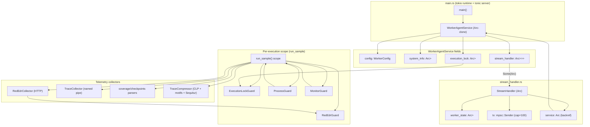
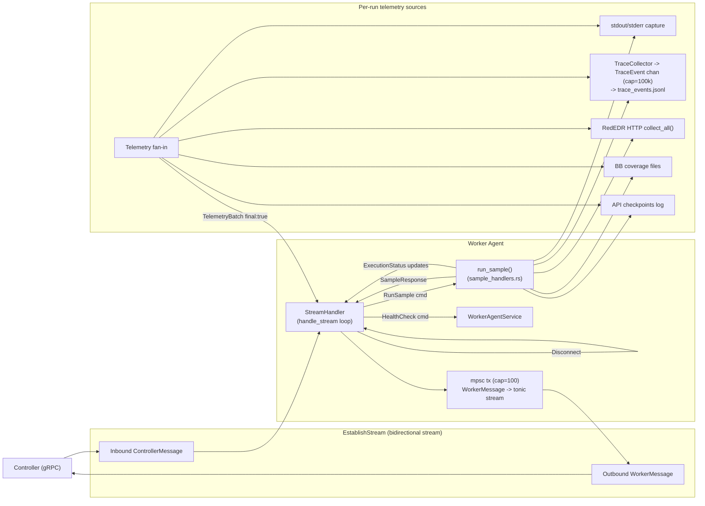
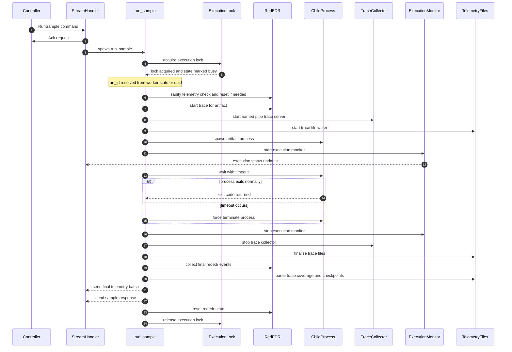
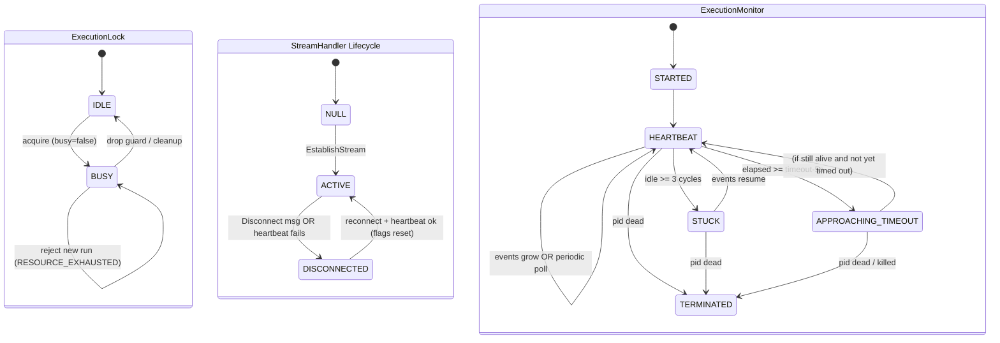
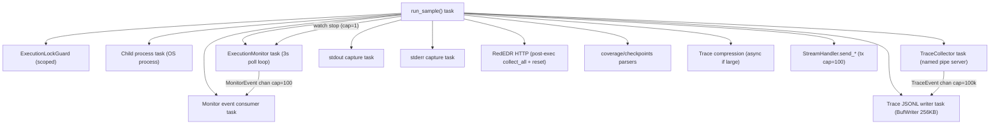

# Big Picture

```mermaid
flowchart TB
%% --- main.rs ---
    subgraph sg_main["main.rs (tokio runtime + tonic server)"]
        main_node["main()"]
        svc["WorkerAgentService (Arc-clone)"]
        main_node --> svc
    end

%% --- WorkerAgentService fields ---
    subgraph sg_svc["WorkerAgentService fields"]
        cfg["config: WorkerConfig"]
        sys["system_info: Arc<Mutex<System>>"]
        exlock["execution_lock: Arc<Mutex<ExecutionState>>"]
        shoptslot["stream_handler: Arc<RwLock<Option<Arc<StreamHandler>>>>"]
    end

    svc --> cfg
    svc --> sys
    svc --> exlock
    svc --> shoptslot

%% --- stream_handler.rs ---
    subgraph sg_stream["stream_handler.rs"]
        stream_node["StreamHandler (Arc)"]
        ws["worker_state: Arc<RwLock<WorkerState>>"]
        tx["tx: mpsc::Sender<WorkerMessage> (cap=100)"]
        back["service: Arc<WorkerAgentService> (backref)"]
        stream_node --> ws
        stream_node --> tx
        stream_node --> back
    end

    shoptslot -->|"Some(Arc)"| stream_node
    back --> svc

%% --- per-execution scope ---
    subgraph sg_exec["Per-execution scope (run_sample)"]
        exec_node["run_sample() scope"]
        lkg["ExecutionLockGuard"]
        reg["RedEdrGuard"]
        prg["ProcessGuard"]
        mog["MonitorGuard"]

        exec_node --> lkg
        exec_node --> reg
        exec_node --> prg
        exec_node --> mog
    end

    exlock --> lkg

%% --- collectors ---
    subgraph sg_collect["Telemetry collectors"]
        red["RedEdrCollector (HTTP)"]
        trc["TraceCollector (named pipe)"]
        parsers["coverage/checkpoints parsers"]
        comp["TraceCompressor (CLP + motifs + Sequitur)"]
    end

    exec_node --> red
    exec_node --> trc
    exec_node --> parsers
    exec_node --> comp

    red --> reg
    prg --> exec_node
    mog --> exec_node

```

# Control plane

```mermaid
flowchart LR
    CTRL["Controller (gRPC)"]

    subgraph BIDIR["EstablishStream (bidirectional stream)"]
        IN["Inbound ControllerMessage"]
        OUT["Outbound WorkerMessage"]
    end

    subgraph WORKER["Worker Agent"]
        SH["StreamHandler\n(handle_stream loop)"]
        RXTX["mpsc tx (cap=100)\nWorkerMessage -> tonic stream"]
        SVC["WorkerAgentService"]
        RUN["run_sample()\n(sample_handlers.rs)"]
    end

    CTRL --> IN --> SH
    SH --> RXTX --> OUT --> CTRL

    SH -->|RunSample cmd| RUN
    SH -->|HealthCheck cmd| SVC
    SH -->|Heartbeat| SH
    SH -->|Disconnect| SH

    subgraph TELE_SG["Per-run telemetry sources"]
        TELE_NODE["Telemetry fan-in"]
        STD["stdout/stderr capture"]
        PIPE["TraceCollector -> TraceEvent chan (cap=100k)\n-> trace_events.jsonl"]
        RED["RedEDR HTTP collect_all()"]
        COV["BB coverage files"]
        CKP["API checkpoints log"]

        TELE_NODE --> STD
        TELE_NODE --> PIPE
        TELE_NODE --> RED
        TELE_NODE --> COV
        TELE_NODE --> CKP
    end

    RUN --> STD
    RUN --> PIPE
    RUN --> RED
    RUN --> COV
    RUN --> CKP

    TELE_NODE -->|TelemetryBatch final:true| SH
    RUN -->|SampleResponse| SH
    RUN -->|ExecutionStatus updates| SH

```

# RunSample 

```mermaid
sequenceDiagram
    autonumber
    participant C as Controller
    participant SH as StreamHandler
    participant RS as run_sample
    participant L as ExecutionLock
    participant RE as RedEDR
    participant P as ChildProcess
    participant T as TraceCollector
    participant M as ExecutionMonitor
    participant FS as TelemetryFiles

    C->>SH: RunSample command
    SH->>C: Ack request

    SH->>RS: spawn run_sample

    RS->>L: acquire execution lock
    L-->>RS: lock acquired and state marked busy
    Note over RS: run_id resolved from worker state or uuid

    RS->>RE: sanity telemetry check and reset if needed
    RS->>RE: start trace for artifact

    RS->>T: start named pipe trace server
    RS->>FS: start trace file writer
    RS->>P: spawn artifact process

    RS->>M: start execution monitor
    M-->>SH: execution status updates

    RS->>P: wait with timeout
    alt process exits normally
        P-->>RS: exit code returned
    else timeout occurs
        RS->>P: force terminate process
    end

    RS->>M: stop execution monitor
    RS->>T: stop trace collector
    RS->>FS: finalize trace files

    RS->>RE: collect final rededr events
    RS->>FS: parse trace coverage and checkpoints

    RS-->>SH: send final telemetry batch
    RS-->>SH: send sample response

    RS->>RE: reset rededr state
    RS->>L: release execution lock

```

# state machine

```mermaid
stateDiagram-v2
  state "ExecutionLock" as EL {
    [*] --> IDLE
    IDLE --> BUSY: acquire (busy=false)
    BUSY --> IDLE: drop guard / cleanup
    BUSY --> BUSY: reject new run (RESOURCE_EXHAUSTED)
  }

  state "StreamHandler Lifecycle" as SL {
    [*] --> NULL
    NULL --> ACTIVE: EstablishStream
    ACTIVE --> DISCONNECTED: Disconnect msg OR heartbeat fails
    DISCONNECTED --> ACTIVE: reconnect + heartbeat ok (flags reset)
  }

  state "ExecutionMonitor" as EM {
    [*] --> STARTED
    STARTED --> HEARTBEAT
    HEARTBEAT --> HEARTBEAT: events grow OR periodic poll
    HEARTBEAT --> STUCK: idle >= 3 cycles
    HEARTBEAT --> APPROACHING_TIMEOUT: elapsed >= timeout-5s
    STUCK --> HEARTBEAT: events resume
    APPROACHING_TIMEOUT --> HEARTBEAT: (if still alive and not yet timed out)
    HEARTBEAT --> TERMINATED: pid dead
    STUCK --> TERMINATED: pid dead
    APPROACHING_TIMEOUT --> TERMINATED: pid dead / killed
  }

```

# Concurrency

```mermaid
flowchart TB
  RS["run_sample() task"] --> LOCK["ExecutionLockGuard (scoped)"]

  RS --> PROC["Child process task (OS process)"]
  RS --> MON["ExecutionMonitor task (3s poll loop)"]
  RS --> PIPE["TraceCollector task (named pipe server)"]
  RS --> WR["Trace JSONL writer task (BufWriter 256KB)"]
  RS --> OUT1["stdout capture task"]
  RS --> OUT2["stderr capture task"]
  RS --> CONS["Monitor event consumer task"]

  PIPE -->|"TraceEvent chan cap=100k"| WR
  MON -->|"MonitorEvent chan cap=100"| CONS
  RS -->|"watch stop (cap=1)"| MON

  RS --> RED["RedEDR HTTP (post-exec collect_all + reset)"]
  RS --> PARSE["coverage/checkpoints parsers"]
  RS --> COMP["Trace compression (async if large)"]

  RS --> SH["StreamHandler.send_* (tx cap=100)"]

```

# Named pipe

```mermaid
flowchart LR
  %% ---- Producer side ----
  A["Instrumented artifact process"]
  A -->|"connect and write"| P["Named pipe\nrededr_trace"]

  %% ---- Worker side entry ----
  RS["run_sample"]
  RS -->|"spawn task"| S["TraceCollector.start_server"]
  S -->|"CreateNamedPipe and accept"| P

  %% ---- Protocol sniff ----
  P --> B["Read first 4 bytes"]
  B -->|"magic is ISTR"| BIN["Binary protocol path"]
  B -->|"otherwise"| TXT["Text protocol path"]

  %% ---- Binary path ----
  subgraph SB["Binary ISTR parsing"]
    BIN --> H["Read InstRecordHeader\nmagic version type tid seq ts len"]
    H --> PL["Read payload bytes\nlen from header"]
    PL --> EV["Dispatch by event type\nline checkpoint success failure"]
    EV --> L1["Parse line payload\nfile line func"]
    EV --> O1["Parse status payload\ncheckpoint or success or failure"]
  end

  %% ---- Text path ----
  subgraph ST["Text base64 parsing"]
    TXT --> R["Read line from pipe"]
    R --> D["Decode base64"]
    D --> F["Parse fields\nline file line func\nor checkpoint"]
  end

  %% ---- Common output ----
  L1 --> TE["TraceEvent struct\nseq tid file line func ts_us"]
  F --> TE
  O1 --> TS["Trace status event\ncheckpoint or success or failure"]

  TE --> CH["mpsc TraceEvent channel\ncap 100k"]
  CH --> W["Trace writer task\nappend JSONL"]
  W --> FILE["trace_events.jsonl"]

  %% optional: status events can be logged or folded into telemetry later
  TS --> LOG["log or convert to telemetry later"]

```