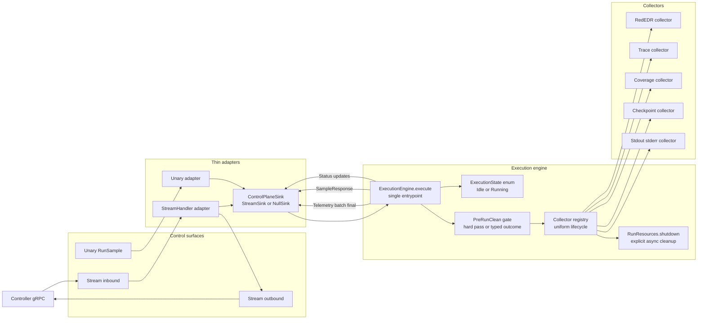
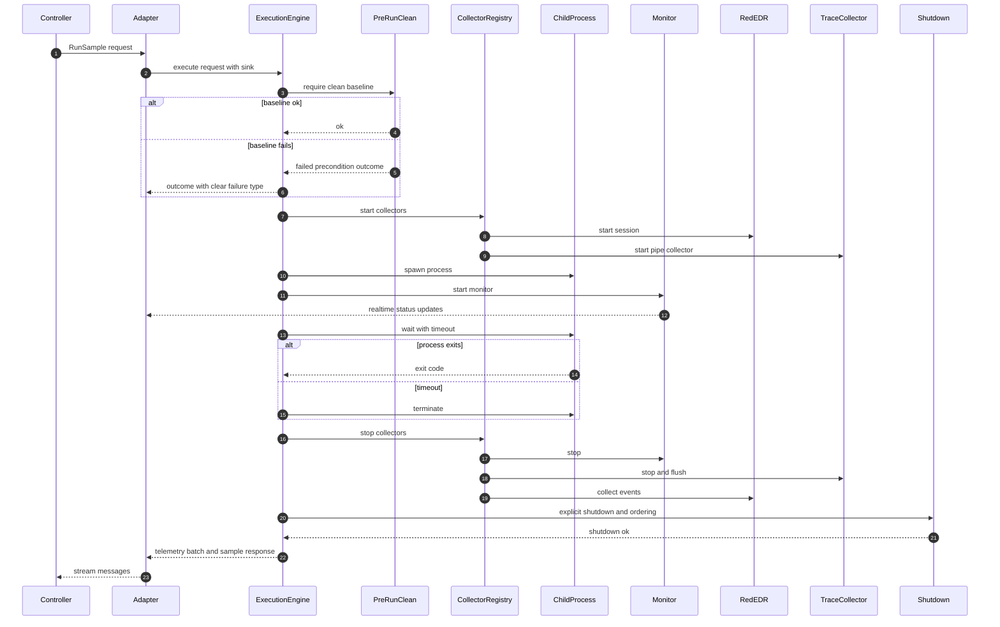

# architecture



# RunSample



# Worker Agent Architecture Review — Discrepancies, Risk Points, and Refactor Plan

This document captures **architecture discrepancies / risk points** identified in the current worker agent design and a **practical modularity & maintainability refactor plan**.

---

## Architecture discrepancies / risk points

### 1) “Single execution lock prevents cross-contamination” is only half true

The `ExecutionLock` prevents concurrent runs, but telemetry contamination can still happen if:

- **RedEDR reset fails** (HTTP error, daemon hung, race)
- **trace pipe server is still draining** when the process exits
- **monitor tasks keep polling or reporting** after the run ends (late events)
- **“leftover events” sanity check isn’t a hard barrier** (you tag `contaminated` and proceed)

**Discrepancy:** The doc implies the lock makes attribution safe; in practice, attribution safety is a **system invariant** that depends on RedEDR and collectors being in a known-clean state, not just single-threading.

**Improve:** make “clean baseline” a first-class state:

- `PreRunClean` must pass or the run is marked `FAILED_PRECONDITION` (or `success=false` but clearly typed).
- Don’t just “tag contaminated” and continue unless you explicitly accept degraded telemetry quality.

---

### 2) RAII Drop spawning its own Tokio runtime is a footgun

This is the biggest maintainability issue.

**Pattern:**

```
Drop -> std::thread::spawn -> Runtime::new -> block_on(async cleanup)
```

**Problems:**

- Creates **nested runtimes** unpredictably.
- Cleanup can **outlive main runtime shutdown**.
- Errors are usually **dropped on the floor**.
- If many drops happen quickly, you can spawn **a lot of threads**.
- On panic paths, you’re depending on **best-effort background cleanup** with no ordering guarantees.

**Discrepancy:** The doc sells RAII as deterministic cleanup. It’s actually “eventually attempted cleanup.”

**Improve:**

- Replace async-in-Drop with explicit async `close()` / `shutdown()`.
- Keep `Drop` as a failsafe that only does minimal synchronous things (flags, best-effort kill without runtime creation).
- If you must run async cleanup, use a **global cleanup executor** (single background task) rather than per-drop runtimes.

---

### 3) Mixed “stream-driven control plane” vs “unary RunSample legacy”

You have **two control surfaces**:

- bidirectional stream message loop (controller sends `RunSample`)
- unary RPC `RunSample` (legacy mode)

This always produces drift:

- different error semantics
- different run_id/job_id correlation
- different telemetry batching behavior
- stream might be disconnected: doc says worker can run without controller stream, but `run_sample` still tries to use `StreamHandler` if present

**Discrepancy:** The doc describes a single lifecycle; the code likely has at least two.

**Improve:**

- Make one internal “engine” function: `execute(request, ctx) -> Outcome`.
- Both unary and stream handlers call the same engine.
- Stream-specific behaviors (acks, realtime status updates) should be a thin adapter.

---

### 4) Channel architecture: some channels are oversized and become “implicit memory buffers”

The `trace events` channel capacity **100,000** is understandable, but dangerous:

- If the consumer slows, you buffer huge bursts in RAM.
- Under high-frequency tracing, you can hit multi-GB memory if events are heavy.

**Discrepancy:** The doc frames it as throughput optimization; it’s also an **unbounded backpressure policy** disguised as a big buffer.

**Improve:**

- Use **bounded + lossy** or **bounded + backpressure** explicitly.
    - If you can lose: drop with counters + “lost_events” telemetry.
    - If you can’t lose: block producer (but then you perturb the traced process if producer is in that path).
- Better: have `TraceCollector` write directly to a file (or a ring buffer) and only send **indexes / summaries** via channel.

---

### 5) “Monitor stuck detection uses events growing” — but what event source?

Monitor checks `/api/stats` (`events_count`), and “stuck threshold = no new events for 9s”.

But:

- benign programs may legitimately produce no new RedEDR events
- RedEDR might miss events
- the process may be CPU busy but not eventful

**Discrepancy:** “stuck” is presented as an execution state, but it’s really “no telemetry progress.”

**Improve:**

- Rename to `telemetry_idle` or `no_new_telemetry`.
- Add an independent signal: process CPU time delta, thread count delta, or I/O delta from sysinfo.
- That way you distinguish:
    - “process idle but alive”
    - “process doing work but telemetry quiet”
    - “process hung”

---

### 6) Ownership: StreamHandler back-reference to service is a cycle risk

You have:

- `WorkerAgentService` holds `Option<Arc<StreamHandler>>`
- `StreamHandler` holds `Arc<WorkerAgentService>`

That is a **strong reference cycle** unless one side is `Weak`.

**Discrepancy:** The doc says “back-reference” but doesn’t acknowledge the leak risk. If both are `Arc`, they’ll never drop.

**Improve:**

- Make `StreamHandler { service: Weak<WorkerAgentService> }`
- Or invert: service owns handler, and handler does not own service.

This is a real maintainability bug because cleanup ordering becomes impossible otherwise.

---

### 7) Too many responsibilities inside `run_sample()` (≈1370 lines)

Even with guards, a function that long becomes “the system.”

Common symptoms:

- every new feature touches this file
- testing becomes impossible (integration-only)
- subtle ordering dependencies creep in

**Discrepancy:** The doc treats it as one lifecycle function; maintainability-wise it’s many subsystems glued together.

**Improve:** extract a pipeline with typed phases (see refactor plan below).

---

## Improvements for modularity & maintainability (practical refactor plan)

### A) Introduce an internal “Execution Engine” with explicit phase boundaries

Create:

- `ExecutionRequest { job_id, artifact_id, timeout, ... }`
- `ExecutionContext { worker_id, run_id, telemetry_dir, stream: Option<StreamSink>, caps, ... }`
- `ExecutionOutcome { exit_status, stdout, stderr, telemetry_summary, flags }`

Then split into modules / phases:

- `prepare_environment()`
- `start_collectors()`
- `spawn_process()`
- `monitor_until_exit()`
- `finalize_collectors()`
- `gather_artifacts()`
- `emit_telemetry()`
- `cleanup()`

Each returns a struct that the next phase consumes. This makes ordering explicit and testable.

---

### B) Replace RAII “async cleanup in Drop” with an explicit shutdown API

Pattern:

```rust
struct RunResources {
    rededr: RedEdrSession,
    proc: ChildHandle,
    monitor: MonitorHandle,
    trace: TraceHandle,
    // ...
}

impl RunResources {
    async fn shutdown(mut self) -> anyhow::Result<()> {
        // stop monitor
        // stop trace
        // kill/await process if needed
        // reset rededr
        Ok(())
    }
}
```

`Drop` becomes:

- if not shutdown: best-effort synchronous kill (or log)

This makes behavior deterministic and dramatically easier to reason about.

---

### C) Make “controller messaging” an interface (port) rather than hard dependency

Instead of `StreamHandler` being used directly inside execution code, use a trait:

```rust
trait ControlPlaneSink {
    async fn status(&self, msg: ExecutionStatus);
    async fn telemetry(&self, batch: TelemetryBatch);
    async fn ack(&self, ack: Ack);
}
```

Then you can have:

- `StreamSink(StreamHandler)`
- `NullSink` for unary mode / disconnected mode
- later: test sink for unit tests

This also removes the need for that `StreamHandler -> service Arc` back-reference.

---

### D) Move telemetry into a “collector registry” with uniform lifecycle

Right now collectors behave differently (pipe vs HTTP vs file parsing). Create a `Collector` trait:

```rust
#[async_trait]
trait Collector {
    async fn start(&mut self, ctx: &ExecutionContext) -> Result<()>;
    async fn stop(&mut self) -> Result<()>;
    async fn collect(&mut self) -> Result<Vec<TelemetryData>>;
}
```

Have:

- `RedEdrCollector`
- `TraceCollector`
- `CoverageCollector`
- `CheckpointCollector`
- `StdoutCollector` / `StderrCollector`

Then `run_sample` doesn’t know details; it just drives lifecycle.

---

### E) Kill the strong Arc cycle (if present)

As mentioned: use `Weak` for back-references or remove them entirely.

If you need to call into service config from `StreamHandler`:

- pass only what it needs (config snapshot)
- or store `Arc<WorkerConfig>` independently

---

### F) Tighten state handling: replace ad-hoc `busy/job_id/artifact` with typed state

`ExecutionState` as bool + options is easy to desync.

Use:

```rust
enum ExecutionState {
  Idle,
  Running {
    job_id: String,
    artifact: String,
    run_id: String,
    started_at: Instant,
  }
}
```

This prevents “busy=true but job_id=None” class of bugs.

---

### G) Normalize `run_id` resolution into one place

Right now it’s “from `WorkerState.current_run_id` set by stream handler, or UUID”.
That’s a coupling smell.

Make run_id generation always inside engine, and pass it outward.
If the controller wants to suggest one, accept it explicitly as `requested_run_id`.

---

### H) Observability: add structured events for phase transitions + timing

You already have telemetry batching; add internal spans like:

- `phase=rededr_reset duration_ms`
- `phase=spawn_process pid`
- `phase=wait exit_code`
- `phase=collect_rededr events_count`
- `phase=compress_trace original_size compressed_size ratio`

This will reveal where timeouts/slowdowns occur and make “stuck” interpretation better.

---

## “Small” changes with big ROI

- Rename “stuck” → `telemetry_idle` and add CPU-delta check.
- Hard fail if RedEDR contamination persists after reset attempt (or explicitly mark run as contaminated and separate it as a different outcome type).
- Consolidate unary and stream execution onto one internal API.
- Split `sample_handlers.rs` into:
    - `execution_engine.rs`
    - `telemetry_pipeline.rs`
    - `process_runner.rs`
    - `rededr_session.rs`
    - `result_packaging.rs`


# Worker Agent Refactor Layout — Mirroring Controller Scheduler

This document proposes a worker/agent folder layout and migration plan that mirrors the controller scheduler refactor principles:

- **api/** = gRPC “surface” only (Tonic handlers, proto mapping, status codes)
- **dispatch/** (or **engine/**) = execution engine / lifecycle orchestration
- **infra/** (or **io/**) = OS / RedEDR / pipes / filesystem / process spawning (pluggable)
- **telemetry/** stays, split into **collectors** + **pipeline**
- **session/** = shared state + locks + stream session state
- Keep file names aligned with domain nouns (**Run**, **Session**, **Monitor**, **Collector**)

---

## 1) Proposed folder layout (worker/agent)

`worker/agent/src/` (crate root)

```
src/
  main.rs
  lib.rs

  api/                         # gRPC surface
    mod.rs
    info.rs                    # ping/health/get_worker_info/get_telemetry
    artifacts.rs               # send_artifact (chunked transfer + sha256)
    stream.rs                  # establish_stream (sets up bidirectional stream)
    run.rs                     # run_sample unary (legacy) -> calls engine

  dispatch/                    # runtime execution engine (pure orchestration)
    mod.rs
    engine.rs                  # execute_run(request, ctx) -> RunOutcome
    phases.rs                  # small phase fns (prepare/start/wait/finalize)
    types.rs                   # RunRequest/RunContext/RunOutcome/RunId/...
    sinks.rs                   # ControlPlaneSink trait + StreamSink/NullSink
    errors.rs                  # typed error mapping (to tonic::Status)

  session/                     # controller stream session & worker runtime state
    mod.rs
    stream_handler.rs          # bidirectional message loop + heartbeat
    worker_state.rs            # WorkerState + HealthMetrics + updates
    execution_lock.rs          # ExecutionState + guard (or state enum)
    channels.rs                # WorkerMessage/ControllerMessage routing types

  infra/                       # OS + side effects (pluggable boundary)
    mod.rs
    process.rs                 # spawn/kill/wait/capture stdout+stderr
    rededr.rs                  # RedEDR client + session (start/reset/stats/logs)
    trace_pipe.rs              # named pipe server + protocol decode
    fs.rs                      # telemetry dir mgmt, file helpers
    sysinfo.rs                 # system refresh, per-pid metrics

  telemetry/                   # telemetry model + collection + compression pipeline
    mod.rs
    model.rs                   # TelemetryData + event types
    collectors/
      mod.rs
      rededr.rs                # collector built on infra/rededr
      trace.rs                 # collector built on infra/trace_pipe
      coverage.rs              # coverage parser helper
      checkpoints.rs           # checkpoints parser helper
      stdio.rs                 # stdout/stderr capture collector wrapper
    pipeline.rs                # gather->size->compress->batch->send
    trace_compressor.rs        # CLP + MatrixProfile + Sequitur compression
    limits.rs                  # 2MB/4MB constants + truncation logic

  capabilities/                # detection & metadata
    mod.rs
    detect.rs                  # auto-detection logic
    windows.rs                 # WindowsVersionInfo + registry helpers
```

### Why this mirrors your controller layout

- **api/** == controller **api/** : boundary handlers only.
- **dispatch/** == controller **dispatch/** : lifecycle engine with typed inputs/outputs.
- **session/** == controller **vm/** (in spirit): long-lived connectivity / streaming state.
- **infra/** == controller **vm/** (in spirit): connectivity + side effects, but here it’s “OS/EDR/pipe/process”.
- **telemetry/** is “storage-like”: a subsystem with its own internal structure.

---

## 2) Rename/move map from current worker files

### Current root files

- `main.rs` stays
- `lib.rs` stays (but should re-export the service + wire modules)

### `service/` → `api/`

- `service/mod.rs` → `api/mod.rs`
- `service/sample_handlers.rs` → `api/run.rs`  
  (shrink to “parse request → call dispatch engine → map outcome”)
- `service/stream_handlers.rs` → `api/stream.rs`
- `service/artifact_handlers.rs` → `api/artifacts.rs`
- `service/info_handlers.rs` → `api/info.rs`
- `service/helpers.rs` → split:
    - parsing helpers → `telemetry/collectors/{coverage,checkpoints}.rs`
    - any gRPC-only glue → `api/` (keep it minimal)

### `stream_handler.rs` → `session/`

- `stream_handler.rs` → `session/stream_handler.rs`

### `execution/` → `dispatch/` + `infra/`

- `execution/monitor.rs` → **two pieces**
    - monitor logic/state machine → `dispatch/monitor.rs` *(or fold into `dispatch/phases.rs`)*
    - sysinfo/rededr polling primitives → `infra/sysinfo.rs` + `infra/rededr.rs`
- `execution/guards.rs` → `dispatch/`
    - recommendation: convert “async cleanup in Drop” into explicit async shutdown paths in `dispatch/engine.rs`
    - Drop becomes last-resort safety net

### `telemetry/` stays but gets reorganized

- `telemetry/collectors/rededr.rs` stays, but should depend on `infra/rededr.rs` client/session
- `telemetry/collectors/trace.rs` stays, but depends on `infra/trace_pipe.rs`
- `telemetry/trace_compressor.rs` stays (likely unchanged)
- Add `telemetry/pipeline.rs` and move sizing logic out of `run_sample()`

### `capabilities.rs` → `capabilities/`

- `capabilities.rs` → `capabilities/detect.rs`
- Add `capabilities/mod.rs` + optionally `capabilities/windows.rs` for registry/version parsing

---

## 3) Updated `mod.rs` exports (keeps imports sane)

### `src/api/mod.rs`

```rust
pub mod artifacts;
pub mod info;
pub mod run;
pub mod stream;
```

### `src/dispatch/mod.rs`

```rust
pub mod engine;
pub mod errors;
pub mod phases;
pub mod sinks;
pub mod types;
// optionally:
pub mod monitor;
```

### `src/session/mod.rs`

```rust
pub mod channels;
pub mod execution_lock;
pub mod stream_handler;
pub mod worker_state;
```

### `src/infra/mod.rs`

```rust
pub mod fs;
pub mod process;
pub mod rededr;
pub mod sysinfo;
pub mod trace_pipe;
```

### `src/telemetry/mod.rs`

```rust
pub mod collectors;
pub mod limits;
pub mod model;
pub mod pipeline;
pub mod trace_compressor;
```

### `src/capabilities/mod.rs`

```rust
pub mod detect;
pub mod windows;
```

---

## 4) Naming conventions to prevent drift (worker side)

Align terminology with the controller refactor style:

- **Run** is the atomic unit: `RunRequest`, `RunContext`, `RunOutcome`
- **Session** is the stream/controller connection: `ControllerSession`, `StreamHandler`
- **Sink** is “where we emit status/telemetry”: `ControlPlaneSink`
- **Infra** is “side effects”: `RedEdrClient`, `TracePipeServer`, `ProcessRunner`

This keeps “what goes where” self-evident.

---

## 5) Key “layout-aligned” refactors (small but structural)

### A) Make `run_sample()` a thin wrapper

`api/run.rs` should be ~100–200 lines, not 1370.

It should:

- validate request
- acquire `execution_lock`
- build `RunContext` (run_id generation here **or** in engine — but in exactly one place)
- call `dispatch::engine::execute_run(...)`
- map `RunOutcome` → `SampleResponse` + stream telemetry via sink

### B) Make stream optional via a trait sink

Put in `dispatch/sinks.rs`:

- `trait ControlPlaneSink { status(); telemetry(); ack(); }`
- `StreamSink(Arc<StreamHandler>)`
- `NullSink` for unary / disconnected mode

Then engine doesn’t know about `StreamHandler` types.

### C) Remove the service ↔ handler `Arc` cycle by design

With the sink trait, you don’t need `StreamHandler` to hold `Arc<WorkerAgentService>` at all.  
If it still needs config, pass `Arc<WorkerConfig>` or a lightweight `ServiceContext`.

---

## 6) Minimal migration sequence (filesystem-level, low risk)

1. Create new folders: `api/`, `dispatch/`, `session/`, `infra/`, `capabilities/`, `telemetry/{model,pipeline,limits}`
2. Move `service/*` → `api/*` and update imports (no logic change yet)
3. Move `stream_handler.rs` → `session/stream_handler.rs`
4. Extract **types** from `sample_handlers.rs` into `dispatch/types.rs` (`RunRequest/Outcome`)
5. Extract telemetry sizing + compression orchestration into `telemetry/pipeline.rs`
6. Introduce `dispatch/engine.rs` and move the lifecycle there (phase by phase)
7. Replace direct `StreamHandler` usage with `ControlPlaneSink`
8. Only after that: clean up guards / async Drop patterns

This mirrors the controller “move first, then split, then rewrite” migration style.

---

## 7) Optional: “symmetric file naming” trick (helps cross-repo cognition)

If you like the controller’s names, you can make worker modules intentionally parallel:

- controller `dispatch/vm_executor.rs` ↔ worker `infra/process.rs` + `dispatch/engine.rs`
- controller `vm/manager.rs` ↔ worker `session/stream_handler.rs` (long-lived comms)
- controller `dispatch/run_pool.rs` ↔ worker `dispatch/execution_lock.rs` (serialization gate)

Not identical roles, but the mental map becomes predictable.
